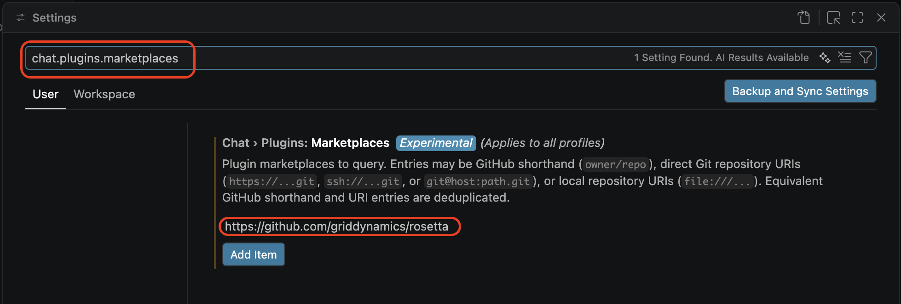
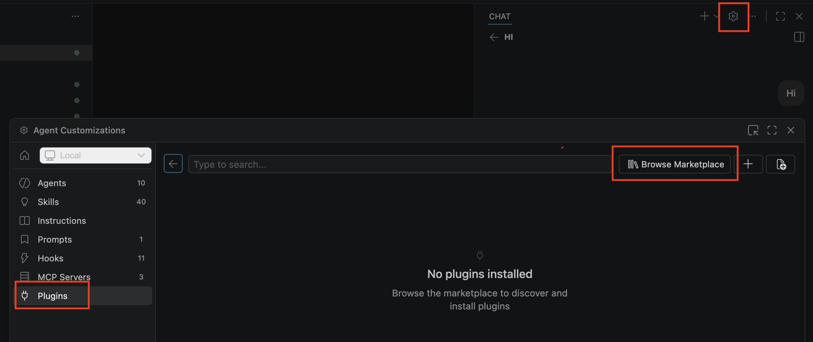
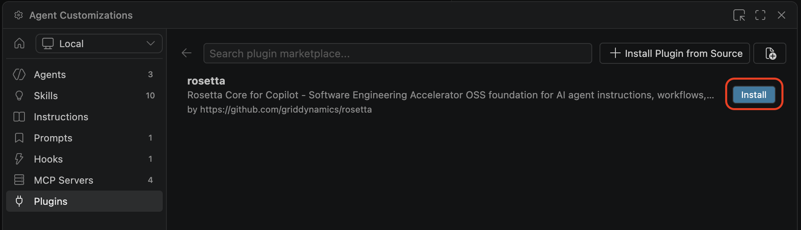

# Plugins

Rosetta plugins bundle the bootstrap rule, skills, agents, workflows, and other instructions directly into your IDE. The agent loads them locally — no live connection to Rosetta is needed at request time.

Two install modes per IDE:

- **Marketplace** — managed install from a plugin marketplace. Easier; preferred when available.
- **Standalone** — manual zip extraction into your repo. For IDEs without a marketplace path, or environments that block external marketplaces.

> [!CAUTION]
> You must receive prior approval from your manager and company to use Rosetta.

> [!WARNING]
> Use **Sonnet 4.6**, **GPT-5.3-codex-medium**, **gemini-3.1-pro**, or better. Avoid Auto.

> [!NOTE]
> Plugins are pre-release. They install and run; report bugs at <https://github.com/griddynamics/rosetta/issues>.

## Claude Code

```sh
claude plugin marketplace add griddynamics/rosetta
claude plugin install rosetta@rosetta
```

To update later:

```sh
claude plugin marketplace update rosetta
claude plugin update rosetta@rosetta
```

## Cursor

### Marketplace (recommended)

If you have a Cursor edition that supports plugins, add `https://github.com/griddynamics/rosetta` to your team marketplace. See <https://cursor.com/docs/plugins#team-marketplaces> for the setup steps on the Cursor side.

Cursor also sees plugins installed via Claude Code. If you've already installed via `claude plugin install`, do **not** install again in Cursor — the same content would be duplicated in Cursor's context.

### Standalone

1. Download `core-cursor-standalone-*.zip` from the [latest release](https://github.com/griddynamics/rosetta/releases/latest).
2. Extract the archive contents into your repository.
3. Verify `.cursor/agents/architect.md` exists. Ensure there is no nested `.cursor/.cursor/` folder.

## VS Code (GitHub Copilot)

### Marketplace (recommended)

1. In VS Code settings, add `https://github.com/griddynamics/rosetta` to `chat.plugins.marketplaces`.
2. Open the Copilot chat panel, click the settings gear icon to open agent customizations.
3. Click **Browse Marketplaces**, then **install** for `rosetta`.







### Standalone

See [GitHub Copilot Standalone](#github-copilot-standalone-jetbrains-and-vs-code) below — same procedure for VS Code and JetBrains.

## GitHub Copilot Standalone (JetBrains and VS Code)

Use this when the marketplace path isn't available — JetBrains Copilot (no marketplace), or VS Code environments that block external marketplaces.

1. Download `core-copilot-standalone-*.zip` from the [latest release](https://github.com/griddynamics/rosetta/releases/latest).
2. Extract the archive contents into your repository. If `.github/copilot-instructions.md` already exists, merge contents — Rosetta first, then the original content.
3. Verify `.github/agents/architect.agent.md` exists. Ensure there is no nested `.github/.github/` folder.

## Codex

Codex plugins currently support hooks, MCPs, and skills only (as of April 2026).

1. Download `core-codex-*.zip` from the [latest release](https://github.com/griddynamics/rosetta/releases/latest).
2. Extract the archive contents into your repository.
3. Enable hooks:

   ```sh
   codex features enable hooks
   ```
