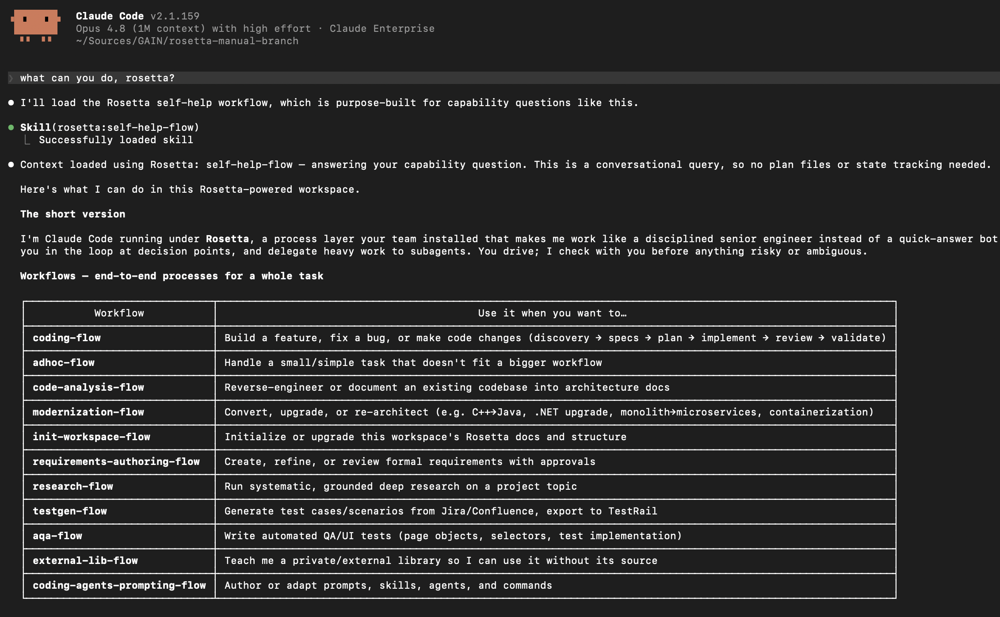
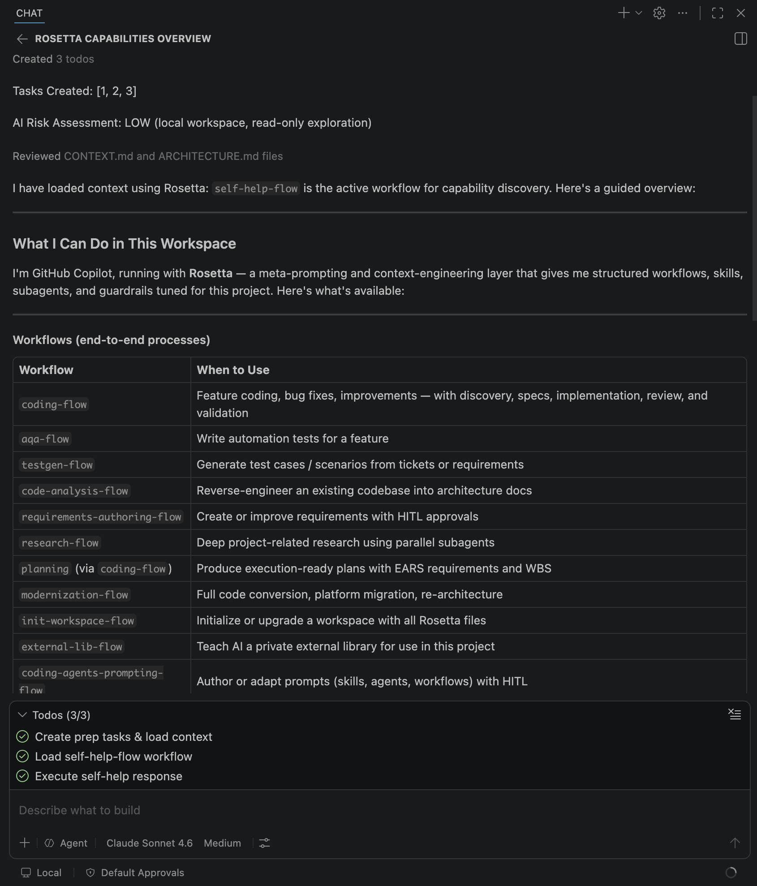

# Plugins

Rosetta plugins bundle the bootstrap rule, skills, agents, workflows, and other instructions directly into your IDE. The agent loads them locally — no live connection to Rosetta is needed at request time.

Every plugin supports two installation methods:

- **Marketplace** — managed install from a plugin marketplace. Easier; preferred when available.
- **Standalone** — manual zip extraction into your repo. For agents without a marketplace path, or environments that block external marketplaces.

> [!CAUTION]
> You must receive prior approval from your manager and company to use Rosetta.

> [!WARNING]
> Use **Sonnet 5 medium**, **GPT-5.6-terra-medium**, **gemini-3.7-flash-high** or newer models. Avoid Auto model selection.

> [!NOTE]
> There will be conflict if you have similar plugins installed: JUXT, Superpowers, GSD, AI-DevKit. Use the ones you have the most experience with.

## Which plugin do I install

Rosetta ships as seven plugins. Five of them are domain sets; the other two bundle all five.

| Plugin | Contains | Requires |
| ------ | -------- | -------- |
| `rosetta` | Everything. Skills, rules, subagents, and all workflows. | nothing |
| `rosetta-light` | Everything, lightweight profile (simpler workflows, smaller models). | nothing |
| `core` | Composable skills, always-on rules, bootstrap, guardrail hooks. No subagents. | nothing |
| `advanced` | Subagents and the orchestrated workflows that spawn them. | `core` |
| `qe` | Test automation and test generation. | `core`, `advanced` |
| `search` | Solr and search engineering. | `core`, `advanced` |
| `modernization` | Conversion, upgrade, and re-architecture workflows. | `core`, `advanced` |

**Most people want `rosetta`.** It is the whole product in one install, and it is what the rest of this page assumes.

Install the split plugins instead when you want a smaller footprint or only one domain. Two things to know before you do.

`core` on its own is deliberately incomplete. It carries no subagents at all, so `skills/orchestration` has nothing to spawn and the routing skills have very little to route to. `core` plus `advanced` is the smallest setup that behaves like Rosetta.

Install the combo **or** the split, never both. Installing `rosetta` alongside `core` and `advanced` puts every skill, agent, and workflow into your session twice under two namespaces. Nothing stops you; nothing warns you either.

The five split plugins are themselves lightweight builds, so `core` plus `advanced` lands closer to `rosetta-light` than to `rosetta`.

## Step 1: Install Plugin

<details>
<summary><b>Claude Code</b></summary>

### Claude Code

#### Marketplace

```sh
claude plugin marketplace add griddynamics/rosetta
claude plugin install rosetta@rosetta
```

For the split plugins instead, install each by name from the same marketplace:

```sh
claude plugin install core@rosetta
claude plugin install advanced@rosetta
claude plugin install qe@rosetta        # optional, needs core + advanced
```
</details>

<details>
<summary><b>Cursor</b></summary>

### Cursor

#### Marketplace

> [!NOTE]
> To add the plugin you need to have the appropriate Cursor plans, such as Teams and Enterprise. 

To Import the Rosetta github repository to your team/company internal marketplace:
* Use the following repository: https://github.com/griddynamics/rosetta

For detailed setup instructions, see the Cursor documentation:
* https://cursor.com/docs/plugins#team-marketplaces

**ALTERNATIVE**: Plugins installed in Claude Code are automatically available in Cursor.

> [!WARNING]
> Cursor automatically detects and uses Claude Code plugins. To avoid duplicate tools, commands, and context, do not install the same plugin separately in both Claude Code and Cursor. If you don't want Cursor to pick up Claude Code plugins at all, go to **Cursor Settings → Rules, Skills, Subagents** and turn off **Include third-party Plugins, Skills, and other configs**.

#### Standalone

1. Download `rosetta-cursor-standalone-*.zip` from the [latest release](https://github.com/griddynamics/rosetta/releases/latest).
2. Extract the archive contents into your repository.
3. Verify you can see a file `.cursor/agents/architect.md`. Ensure there are no `.cursor/.cursor` folders.

</details>

<details>
<summary><b>GitHub Copilot</b></summary>

### GitHub Copilot

GitHub Copilot runs in VS Code and JetBrains. Use **Marketplace** install when available; **Standalone** is a fallback for either IDE.

#### Marketplace (VS Code and JetBrains)

1. In VS Code settings, add `https://github.com/griddynamics/rosetta` to `chat.plugins.marketplaces`. In JetBrains, add the same URL under the GitHub Copilot plugin's marketplace setting (menu path may vary by IDE version).
2. Open the Copilot chat panel, click the settings gear icon to open agent customizations.
3. Click **Browse Marketplaces**, then **install** for `rosetta`.


#### Standalone (VS Code and JetBrains) — fallback

Use when your Marketplace/plugin catalog isn't available, or to avoid a live registry dependency.

> [!NOTE]
> The standalone installation is also detected by VS Code, so installing Rosetta through the standalone and marketplace methods will result in duplicate tools, commands, and context.

1. Download `rosetta-copilot-standalone-*.zip` from the [latest release](https://github.com/griddynamics/rosetta/releases/latest).
2. Extract the archive contents into your repository. If `.github/copilot-instructions.md` already exists, merge contents — Rosetta first, then the original content.
3. Verify you can see a file `.github/agents/architect.agent.md`. Ensure there are no `.github/.github` folders.

</details>

<details>
<summary><b>Codex</b></summary>

### Codex

> [!NOTE]
> Codex plugins currently support hooks, MCPs, and skills only (as of April 2026).

#### Standalone

1. Download `rosetta-codex-*.zip` from the [latest release](https://github.com/griddynamics/rosetta/releases/latest).
2. Extract the archive contents into your repository.
3. Enable hooks:

   ```sh
   codex features enable hooks
   ```

</details>

<details>
<summary><b>Antigravity</b></summary>

### Antigravity

One plugin serves Antigravity 2.0, Antigravity CLI, and Antigravity IDE.

#### Standalone

1. Download `rosetta-antigravity-*.zip` from the [latest release](https://github.com/griddynamics/rosetta/releases/latest).
2. Create the folder `.agents/plugins/rosetta/` at your workspace root.
3. Extract the archive contents into it.
4. Verify you can see a file `.agents/plugins/rosetta/plugin.json`. Ensure there are no `.agents/plugins/rosetta/rosetta-antigravity` folders.

For all workspaces instead of one, extract into `~/.gemini/config/plugins/rosetta/` — same contents.

</details>

## Step 2: Verify

Ask the agent:

```
What can you do, Rosetta?
```

The agent will follow Rosetta prompts and show Rosetta workflows and execute `help-flow` (see screenshots from different tools below):

**Claude Code:**



**GitHub Copilot:**



## Upgrading

- Standalone upgrades require to redownload and replace files (install again).
- Marketplace plugins usually automatically upgrade.

See [INSTALLATION.md#upgrading](INSTALLATION.md#upgrading) for upgrade instructions for your installation method.

## Next Steps

Once the plugin is verified:

- **Use Rosetta day to day** — see the [User Guide](user-guide/README.md).
- **Run your first session and initialize the repo** — see [QUICKSTART.md](QUICKSTART.md).
- **Explore the workflows** (coding, requirements authoring, modernization, and more) — see [USAGE_GUIDE.md — Workflows](USAGE_GUIDE.md#workflows).
