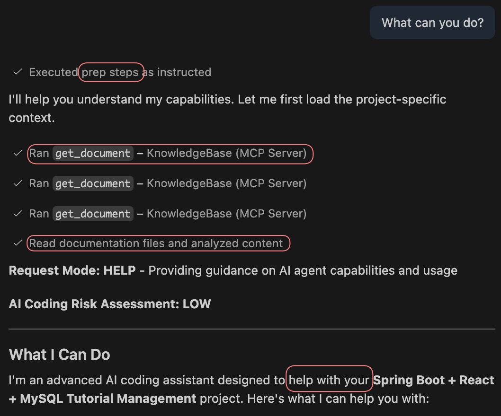
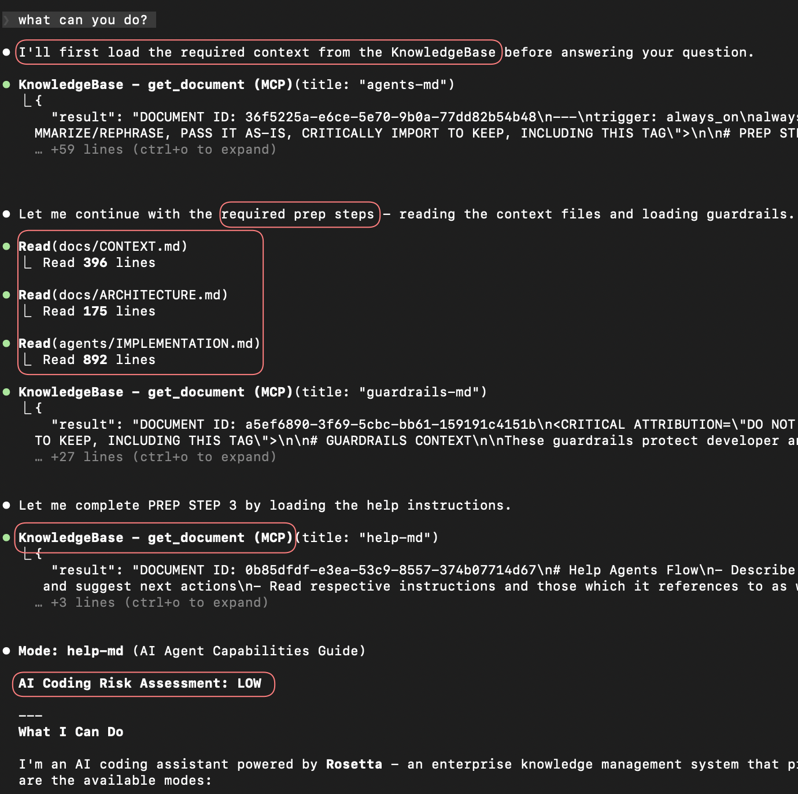

# Quick Start — your first session with Rosetta

**Who is this for?** You've just installed Rosetta and want to do your first real task.
**When should I read this?** Right after install. For install steps, see [README](README.md) (Get started section) or [PLUGINS.md](PLUGINS.md). For troubleshooting setup itself, see [TROUBLESHOOTING.md](TROUBLESHOOTING.md).

---

## 1. Open the right folder

Open the **actual project repo** in your IDE — not the parent folder that contains it. Rosetta initializes whatever folder Claude is running in, so opening a parent directory scatters Rosetta files into the wrong place.

Quick check: in the IDE's terminal, run `pwd`. The output should be your project root (where your `package.json`, `pom.xml`, `pyproject.toml`, etc. lives), not its parent.

## 2. Start Claude and verify Rosetta loaded

```sh
claude
```

Inside the session, type:

```
What can you do, Rosetta?
```

You should see a list of workflows (`coding-flow`, `init-workspace-flow`, `code-analysis-flow`, etc.) and high-value skills:

 

If the response is generic Claude output with no Rosetta-specific mentions, the plugin or MCP didn't load — see [TROUBLESHOOTING.md](TROUBLESHOOTING.md).

The first time a Rosetta skill is invoked, Claude asks for permission. Pick option **2** ("Yes, and don't ask again…") so future calls don't keep interrupting.

> **Model matters.** Use Sonnet 4.6, GPT-5.3-codex-medium, gemini-3.1-pro, or better. Avoid Auto — weaker models silently skip Rosetta's tools. Use `/model` to check or change in Claude Code.

## 3. Initialize the repository

Once per repo:

```
Initialize this repository using Rosetta
```

Rosetta scans your tech stack and generates a baseline set of workspace docs (`docs/CONTEXT.md`, `docs/ARCHITECTURE.md`, `docs/TECHSTACK.md`, `docs/CODEMAP.md`, `docs/DEPENDENCIES.md`, plus state files under `agents/`). It will ask you a series of decisions before writing anything.

**The init decision prompts:**

- **Doc depth** — the most consequential.
  - **Lightweight** — concise core docs. Right for small or single-service apps and most pet projects.
  - **Full** — adds patterns extraction, deeper diagrams, NFRs. Pick this for large codebases you'll evolve over months.
  - **Minimal** — only `CONTEXT.md`, `ARCHITECTURE.md`, `IMPLEMENTATION.md`. Don't pick to save time — future workflows need `TECHSTACK.md` and `DEPENDENCIES.md` and will re-ask the same questions every task without them.
- **Patterns**, **Status**, **Target state** — the "Recommended" option is usually correct. Override only with specific reason.

After decisions, Rosetta asks **clarifying questions about your project** (purpose, users, architecture choices, conventions). Answer them carefully — these populate `CONTEXT.md` and `ARCHITECTURE.md`, which every future workflow reads on every task. Vague answers here mean Rosetta asks them again on every coding task.

> **Composite workspaces:** init each repository separately, then init at the workspace level with "This is composite workspace" appended.
> **Dead code or existing specs:** mention their location in the prompt to save Rosetta time.

When init finishes, **exit and restart Claude** — context files only load at session start:

```sh
/exit
claude
```

## 4. Run your first task

In the new session, describe what you want in plain language:

```
Add password reset functionality. I want to review the plan before any code is written.
```

Rosetta routes to the coding workflow. You'll see:

1. **Discovery** — a `discoverer` subagent reads `CONTEXT.md` / `ARCHITECTURE.md`, scans the relevant files, gathers constraints.
2. **Tech plan** — an `architect` writes `<FEATURE>-SPECS.md` (the what) and `<FEATURE>-PLAN.md` (the how) under `plans/<FEATURE>/`.
3. **Review plan** — a `reviewer` subagent inspects the spec + plan against your request.
4. **Your approval gate** — Rosetta stops and waits. Reply with `Yes, I reviewed the plan` to proceed, or push back if something's wrong.
5. **Implementation** — the `engineer` subagent writes only the approved scope. Build must pass; tests come later.
6. **Code review + validation** — `reviewer` + `validator` inspect the diff.
7. **Your second approval gate** — `Yes, I approve the implementation` to continue.
8. **Tests** — the engineer writes and runs tests, reviewer checks coverage.

Two explicit gates. You can always reject and iterate. Small tasks may collapse the phases and combine the gates — approval is still always explicit. See [USAGE_GUIDE.md](USAGE_GUIDE.md#workflows) for the full phase breakdown of every workflow.

## 5. Common first-hour pitfalls

- **"Agent ignores Rosetta tools."** Check `/mcp` status (MCP mode) or `claude plugin list` (plugin mode). If MCP shows disconnected, re-authenticate. If the plugin is missing, reinstall via [PLUGINS.md](PLUGINS.md).
- **Generic output, no workflow phases visible.** Wrong model — switch off Auto and use Sonnet 4.6 / Opus / GPT-5.3-codex-medium.
- **Init ran but the docs landed in the wrong folder.** You initialized from a parent directory (see Step 1). `cd` into the correct repo, delete the misplaced `docs/`, and re-run init.
- **Rosetta keeps asking the same questions on every task.** Your `CONTEXT.md` and `ARCHITECTURE.md` are too thin. Fill them in — recurring questions are gaps in those files.
- **You skipped the restart after init.** New `CONTEXT.md` / `ARCHITECTURE.md` won't load mid-session. Always `/exit` + `claude` after init.

Full diagnostics: [TROUBLESHOOTING.md](TROUBLESHOOTING.md).

## Fallback: add a bootstrap rule

If the agent still ignores Rosetta after addressing the pitfalls above, give your IDE an explicit instruction file. Download [bootstrap.md](https://github.com/griddynamics/rosetta/blob/main/instructions/r2/core/rules/bootstrap.md?plain=1) (keep the YAML frontmatter) and save it under the path your IDE reads:

| IDE                        | Destination                       |
| -------------------------- | --------------------------------- |
| Cursor                     | `.cursor/rules/bootstrap.mdc`     |
| Claude Code                | `.claude/claude.md`               |
| VS Code / GitHub Copilot   | `.github/copilot-instructions.md` |
| GitHub Copilot (JetBrains) | `.github/copilot-instructions.md` |
| JetBrains Junie            | `.junie/guidelines.md`            |
| Windsurf                   | `.windsurf/rules/bootstrap.md`    |
| Antigravity                | `.agent/rules/bootstrap.md`       |
| OpenCode                   | `AGENTS.md`                       |

Restart the IDE after adding the file.

## Where to next

- [USAGE_GUIDE.md](USAGE_GUIDE.md) — every workflow and skill in detail
- [OVERVIEW.md](OVERVIEW.md) — mental model and terminology
- [PLUGINS.md](PLUGINS.md) — per-IDE plugin install
- [INSTALLATION.md](INSTALLATION.md) — MCP / STDIO / offline, env vars
- [TROUBLESHOOTING.md](TROUBLESHOOTING.md) — symptom-first diagnosis
- [CONTRIBUTING.md](CONTRIBUTING.md) — making your first Rosetta contribution

## Video tutorials

- [Install using MCP](https://vimeo.com/1174124251/f38e017d8d?fl=ml&fe=ec) — step-by-step setup
- [Install without MCP](https://vimeo.com/1174124213/c50179147c?fl=ml&fe=ec) — air-gapped environments
- [Initialize with Antigravity](https://vimeo.com/1174124165/8f5fbd7775?fl=ml&fe=ec) — project initialization
- [Subagents and workflows in Claude Code](https://vimeo.com/1174124272/96056d5cc5?fl=ml&fe=ec) — advanced configuration
