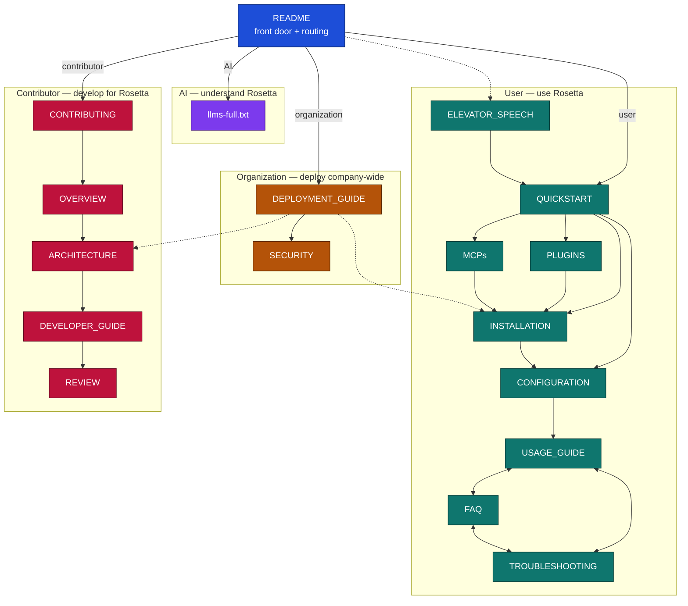

# Documentation Structure Plan

Each doc answers one question for one reader at one moment. If a file answers two questions, the reader has to skim past half of it.

## Reader profiles

Four reader types. Every doc serves one primary profile. README is the shared front door that routes all four.

- **User** — wants to use Rosetta on their own project. The primary audience. Path: README → QUICKSTART → install (PLUGINS / MCPs / INSTALLATION) → CONFIGURATION → USAGE_GUIDE, with FAQ and TROUBLESHOOTING for support.
- **AI** — a coding agent reading the repo to learn Rosetta. Path: README points it to `llms-full.txt`, one dense machine-readable source.
- **Contributor** — develops for Rosetta. Path: CONTRIBUTING → OVERVIEW → ARCHITECTURE → DEVELOPER_GUIDE → REVIEW.
- **Organization** — wants to deploy Rosetta company-wide. Path: INSTALLATION → DEPLOYMENT_GUIDE → SECURITY, reusing ARCHITECTURE.

INSTALLATION and ARCHITECTURE intentionally serve two profiles. Everything else has one home.

| File | One-line job | Serves | Profile |
|---|---|---|---|
| `README.md` | Orientation + route to the right doc. | Anyone landing on the repo. | Front door (all) |
| `ELEVATOR_SPEECH.md` | 30-second pitch for the unconvinced. | Someone asked "what is Rosetta?" in a hallway. | User |
| `QUICKSTART.md` | Fastest path to a working setup. | A user who decided to try it. | User |
| `INSTALLATION.md` | Complete setup reference, all modes and transports. | A user or org with a non-default setup. | User + Organization |
| `PLUGINS.md` | Plugin install path, per IDE. | Users on the plugin install route. | User |
| `MCPs.md` | MCP install path. | Users on the MCP install route. | User |
| `CONFIGURATION.md` | Post-install workspace setup (includes refsrc examples). | A user asking "now what?". | User |
| `USAGE_GUIDE.md` | How to run the workflows day to day. | A configured user doing real work. | User |
| `FAQ.md` | Fast answers to recurring real questions. | Anyone scanning before a full guide. | User |
| `TROUBLESHOOTING.md` | Recover when setup or runtime breaks. | A user who hit an error. | User |
| `CHANGELOG.md` | Release history. | Existing users checking what moved. | User |
| `llms-full.txt` | Dense, machine-readable source of the whole project. | An AI agent reading the repo. | AI |
| `OVERVIEW.md` | Mental model. How to think about Rosetta. | A contributor getting oriented. | Contributor |
| `ARCHITECTURE.md` | System structure, components, data flow. | Contributors and org deployers. | Contributor + Organization |
| `CONTRIBUTING.md` | How to make a correct contribution. | A first-time contributor. | Contributor |
| `DEVELOPER_GUIDE.md` | Navigate and build the codebase. | Contributors writing code. | Contributor |
| `REVIEW.md` | Standards for evaluating a change. | Reviewers and PR authors. | Contributor |
| `SECURITY.md` | Report vulnerabilities + security posture. | Security-conscious users and orgs. | Organization |
| `DEPLOYMENT_GUIDE.md` | Deploy Rosetta server org-wide. | Platform / infra owners. | Organization |

`refsrc-examples.md` is removed — its content now lives in `CONFIGURATION.md` as a collapsible section.

## 2. Per-document contract

### README.md
- **Audience:** anyone landing on the repo for the first time.
- **Answers:** "What is this, and where do I go next?"
- **Owns:** one-paragraph what-it-is, the value proposition in brief, the routing table ("I want to… → read X"), community/license pointers.

### OVERVIEW.md
- **Audience:** someone deciding whether/how to adopt, before touching a terminal.
- **Answers:** "How should I think about Rosetta? What does it do and not do?"
- **Owns:** problem statement, core mental model, key concepts/terminology, session lifecycle, the "what Rosetta does not do" boundary.

### ELEVATOR_SPEECH.md
- **Audience:** an unconvinced colleague who asked in passing.
- **Answers:** "Why does this exist, in 30 seconds?"
- **Owns:** the pitch — problem, solution, one-line core idea, proof.

### QUICKSTART.md
- **Audience:** a user who decided to try it and wants it working now.
- **Answers:** "Minimum steps to a working setup?"
- **Owns:** install one-liner, initialize-once step, a short "next steps" pointing into the workflows. Happy path only.

### INSTALLATION.md
- **Audience:** a user whose setup is non-default (HTTP/STDIO, offline, specific IDE).
- **Answers:** "Every supported way to install, in full."
- **Owns:** all transports, bootstrap rule, verify, initialize, upgrade, uninstall, env vars. The canonical install reference.

### PLUGINS.md
- **Audience:** a user installing via plugin, per IDE (Claude Code, Cursor, Copilot, Codex).
- **Answers:** "Plugin install for my IDE?"
- **Owns:** per-IDE plugin steps, verify, upgrade.

### MCPs.md
- **Audience:** a user connecting the Rosetta MCP.
- **Answers:** "Connect the MCP and confirm it works?"
- **Owns:** MCP connect, bootstrap rule, verify, common MCP issues.

### CONFIGURATION.md
- **Audience:** a user who installed and asks "now what?".
- **Answers:** "How do I set up my workspace so Rosetta works well here?"
- **Owns:** capturing CONTEXT.md / ARCHITECTURE.md, providing refsrc, defining patterns, choosing a workspace layout, ecosystem config.

### USAGE_GUIDE.md
- **Audience:** a configured user doing real work.
- **Answers:** "How do I run each workflow (coding, requirements, QA, modernization, research)?"
- **Owns:** workflow catalog, greenfield/brownfield paths, customization, recommended MCP servers, best practices.

### FAQ.md
- **Audience:** anyone scanning for a fast answer.
- **Answers:** "Quick answer to a real recurring question."
- **Owns:** short Q&A grouped by theme (install/detection, tokens/perf, behavior, concepts, contributing). Each answer ≤ a few lines + a link to the owning doc.

### TROUBLESHOOTING.md
- **Audience:** a user who hit an error.
- **Answers:** "It broke — how do I fix it?"
- **Owns:** symptom → cause → fix, grouped by area (connection/auth, agent not using Rosetta, model selection, slow responses), plus contributor-side dev setup issues.

### CONTRIBUTING.md
- **Audience:** a first-time contributor.
- **Answers:** "How do I make a correct contribution, fast?"
- **Owns:** what's welcome, the workflow, prompt-change rules, PR checklist, legal/CLA.

### DEVELOPER_GUIDE.md
- **Audience:** a contributor writing code.
- **Answers:** "Where do I change what, and how do I run it locally?"
- **Owns:** repo layout, local dev (MCP/CLI), validation, tests, type checking, integration testing.

### REVIEW.md
- **Audience:** reviewers and authors prepping a PR.
- **Answers:** "What makes a change acceptable?"
- **Owns:** review criteria, code + instruction standards, AI-assisted change review, approval rules.

### SECURITY.md
- **Audience:** security-conscious users and reporters.
- **Answers:** "How do I report a vuln, and what's the security posture?"
- **Owns:** reporting process, safe harbor, supported versions, security architecture, guardrails, shared responsibility.

### DEPLOYMENT_GUIDE.md
- **Audience:** platform/infra owner rolling Rosetta out org-wide.
- **Answers:** "How do I deploy and operate the Rosetta server?"
- **Owns:** server (RAGFlow) + MCP deploy, Docker/Helm, Redis, env management, images.

### CHANGELOG.md
- **Audience:** existing users tracking releases.
- **Answers:** "What changed between releases?"
- **Owns:** the only place for change history, version-by-version.

### ARCHITECTURE.md
- **Audience:** a contributor or org deployer who needs system internals.
- **Answers:** "How is Rosetta built — components, data flow, boundaries?"
- **Owns:** system structure, components, data flow. Reused by the Organization profile.

### llms-full.txt
- **Audience:** an AI coding agent reading the repo.
- **Answers:** "Everything about Rosetta, in one machine-readable pass."
- **Owns:** dense, full-text project knowledge for AI. README links here for the AI profile.

refsrc examples now live in `CONFIGURATION.md`.

---

## 4. Reading journey

README is the single front door. It routes each of the four reader profiles into its own flow. INSTALLATION and ARCHITECTURE are shared (dotted links show the second profile reusing them).

---

## 5. Known overlaps to clarify at the sync

Observed today, stated as boundary questions — not deletion proposals. These are the concrete "who owns this fact" decisions to make with Igor.

1. **Setup steps** appear in QUICKSTART, INSTALLATION, CONFIGURATION, and USAGE_GUIDE. Decide the owner per step: install → INSTALLATION, first-run init → QUICKSTART, workspace setup → CONFIGURATION. Others link.
2. **Bootstrap rule + verify** are spelled out in INSTALLATION, PLUGINS, and MCPs. Decide whether INSTALLATION owns the canonical version and the two children link to it.
3. **FAQ vs TROUBLESHOOTING** boundary: FAQ = "is this expected?", TROUBLESHOOTING = "fix this break". Sort each existing entry into one.
4. **README length:** README currently carries a Quick Start section *and* links to QUICKSTART. Decide whether README keeps a 3-line teaser that links out, or the inline steps. (This is the exact Yuriy↔Igor disagreement — resolving #1 resolves it.)
5. **Video tutorial + links blocks** are repeated across QUICKSTART, MCPs, USAGE_GUIDE. Decide one owner (likely USAGE_GUIDE) and link from the rest.

Resolving overlap #1 dissolves most of the others, because nearly all of them are the same setup facts written in more than one place.
