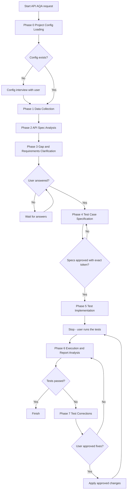
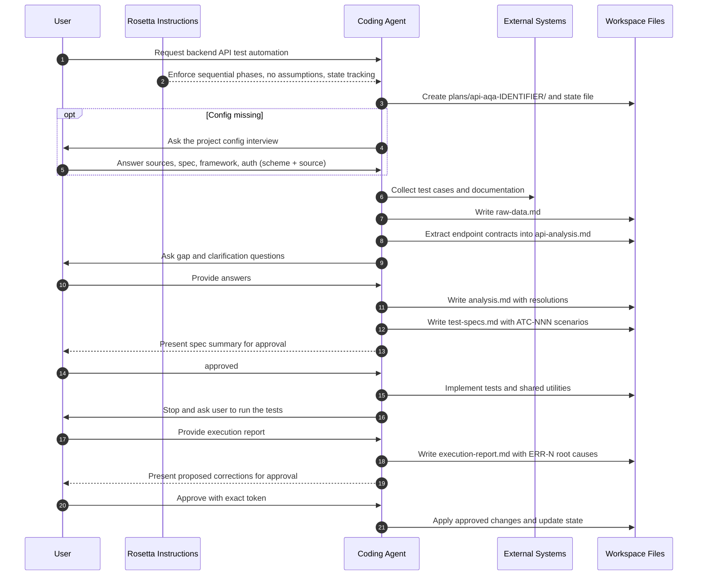

# API AQA Flow

## TL;DR

Use `api-aqa-flow` when backend API endpoints need automated test coverage grounded in real contracts. The workflow loads or creates a project config, collects test cases and documentation, extracts endpoint contracts from Swagger/OpenAPI or backend code, clarifies gaps with you, writes Given-When-Then specifications for your approval, implements them as executable tests with shared utilities, then stops so you can run the tests — and triages your results into evidence-backed corrections.

This is a strict sequential workflow (phases 0–7). Phases build on each other, `agents/TEMP/<FEATURE>/api-aqa-state.md` is updated after each phase, and the coding agent must not skip ahead. Mandatory user interaction happens in Phases 3–7; Phase 0 asks a config interview only when no project config exists yet.

## When To Use This Workflow

- Automate backend API tests from a TestRail case, Jira ticket, or a direct endpoint description.
- Recover endpoint contracts (parameters, schemas, status codes, auth, data dependencies) from a Swagger/OpenAPI spec or backend routes before test design.
- Turn raw test cases into implementation-ready Given-When-Then specs with traceable `ATC-NNN` ids.
- Build or extend shared API test infrastructure: auth helpers, data factories, response validators.
- Diagnose failing API test runs and prepare approved, root-cause-aligned fixes.

## When Not To Use This Workflow

- Do not use it for UI / end-to-end automation. Use [UI AQA Flow](/rosetta/docs/ui-aqa-flow/).
- Do not use it for manual test case authoring or TestRail export without automation. Use [Test Case Generation](/rosetta/docs/testgen-flow/).
- Do not use it for implementing product endpoints. Use [Coding](/rosetta/docs/coding-flow/).
- Do not use it when you only need an explanation of the API architecture. Use [Code Analysis](/rosetta/docs/code-analysis-flow/).

## Before You Start

Prepare the inputs this workflow explicitly depends on:

- A test case reference: TestRail ID, Jira ticket key/URL, or a direct description of the endpoints under test.
- A Swagger/OpenAPI spec URL or file path, or a backend source path with route definitions (e.g. `RefSrc/my-backend/` or `src/`).
- Access to the repository's existing API tests, helpers, and conventions.
- For first runs: answers for the config interview — document storage, spec availability and format, test-case source, test framework, auth mechanism (described as scheme + source, never literal credentials).
- If TestRail/Jira/Confluence are in scope: the corresponding MCP access.

Auth answers are redacted at intake: the config records `Bearer JWT from AuthHelper; credentials in env vars ...` style descriptions — literal tokens or passwords are never persisted.

## How To Start

Typical prompts:

```text
/api-aqa-flow Write backend API tests for TC-1234. Swagger: https://api.example.com/swagger.json
```

```text
/api-aqa-flow Automate backend tests for PROJ-123 with Swagger from RefSrc/my-backend/docs/openapi.json
```

```text
/api-aqa-flow Create API tests for the user registration endpoint (no ticket, direct description).
```

```text
/api-aqa-flow Write contract tests for the auth endpoints (login / refresh / logout). Swagger: https://api.example.com/v2/openapi.yaml; Jira: PROJ-789.
```

## How Rosetta Shapes This Workflow

Rosetta provides the instructions. The coding agent executes them.

- One phase at a time; phase-output gates verify each artifact exists before the next phase starts — notably every `ATC-NNN` spec must trace back to a Phase 3 source before implementation.
- NO ASSUMPTIONS: endpoints, payloads, auth mechanisms, and response schemas are never invented — the agent asks when a source is missing, and unresolvable items become visible gaps, not fabricated values.
- Human gates are built in: clarification answers (Phase 3), spec approval with exact tokens (Phase 4), your test execution (Phase 5→6), report handoff (Phase 6), and per-change approval (Phase 7). The execution gate is mechanical — "skip the test run" is refused.
- State-driven: `agents/TEMP/<FEATURE>/api-aqa-state.md` records phase completion, metrics, and approvals; a verification-failure override prevents falsified "already done" skips.
- Repository conventions win: existing helpers are extended rather than duplicated, and repository markdown beats skill defaults on naming, structure, and test patterns.
- Every tracked artifact passes a fail-closed sensitive-data scan before it is written (Swagger specs and test logs routinely embed real secrets).

## Workflow At A Glance

| Phase | What you provide | What the coding agent does | What you get | Mandatory workflow stop |
|---|---|---|---|---|
| 0. Project Config Loading | Test case reference; config interview answers on first run | Derives `{IDENTIFIER}`, creates `plans/api-aqa-{IDENTIFIER}/`, loads or creates the project config, seeds state | `api-aqa-project-config.md`, `initial-data.md`, state file | Config interview only if no config exists |
| 1. Data Collection | Access to TMS/docs sources per config | Collects test cases + documentation via config-resolved vendor bindings; scans existing test patterns and backend source | `plans/api-aqa-{IDENTIFIER}/raw-data.md` | None |
| 2. API Spec Analysis | Swagger URL/path or backend source | Extracts per-endpoint contracts, reconciles spec vs code, documents auth and data dependencies | `plans/api-aqa-{IDENTIFIER}/api-analysis.md` | None |
| 3. Gap & Requirements Clarification | Answers to Critical / Important / Optional questions | Cross-references cases, docs, and contracts; surfaces gaps, contradictions, ambiguities | `plans/api-aqa-{IDENTIFIER}/analysis.md` with resolutions | Mandatory user answers before Phase 4 |
| 4. Test Case Specification | Explicit approval (`approved` / `approve` / `yes`) | Writes Given-When-Then `ATC-NNN` specs with file mapping, shared utilities, execution order | `plans/api-aqa-{IDENTIFIER}/test-specs.md` | Approval gate before Phase 5 |
| 5. Test Implementation | Nothing new; then you run the tests | Implements every approved ATC + shared utilities (auth helper, data factory, validators), lint-clean, with ATC↔test traceability | Test files + hand-off summary | Mandatory user execution before Phase 6 |
| 6. Execution & Report Analysis | Test execution report or output | Triages each failure into one taxonomy category with root cause + evidence label | `plans/api-aqa-{IDENTIFIER}/execution-report.md` | Mandatory user handoff of results |
| 7. Test Corrections | Explicit approval per proposed fix | Prepares before/after proposals tied to `ERR-N` report entries; applies approved changes with lint checks | Corrected test files and re-test guidance | Explicit approval required before changes |

## Workflow Overview



## Interaction Flow



## Phases

### Phase 0: Project Config Loading

Goal:
- Initialize the session and make data retrieval, spec source, framework, and auth explicit before collection starts.

What you provide:
- The test case reference (TestRail ID, Jira key/URL, or direct description).
- On first run: interview answers (document storage, Swagger availability + format, test-case source, framework, auth mechanism).

What the agent does:
- Derives the session `{IDENTIFIER}` (Jira key → TestRail ID → kebab-case feature; never fabricated).
- Creates `plans/api-aqa-{IDENTIFIER}/`, writes `initial-data.md`, seeds `agents/TEMP/<FEATURE>/api-aqa-state.md`.
- Loads the existing per-session config or runs the interview and writes `api-aqa-project-config.md` with every required key filled or explicitly `N/A`.

What to watch for:
- Auth is recorded as scheme + source only; a pasted literal credential is redacted before the config is written.
- An incomplete config blocks Phase 1 rather than silently degrading later collection.

### Phase 1: Data Collection

Goal:
- Gather the raw evidence set: test cases, documentation, existing test patterns, backend source shape.

What you provide:
- Access to the configured sources (or confirmations when a source is out of scope).

What the agent does:
- Resolves TMS and documentation vendors from the config (never hardcoded) and collects via the `data-collection` bindings.
- Scans existing API tests for framework, HTTP client, conventions, reusable utilities; notes backend route patterns.
- Assembles `raw-data.md` (test case data, documentation, existing patterns, backend analysis, endpoints identified, summary) with every gap recorded.

What to watch for:
- A documentation source that is not configured is recorded as an explicit skipped outcome, not silently missing.
- Env-file paths and variable names are recorded — never literal values.

### Phase 2: API Spec Analysis

Goal:
- Recover authoritative endpoint contracts for every target endpoint.

What you provide:
- The spec source if it was not already configured (Swagger URL/path or backend source path).

What the agent does:
- Locates the contract source in priority order: spec URL/file → Swagger-in-source → framework route definitions.
- Extracts per endpoint: parameters, request/response schemas + status codes, auth (mechanism/scopes/public), data dependencies, source citations.
- Reconciles spec vs code when both exist and records discrepancies; writes `api-analysis.md` (read-only phase).

What to watch for:
- Every target endpoint gets a contract entry or a flagged gap — no silent drops, no invented schemas.
- Entries without source citations are gaps, not facts.

### Phase 3: Gap & Requirements Clarification

Goal:
- Resolve every unknown that would otherwise become a guessed assertion.

What you provide:
- Answers to Critical / Important / Optional questions; explicit decisions on anything you defer.

What the agent does:
- Cross-references test cases against contracts and docs; emits gaps (`G[N]`), contradictions (`C[N]`), ambiguities (`A[N]`) with verbatim quotes and impact.
- Presents prioritized questions and waits; records every answer, assumption, skip, and deferral in `analysis.md`.

What to watch for:
- A Critical question without an answer blocks the workflow (or requires your explicit approval to proceed as a flagged assumption).
- The completion invariant holds: questions = answers + assumptions + skipped + deferred.

### Phase 4: Test Case Specification

Goal:
- Produce implementation-ready Given-When-Then specifications you explicitly approve.

What you provide:
- Review of the spec summary; the exact approval token (`approved` / `approve` / `yes`) — anything else is treated as review feedback.

What the agent does:
- Generates scenario coverage per case (happy path, validation/negative, auth, resource, edge) with exact request values and response assertions.
- Writes `test-specs.md`: `ATC-NNN` entries (each traceable to a Phase 3 source), test file mapping, shared utilities, execution order, assumptions.

What to watch for:
- Untraceable or unmappable cases land in an explicit excluded section — never silently dropped.
- Partial approval drops the rejected scenarios; repeated rejection cycles re-open Phase 3 instead of looping forever.

### Phase 5: Test Implementation

Goal:
- Implement every approved ATC as executable, lint-clean tests with shared utilities, then hand execution to you.

What you provide:
- Nothing new until the stop: then you run the provided command and return real results.

What the agent does:
- Implements tests and shared utilities (auth helper, data factory, response validators), preferring to extend existing helpers.
- Keeps ATC↔test traceability (every test function carries its `ATC-NNN`), synthetic data only, no hardcoded credentials.
- Emits a hand-off summary (files, ATC mapping, assumptions, gaps, lint status, waivers, ready-for-test) and stops.

What to watch for:
- Unimplementable ATCs are surfaced as gaps with reasons — no silent drops.
- The execution gate is mechanical: only actual execution results advance the workflow.

### Phase 6: Execution & Report Analysis

Goal:
- Turn your run results into categorized failures with evidence-backed root causes and recommendations.

What you provide:
- The execution report or output (or its location under `agents/user-instructions/`).

What the agent does:
- Categorizes each failure into exactly one API taxonomy category (connection/environment, authentication, request, response assertion, test data, timing/race, application bug, unknown).
- Assigns each root cause an evidence label (`Confirmed` / `Assumption` / `Unknown`) with a one-line citation; identifies cross-failure patterns.
- Writes `execution-report.md` with sequential `ERR-N` entries, failures-by-category, and recommendations (read-only phase).

What to watch for:
- No fabricated pass/fail counts — inconsistent inputs are called out and re-requested.
- Application bugs are distinguished from test defects before anything is "fixed".

### Phase 7: Test Corrections

Goal:
- Apply root-cause-aligned fixes to the tests, one approved change at a time.

What you provide:
- Exact approval tokens per change or named batch; partial approval applies only the named items.

What the agent does:
- Prepares one proposed change per fix (before/after code, `ERR-N` reference, change type, impact, risk) — preparation writes nothing.
- Applies approved changes incrementally with lint checks after each; reverts and re-presents on lint failure.
- Caps retries at 3 cycles per failing change, then escalates; returns to Phase 6 if tests still fail after corrections.

What to watch for:
- Only test and shared test-utility files are in scope — application source is never modified.
- A change that cannot be aligned to a confirmed root cause is not proposed; the workflow goes back to analysis instead.

## How To Review Results

- After Phase 0, verify the config reflects your real sources, framework, and auth strategy (scheme + source only).
- After Phase 1, verify the right cases/pages were captured and skipped sources are explicitly recorded.
- After Phase 2, spot-check contract entries against the spec: citations present, discrepancies recorded, no invented status codes.
- After Phase 3, answer Criticals for real — assumptions you approve here become test behavior.
- After Phase 4, review the spec summary and approve with an exact token; check auth/negative coverage exists for protected endpoints.
- After Phase 5, run the tests yourself and return the actual output.
- After Phase 6, check every failure has a category, root cause, and evidence label.
- After Phase 7, re-run and confirm; the workflow loops corrections through analysis, never blind re-fixes.

## Workflow-Specific Customization

- Reuse the per-session `api-aqa-project-config.md` — parallel sessions never share one config file, so keep a known-good one to copy from.
- Keep the Swagger/OpenAPI spec accurate; spec-vs-code discrepancies are surfaced but a maintained spec removes whole classes of questions.
- Standardize auth for tests (helper + env var names) so Phase 5 extends your helper instead of inventing one.
- Team conventions for test layout and naming live in repository docs — they win over defaults and are read in Phase 1.

## Artifacts You Will Get

Per session, under `plans/api-aqa-{IDENTIFIER}/`:

- `api-aqa-project-config.md` — sources, spec, framework, auth strategy (redacted).
- `initial-data.md` — the starting prompt and references.
- `raw-data.md` — test cases, documentation, existing patterns, endpoints identified.
- `api-analysis.md` — per-endpoint contracts with citations and discrepancies.
- `analysis.md` — gaps/contradictions/ambiguities with your answers and resolutions.
- `test-specs.md` — approved `ATC-NNN` Given-When-Then specs, file mapping, utilities, execution order.
- `execution-report.md` — categorized failures with `ERR-N` root causes and recommendations.

Plus: `agents/TEMP/<FEATURE>/api-aqa-state.md` (phase status, metrics, approvals) and the implemented test files + shared utilities.

## Common Mistakes

- Starting without any spec or backend source and expecting real contracts — the workflow stops rather than fabricates.
- Pasting literal tokens/passwords into the config interview (they are redacted, but describe scheme + source instead).
- Leaving Critical questions unanswered and expecting Phase 4 to guess.
- Typing "looks good" at the spec gate — only exact tokens advance the workflow.
- Asking the agent to run the tests — execution is deliberately yours.
- Approving all corrections in bulk without checking which failures are application bugs.
- Re-running the flow with a different `{IDENTIFIER}` for the same work — artifacts land in a new session folder.

## Source Files

Authoritative source workflow and phases:

- [api-aqa-flow.md](https://github.com/griddynamics/rosetta/blob/main/instructions/r3/core/workflows/api-aqa-flow.md)
- [api-aqa-flow-project-config-loading.md](https://github.com/griddynamics/rosetta/blob/main/instructions/r3/core/workflows/api-aqa-flow-project-config-loading.md)
- [api-aqa-flow-data-collection.md](https://github.com/griddynamics/rosetta/blob/main/instructions/r3/core/workflows/api-aqa-flow-data-collection.md)
- [api-aqa-flow-api-spec-analysis.md](https://github.com/griddynamics/rosetta/blob/main/instructions/r3/core/workflows/api-aqa-flow-api-spec-analysis.md)
- [api-aqa-flow-gap-and-requirements-clarification.md](https://github.com/griddynamics/rosetta/blob/main/instructions/r3/core/workflows/api-aqa-flow-gap-and-requirements-clarification.md)
- [api-aqa-flow-test-case-specification.md](https://github.com/griddynamics/rosetta/blob/main/instructions/r3/core/workflows/api-aqa-flow-test-case-specification.md)
- [api-aqa-flow-test-implementation.md](https://github.com/griddynamics/rosetta/blob/main/instructions/r3/core/workflows/api-aqa-flow-test-implementation.md)
- [api-aqa-flow-execution-and-report-analysis.md](https://github.com/griddynamics/rosetta/blob/main/instructions/r3/core/workflows/api-aqa-flow-execution-and-report-analysis.md)
- [api-aqa-flow-test-correction.md](https://github.com/griddynamics/rosetta/blob/main/instructions/r3/core/workflows/api-aqa-flow-test-correction.md)

Shared skills: [qa-knowledge](https://github.com/griddynamics/rosetta/tree/main/instructions/r3/core/skills/qa-knowledge), [qa-structure](https://github.com/griddynamics/rosetta/tree/main/instructions/r3/core/skills/qa-structure), [data-collection](https://github.com/griddynamics/rosetta/tree/main/instructions/r3/core/skills/data-collection)
