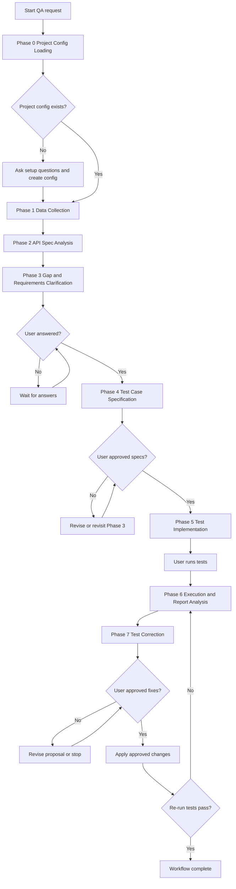
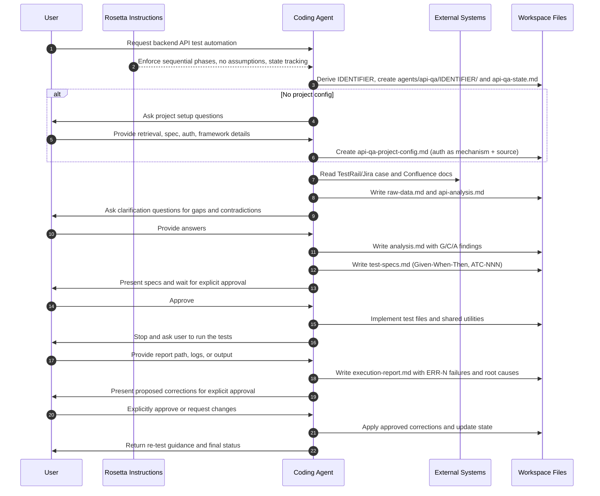

# API-QA Flow (r3)

> This page describes the **r3** instruction line of the API-QA workflow --
> backend API test automation (renamed from `qa-flow`). For UI test
> automation use [UI-QA Flow](/rosetta/docs/ui-qa-flow-r3/); for manual test-case
> authoring use [Test Case Generation](/rosetta/docs/testgen-flow-r3/).

## TL;DR

Use API-QA Flow when a TestRail or Jira test case needs to become a working, automated **backend API** test grounded in the real endpoint contracts. The workflow loads project config, collects the test case and existing test patterns, analyzes the API spec, clarifies gaps with you, writes Given-When-Then specifications, implements the tests with shared utilities, then stops so you can run them and return the results for failure analysis and corrections.

This is a strict sequential workflow. Phases build on each other, `agents/api-qa-state.md` is updated after each phase, and the coding agent must not skip ahead. Mandatory user interaction happens in Phase 3, Phase 4, Phase 5, Phase 6, and Phase 7. Phase 0 asks setup questions only when no project config exists yet.

## When To Use This Workflow

- Automate a TestRail or Jira test case against a backend API.
- Turn endpoint test cases into executable tests grounded in Swagger/OpenAPI or backend source.
- Add or update API automation while reusing existing test framework, HTTP client, auth helpers, and data factories.
- Diagnose failing API test output and prepare grounded fixes.

## When Not To Use This Workflow

- Do not use it for UI or end-to-end browser automation. Use [UI-QA Flow](/rosetta/docs/ui-qa-flow-r3/).
- Do not use it for manual test case authoring or TestRail publishing. Use [Test Case Generation](/rosetta/docs/testgen-flow-r3/).
- Do not use it for backend feature implementation. Use [Coding](/rosetta/docs/coding-flow/).
- Do not use it when you only need to understand the API architecture. Use [Code Analysis](/rosetta/docs/code-analysis-flow/).

## Before You Start

Prepare the inputs this workflow explicitly depends on:

- A TestRail case ID, a Jira ticket, or a precise description of the API behavior under test.
- Access to the API specification -- a Swagger/OpenAPI URL, or backend source where routes are defined.
- Access to the target repository test code (existing API tests, HTTP client, auth helpers, data factories, assertion conventions).
- Confluence page URLs or search terms when documentation beyond the ticket is relevant.
- `agents/api-qa/api-qa-project-config.md` if it already exists; otherwise expect Phase 0 to create it.
- Any files under `agents/user-instructions/` that define test creation rules, execution-report locations, or team conventions.

You also get better results when the project already has strong shared Rosetta context. Keep shared setup in [Usage Guide](/rosetta/docs/usage-guide/#customization), especially `docs/CONTEXT.md`, `docs/ARCHITECTURE.md`, and `docs/TECHSTACK.md`.

## How To Start

Typical prompts:

```text
Automate TestRail case C12345 for the order-lookup API.
```

```text
Create API tests for PROJ-321 using the Swagger at https://api.company.com/openapi.json
```

```text
Analyze this failing API test report for the checkout endpoints and prepare corrections.
```

```text
Extend our existing API test suite with the new authentication scenarios from PROJ-654.
```

## How Rosetta Shapes This Workflow

Rosetta provides the instructions. The coding agent executes them. Rosetta itself does not read your source code or test data.

For this workflow, the always-active Rosetta behavior changes the user experience in these ways:

- The coding agent is expected to work one phase at a time. It should not compress phases into one jump.
- If required inputs are missing, the agent must ask instead of guessing endpoints, payloads, auth mechanisms, or response schemas.
- Human review is built into the workflow, not added later. The agent must stop for clarification answers, spec approval, test execution, report handoff, and approval before corrections.
- The workflow is state-driven. After each phase, the agent updates `agents/api-qa-state.md` so the work can resume cleanly after interruptions.
- Existing project architecture wins over convenience. The agent inspects existing tests, utilities, and coding standards before writing new automation, and repository docs win over skill defaults.
- Public artifacts are redacted before they are written. The project config and every per-session artifact pass a redaction pre-emit gate so tokens and credentials are not persisted into the workspace -- auth is recorded as a mechanism plus source, never as a literal value.

## Workflow At A Glance

Artifacts live under the session directory `agents/api-qa/{IDENTIFIER}/`, where `{IDENTIFIER}` is derived from the Jira key, the TestRail case ID, or a kebab-case feature slug (first available wins; never fabricated).

| Phase | What you provide | What the coding agent does | What you get | Mandatory workflow stop |
|---|---|---|---|---|
| 0. Project Config Loading | Test case reference; project retrieval details if no config exists | Derives `{IDENTIFIER}`, creates the session directory, loads or creates the project config (redacted), records initial state | `agents/api-qa-state.md`, `initial-data.md`, project-wide `agents/api-qa/api-qa-project-config.md` if missing | Setup questions only when the config is missing |
| 1. Data Collection | TestRail/Jira reference, documentation pointers | Resolves the configured vendors, pulls the test case, searches documentation, scans existing API test patterns | `raw-data.md` | None |
| 2. API Spec Analysis | Swagger/OpenAPI URL or backend source if not in config | Extracts endpoint contracts, auth requirements, and data dependencies; reconciles spec against code | `api-analysis.md` | None |
| 3. Gap & Requirements Clarification | Answers to clarification questions | Cross-references sources into `G[N]`/`C[N]`/`A[N]` findings and prioritized questions, then waits | `analysis.md` | Mandatory user answers before Phase 4 |
| 4. Test Case Specification | Explicit approval of the specs | Writes Given-When-Then scenarios (`ATC-NNN`) traced to their sources | `test-specs.md` | Mandatory explicit approval before Phase 5 |
| 5. Test Implementation | Execution of the tests | Implements tests and shared utilities (auth, data factories, response validation), lint-clean, then hands off the run command | Test files + shared utilities | Mandatory user execution before Phase 6 |
| 6. Execution & Report Analysis | Test report, logs, or output | Triages failures, categorizes root causes (`ERR-N` ids + evidence labels), recommends fixes | `execution-report.md` | Mandatory user handoff of execution results |
| 7. Test Correction | Explicit approval for proposed fixes | Proposes fixes aligned to root causes, applies approved changes incrementally with lint checks | Corrected test files | Explicit approval required before changes |

Recommended review still matters throughout the workflow, but those checks are advisory checkpoints, not extra mandatory stops.

## Workflow Overview



## Interaction Flow



## Phases

### Phase 0: Project Config Loading

Goal:
- Initialize the session directory and make the project's retrieval, spec, and auth setup explicit before data collection starts.

What you provide:
- A test case reference: TestRail case ID, Jira ticket, or a direct description.
- If no project config exists, the project-specific retrieval process, spec location, test framework, and auth mechanism.

What the coding agent does:
- Derives `{IDENTIFIER}` (Jira key → TestRail ID → kebab-case feature slug; first available wins, never fabricated).
- Creates `agents/api-qa/{IDENTIFIER}/` and seeds `agents/api-qa-state.md`.
- Loads the project-wide `agents/api-qa/api-qa-project-config.md`, or -- when it is missing -- interviews you for the required setup and creates it.
- Redacts the config before writing it: auth is recorded as a mechanism plus source (for example `Bearer JWT from AuthHelper.get_token('admin')`), never as a literal credential. This gate is fail-closed.
- Writes `initial-data.md`.

Artifacts:
- `agents/api-qa/{IDENTIFIER}/` session directory
- `agents/api-qa/api-qa-project-config.md` (project-wide, created only if missing)
- `agents/api-qa/{IDENTIFIER}/initial-data.md`
- `agents/api-qa-state.md`

Recommended review:
- The project config should capture how your team really retrieves cases, specs, and docs -- not just defaults.
- Confirm no literal credential was persisted (auth should read as a mechanism plus source).

### Phase 1: Data Collection

Goal:
- Gather the test case, documentation, and existing test patterns that ground every later phase.

What you provide:
- Usually nothing beyond Phase 0, unless documentation search needs page URLs or permission workarounds.

What the coding agent does:
- Resolves the configured test-management vendor (TestRail or Jira) from the project config; if none resolves, it asks once rather than guessing.
- Pulls the test case data and resolves the API endpoints it targets.
- Scans the existing test framework, HTTP client, auth and assertion patterns, and reusable utilities (read-only; it records env-file paths and variable names, never literal values).
- Runs the optional documentation MCP (for example Confluence) when the config scopes one, and records the outcome explicitly.
- Assembles `raw-data.md`.

Artifacts:
- `agents/api-qa/{IDENTIFIER}/raw-data.md`
- Updated `agents/api-qa-state.md`

Recommended review:
- Confirm the right test case and documentation sources were used.
- Confirm the existing-pattern scan found the real framework and utilities to reuse.

### Phase 2: API Spec Analysis

Goal:
- Extract endpoint contracts, auth requirements, and data dependencies before any specification work.

What you provide:
- A Swagger/OpenAPI URL or backend source path if the config does not already point to one.

What the coding agent does:
- Determines the spec source in priority order: Swagger URL from config, Swagger in backend source, then API route definitions in code.
- Extracts per-endpoint request/response schemas, auth requirements, status codes, and data dependencies.
- Reconciles the spec against the code when both are available, flagging discrepancies.
- Cites a Swagger JSONPath or a code `file:line` for every entry -- uncited entries are treated as gaps, not facts.
- Writes `api-analysis.md` after passing the redaction pre-emit gate.

Artifacts:
- `agents/api-qa/{IDENTIFIER}/api-analysis.md`
- Updated `agents/api-qa-state.md`

Recommended review:
- Every endpoint under test should have a contract entry or an explicit gap with a reason.
- Auth details and data dependencies should be concrete enough to drive test setup.

### Phase 3: Gap & Requirements Clarification

Goal:
- Surface every gap, contradiction, and ambiguity across the sources and resolve the unknowns with you before specifications are written.

What you provide:
- Answers to the prioritized clarification questions.

What the coding agent does:
- Cross-references the test cases, documentation, and API analysis into stable findings: gaps (`G[N]`), contradictions (`C[N]`), and ambiguities (`A[N]`), each with a source quote, citation, and impact.
- Presents questions grouped by priority (Critical / Important / Optional).
- Stops and waits for your answers; a Critical unknown is held as a blocking item rather than silently assumed.
- Records answers and remaining assumptions in `analysis.md`.

Artifacts:
- `agents/api-qa/{IDENTIFIER}/analysis.md`
- Updated `agents/api-qa-state.md`

Recommended review:
- Findings must point to real evidence, not invented concerns.
- Answer every Critical question; unresolved criticals should block, not slip through as silent defaults.

### Phase 4: Test Case Specification

Goal:
- Convert resolved test cases into implementation-ready API specifications and get your approval before any code is written.

What you provide:
- Explicit approval of the specifications.

What the coding agent does:
- Loads the Phase 1–3 outputs and writes Given-When-Then scenarios with stable `ATC-NNN` identifiers.
- Traces every `ATC-NNN` back to a Phase 1 test case (`TC-NNN`) and/or a Phase 3 finding (`G[N]`/`C[N]`/`A[N]`) -- an untraceable scenario fails validation.
- Adds a test-file mapping, shared-utility plan, execution order, and assumptions.
- Presents a summary and waits for approval. Approval is token-disciplined: only a clear approve/yes advances it; a rejection sends the work back to Phase 3.
- Writes `test-specs.md` after the redaction pre-emit gate.

Artifacts:
- `agents/api-qa/{IDENTIFIER}/test-specs.md`
- Updated `agents/api-qa-state.md`

Recommended review:
- Scenarios should cover all in-scope endpoints and the resolved gaps, not only happy paths.
- Spot-check the `ATC-NNN` traceability -- every spec should map back to a real source.

### Phase 5: Test Implementation

Goal:
- Implement the approved specifications as executable, lint-clean API tests with shared utilities, then hand execution to you.

What you provide:
- Usually no new input beyond approved specs.
- Later in the phase, you must execute the tests yourself.

What the coding agent does:
- Confirms the specs are approved, then reads the repository coding standards as the authority (repo docs win over skill defaults).
- Implements the tests plus shared utilities -- auth helper, data factory, response validator -- preferring to extend what already exists.
- Carries each `ATC-NNN` into the test name or docstring; any spec it cannot implement is surfaced as a gap, never silently dropped.
- Uses synthetic data and config/env for runtime values -- no hardcoded credentials, URLs, or production data.
- Runs the project lint/format on the touched files and resolves issues.
- Provides the exact test-execution command and stops. This execution gate is mechanical: the agent refuses "skip" or "move on" requests, and the only input that advances it is actual execution results.

Artifacts:
- New or modified test files and shared utilities
- Updated `agents/api-qa-state.md`

Recommended review:
- Every approved `ATC-NNN` should map to an implemented test or an explicit gap.
- Tests should reuse existing utilities and conventions instead of introducing parallel ones.
- The execution command should be clear enough to run without guesswork.

### Phase 6: Execution & Report Analysis

Goal:
- Turn the execution results you provide into categorized failures and grounded root-cause analysis.

What you provide:
- The test report, console logs, or other execution output if the location is not already defined in `agents/user-instructions/`.

What the coding agent does:
- Locates and parses the report (asking you for it if needed).
- Categorizes each failure per the QA failure taxonomy and assigns a stable `ERR-N` id.
- Labels each root cause `Confirmed`, `Assumption`, or `Unknown` with a one-line rationale, so corrections stay grounded.
- Records patterns and recommended actions.
- Writes `execution-report.md` after the redaction pre-emit gate.

This phase is read-only: it parses, categorizes, and recommends, but makes no code edits. The agent refuses "just fix it now" or "patch and move on" requests, citing that scope.

Artifacts:
- `agents/api-qa/{IDENTIFIER}/execution-report.md`
- Updated `agents/api-qa-state.md`

Recommended review:
- Root causes should be evidence-based -- check the `Confirmed`/`Assumption`/`Unknown` labels.
- Distinguish test bugs from application bugs before approving corrections.

### Phase 7: Test Correction

Goal:
- Prepare and apply only approved fixes to the failing API tests.

What you provide:
- Explicit approval for the proposed changes, or feedback modifying or rejecting parts of them.

What the coding agent does:
- Builds proposed changes from the Phase 6 report, each aligned to a confirmed root cause (`ERR-N`) and tagged with a change-type (assertion-fix, auth-fix, data-setup, request-shape, wait-strategy, or other) -- no writes yet.
- Presents the proposals with before/after code and waits for token-disciplined approval; a rejection sends the work back to Phase 6.
- Applies approved changes incrementally, running lint after each; a change that breaks lint is reverted and re-presented, never left broken.
- Retries a failing change in place up to three cycles, then escalates rather than looping silently.
- Records issues fixed, files modified, and the approval token in state, and gives you re-test guidance.

Artifacts:
- Corrected test or shared-utility files
- Updated `agents/api-qa-state.md`

Recommended review:
- The applied changes must match the approved proposal.
- Fixes should address root causes without changing test intent.
- If a failure is an application defect, the workflow should surface that instead of masking it with test changes.

## How To Review Results

Review each handoff like a QA and test-automation lead, not like a passive approver. These are recommended review checkpoints, not additional mandatory workflow stops beyond the ones listed in the summary table.

- After Phase 0, verify the project config reflects your real setup and that no literal credential was persisted.
- After Phase 1, verify the right test case, documentation, and existing test patterns were captured.
- After Phase 2, verify each endpoint under test has a cited contract entry or an explicit gap.
- After Phase 3, verify findings are evidence-based and answer every Critical question.
- After Phase 4, verify the specs cover the scope and that `ATC-NNN` traceability is honest before you approve.
- After Phase 5, verify the tests reuse existing utilities and cover the approved specs before you run them.
- After Phase 6, verify the failure analysis separates test bugs from application bugs and that evidence labels are honest.
- After Phase 7, verify the proposed fix list before approving and verify the applied changes after approval.

If a clarification batch, spec, or correction proposal is vague, stop the workflow and ask for a more explicit version. This workflow is only reliable when the review loop is used seriously.

## Workflow-Specific Customization

These customizations materially improve API-QA Flow:

- Keep `agents/api-qa/api-qa-project-config.md` accurate. It is the single source for retrieval, spec location, test framework, and auth mechanism -- and it is reused across every ticket.
- Point the config at the real spec source (a Swagger/OpenAPI URL or the backend routes) so Phase 2 extracts contracts instead of guessing.
- Use `agents/user-instructions/` for team-specific test creation rules, execution-report locations, and conventions.
- Keep existing test utilities -- auth helpers, data factories, response validators -- clean and current. This workflow is designed to extend them, not bypass them.
- Record auth as a mechanism plus source in the config; never paste literal tokens or passwords.

## Artifacts You Will Get

Common artifacts from this workflow:

- `agents/api-qa-state.md`
- `agents/api-qa/api-qa-project-config.md` (project-wide; created or updated in Phase 0)
- `agents/api-qa/{IDENTIFIER}/initial-data.md` (Phase 0)
- `agents/api-qa/{IDENTIFIER}/raw-data.md` (Phase 1)
- `agents/api-qa/{IDENTIFIER}/api-analysis.md` (Phase 2)
- `agents/api-qa/{IDENTIFIER}/analysis.md` (Phase 3)
- `agents/api-qa/{IDENTIFIER}/test-specs.md` (Phase 4)
- `agents/api-qa/{IDENTIFIER}/execution-report.md` (Phase 6)
- New or modified test files and shared utilities (Phases 5 and 7)

Common artifact content:

- test case capture from TestRail/Jira plus documentation
- endpoint contracts, auth requirements, and data dependencies
- gap/contradiction/ambiguity findings (`G[N]`/`C[N]`/`A[N]`)
- Given-When-Then specifications (`ATC-NNN`) traced to their sources
- failure categorization with `ERR-N` ids, evidence labels, and root-cause analysis
- proposed corrections and approval record

## Common Mistakes

- Starting without a real test case source or a reachable API spec.
- Letting Phase 3 stay vague and then expecting correct specifications later.
- Skipping `agents/user-instructions/` even though it may define report locations or team-specific rules.
- Guessing endpoints, payloads, or auth instead of grounding them in the spec or backend source.
- Writing tests that ignore existing utilities and conventions because it feels faster.
- Approving corrections before checking whether the failure is a real product bug.
- Treating user comments as approval in Phase 4 or Phase 7. This workflow requires explicit, token-disciplined approval.
- Forgetting that Phase 5 stops until you run the tests and return results.

## Source Files

Authoritative source workflow and phases:

- [api-qa-flow.md](https://github.com/griddynamics/rosetta/blob/main/instructions/r3/core/workflows/api-qa-flow.md)
- [api-qa-flow-project-config-loading.md](https://github.com/griddynamics/rosetta/blob/main/instructions/r3/core/workflows/api-qa-flow-project-config-loading.md)
- [api-qa-flow-data-collection.md](https://github.com/griddynamics/rosetta/blob/main/instructions/r3/core/workflows/api-qa-flow-data-collection.md)
- [api-qa-flow-api-spec-analysis.md](https://github.com/griddynamics/rosetta/blob/main/instructions/r3/core/workflows/api-qa-flow-api-spec-analysis.md)
- [api-qa-flow-gap-and-requirements-clarification.md](https://github.com/griddynamics/rosetta/blob/main/instructions/r3/core/workflows/api-qa-flow-gap-and-requirements-clarification.md)
- [api-qa-flow-test-case-specification.md](https://github.com/griddynamics/rosetta/blob/main/instructions/r3/core/workflows/api-qa-flow-test-case-specification.md)
- [api-qa-flow-test-implementation.md](https://github.com/griddynamics/rosetta/blob/main/instructions/r3/core/workflows/api-qa-flow-test-implementation.md)
- [api-qa-flow-execution-and-report-analysis.md](https://github.com/griddynamics/rosetta/blob/main/instructions/r3/core/workflows/api-qa-flow-execution-and-report-analysis.md)
- [api-qa-flow-test-correction.md](https://github.com/griddynamics/rosetta/blob/main/instructions/r3/core/workflows/api-qa-flow-test-correction.md)
