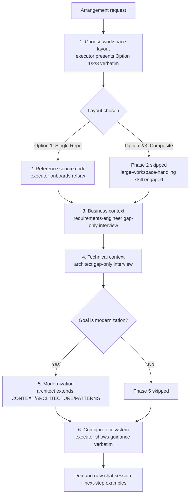
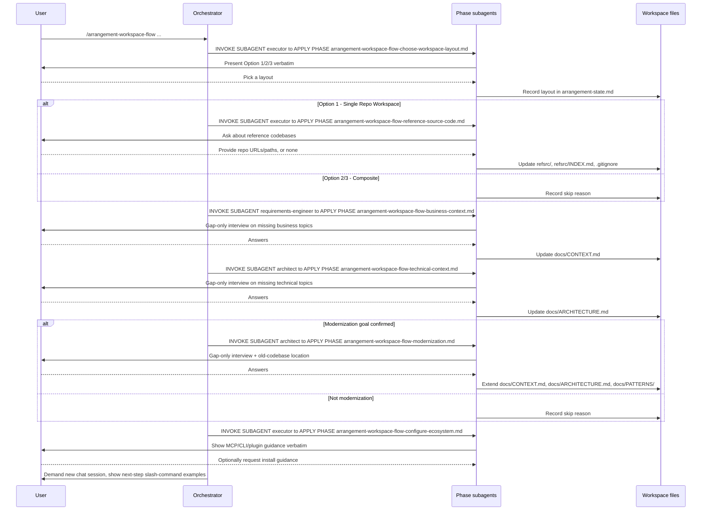

# Arrangement Workspace Flow

## Availability

OSS

## TL;DR

- Use this workflow to arrange an already-initialized workspace: pick a layout, onboard reference code, close context gaps, confirm modernization, and point to ecosystem tooling.
- It assumes Rosetta setup is done. It does not generate shells, run discovery, or extract patterns — that is [Init Workspace Flow](/rosetta/docs/init-workspace-flow/)'s job.
- Six phases, each dispatched to a mandatory subagent: `executor` (layout, reference code, ecosystem) and `requirements-engineer`/`architect` (business context, technical context, modernization).
- Phases 2 and 5 are conditional: reference source code only applies to Single Repo Workspace layout, modernization only applies when the project goal is modernization.
- Context interviews are gap-only — the workflow compares `docs/CONTEXT.md`/`docs/ARCHITECTURE.md` against required topics and asks only about what is missing or partial.
- Every decision is tracked in `arrangement-state.md`.

## When To Use This Workflow

- Decide between a single-repo or composite (submodules or gitignore) workspace layout for multi-repo work.
- Bring in reference codebases the agent needs to read but must not write to (a backend for a frontend repo, a corporate library, a peer service).
- Close known gaps in `docs/CONTEXT.md` or `docs/ARCHITECTURE.md` against a fixed set of required topics.
- Confirm a modernization goal and capture the target pattern and old-to-new mapping.
- Get MCP, CLI, and plugin recommendations, and optionally get guided through installing one.

## When Not To Use This Workflow

- Do not use it to initialize a fresh repository, generate shells, run discovery, or extract patterns. Use [Init Workspace Flow](/rosetta/docs/init-workspace-flow/).
- Do not use it for feature implementation, bug fixes, or refactoring. Use the [Coding Flow](/rosetta/docs/coding-flow/).
- Do not use it to onboard an external library as reusable reference material with a compressed learning flow. Use the [External Library Flow](/rosetta/docs/external-lib-flow/).
- Do not use it to run the actual migration work after a modernization goal is confirmed. Use the [Modernization Flow](/rosetta/docs/modernization-flow/).

## Before You Start

- Know whether your project needs a single writable repository with read-only reference code, or a composite workspace spanning multiple repositories.
- Be ready to answer gap-only questions about business context (goal, stakeholders, issue tracker, DoD) and technical context (how to run/build/test, dependencies, auth, CI/CD).
- Decide up front whether the project's goal is modernization — the workflow only runs that phase when you confirm it.
- Have repo URLs or local paths ready for any reference codebases or an old codebase you want cloned read-only into `refsrc/`.
- Do not expect installs to happen automatically. The ecosystem phase only shows guidance; you decide what to install and the agent guides you, it does not install anything itself.

For shared setup and installation details, use the [Usage Guide](/rosetta/docs/usage-guide/) and [Overview](/rosetta/docs/overview/).

## How To Start

```text
/arrangement-workspace-flow Arrange this workspace, I have reference code in another repo
```

```text
/arrangement-workspace-flow Close the gaps in CONTEXT.md and ARCHITECTURE.md
```

```text
/arrangement-workspace-flow This is a modernization project, help me set it up
```

## How Rosetta Shapes This Workflow

Rosetta provides the instructions for this workflow. The coding agent acts on those instructions. Rosetta itself does not see user requests, code, or project data.

In practice, that changes the user experience in four ways:

- The orchestrator never reads or executes a phase file itself. Each phase is dispatched with the literal contract `INVOKE SUBAGENT <name>` to `APPLY PHASE <file>.md`, and every declared subagent is mandatory — if one is unavailable, the workflow stops and reports the unmet prerequisite instead of running the phase inline.
- Layout and reference-source guidance is shown to you verbatim, not summarized. The same applies to the ecosystem recommendations in Phase 6.
- Context interviews are gap-only. Earlier phases (or an earlier Init Workspace run) that already covered a topic are not re-asked.
- The flow is state-driven. Every phase reads and updates `arrangement-state.md` before the next phase starts, and it ends by demanding a new chat session.

## Workflow At A Glance

| Phase | Subagent | Applies | What happens | Main gate or result |
|---|---|---|---|---|
| 1. Choose workspace layout | `executor` | All | Show Single Repo / Composite+Submodules / Composite+gitignore verbatim; guide the chosen option's setup actions | Layout recorded in `arrangement-state.md`; Option 2/3 requires the `large-workspace-handling` skill |
| 2. Reference source code | `executor` | Single Repo Workspace only | Identify and validate existing `refsrc/` entries; ask for and onboard additional read-only reference code | `refsrc/`, `refsrc/INDEX.md`, `.gitignore` updated, or explicit skip reason |
| 3. Business context | `requirements-engineer` | All | Gap-only interview against required business topics | `docs/CONTEXT.md` closed to those topics, ≤100 lines |
| 4. Technical context | `architect` | All | Gap-only interview against required technical topics | `docs/ARCHITECTURE.md` closed to those topics, ≤100 lines |
| 5. Modernization | `architect` | Only if the goal is modernization | Confirm goal, gap-only interview on context/architecture/pattern topics, capture old-code location | Extended `docs/CONTEXT.md`/`docs/ARCHITECTURE.md`/`docs/PATTERNS/`, or explicit skip reason |
| 6. Configure ecosystem | `executor` | All | Show MCP/CLI/plugin guidance verbatim; guide install only on request | Guidance shown; any install noted in `docs/CONTEXT.md`, never installed by the agent |

## Workflow Overview



## Interaction Flow



## Phases

### 1. Choose Workspace Layout

Goal: help you pick the workspace shape before anything else gets set up, since it determines whether Phase 2 applies.

- Required user input: a choice between Single Repo Workspace, Composite Workspace with Submodules, or Composite Workspace with gitignore. If the repo already shows evidence of a chosen layout (existing submodules, existing `refsrc/`), the agent confirms it instead of re-asking.
- Agent actions: an `executor` shows all three layout options and their setup actions verbatim, then guides the chosen option's setup actions. Option 2 or 3 requires the `large-workspace-handling` skill.
- Produced result: the chosen layout applied, and its name recorded in `arrangement-state.md`.
- Review expectation: confirm the layout options were shown unabridged and the setup actions for your choice actually ran.
- What to watch: cloning into `refsrc/` here — that happens in Phase 2, not this one.

### 2. Reference Source Code

Applies to: Single Repo Workspace (Option 1) only. Composite layouts skip this phase with a recorded skip reason.

- Required user input: repo URL or local path for each reference codebase, or confirmation that none is needed.
- Agent actions: an `executor` checks `docs/ARCHITECTURE.md`/`docs/CONTEXT.md` and existing `refsrc/*` folders for prior reference code, validates the `.gitignore` exceptions (`agents/TEMP/`, `refsrc/`, `!refsrc/INDEX.md`) and `refsrc/INDEX.md` entries, then asks whether more reference code should be onboarded.
- Produced result: updated `refsrc/`, `refsrc/INDEX.md`, and `.gitignore`, or an explicit no-op reason when there is nothing to onboard.
- Review expectation: every `refsrc/*` folder has a matching `refsrc/INDEX.md` entry and vice versa.
- What to watch: treating composite-workspace sibling submodules or folders as `refsrc/` candidates, or writing into a `refsrc/` folder instead of the writable workspace.

### 3. Business Context

Goal: close `docs/CONTEXT.md` gaps against a fixed set of required business topics — goal, ecosystem fit, source/target of the work, issue tracker, ticket-to-shipped flow, stakeholders, business rules, compliance, SDLC/DoD, and documentation access.

- Required user input: answers to a gap-only interview, one question at a time, with recommended and alternative enterprise-ready answers offered for each.
- Agent actions: a `requirements-engineer` compares existing `docs/CONTEXT.md` against the required topics, interviews only on what is missing or partial, then updates the file.
- Produced result: `docs/CONTEXT.md` closed against the required topics, staying bulleted, non-technical, and ≤100 lines (or an index to per-feature `<FEATURE>-CONTEXT.md` files if it would exceed that).
- Review expectation: topics already covered are not re-interviewed; the file stays free of technical detail.
- What to watch: editing `docs/CONTEXT.md` before gap coverage is complete, or letting technical details leak into it.

### 4. Technical Context

Goal: close `docs/ARCHITECTURE.md` gaps against a fixed set of required technical topics — local run instructions, integration/e2e test locations, AI agentic harnesses, external/private library dependencies, technical targets, known gaps, service dependencies, auth/routing, deployment infrastructure, CI/CD, recommended tooling, and coding/style standards.

- Required user input: answers to a gap-only interview, one question at a time, with recommended and alternative enterprise-ready answers offered for each.
- Agent actions: an `architect` compares existing `docs/ARCHITECTURE.md` against the required topics, interviews only on what is missing or partial, then updates the file.
- Produced result: `docs/ARCHITECTURE.md` closed against the required topics, staying bulleted, engineering-only, and ≤100 lines (or an index to per-feature `<FEATURE>-ARCHITECTURE.md` files if it would exceed that).
- Review expectation: topics already covered are not re-interviewed; the file stays free of business detail and does not turn into a changelog or requirements dump.
- What to watch: editing `docs/ARCHITECTURE.md` before gap coverage is complete, or inventing hand-off contracts the phase doesn't need.

### 5. Modernization

Applies to: projects whose goal is modernization, confirmed by you. Otherwise this phase is skipped with a recorded reason.

- Required user input: confirmation that the goal is modernization, gap-only answers on modernization goals/process, target pattern and limits, what stays/changes, deployment approach, and the old-to-new mapping for every pattern in `docs/PATTERNS/INDEX.md`, plus the old codebase's repo URL or path.
- Agent actions: an `architect` compares existing `docs/CONTEXT.md`, `docs/ARCHITECTURE.md`, and `docs/PATTERNS/INDEX.md` against the required topics, interviews only on gaps, appends (never replaces) modernization facts to `docs/CONTEXT.md`/`docs/ARCHITECTURE.md`, records the old-to-new pattern mapping in `docs/PATTERNS/`, and guides cloning the old codebase into `refsrc/<name>`.
- Produced result: extended `docs/CONTEXT.md`/`docs/ARCHITECTURE.md`, updated `docs/PATTERNS/INDEX.md` and `docs/PATTERNS/CHANGES.md`, old codebase location captured, and a recommendation to run [Init Workspace Flow](/rosetta/docs/init-workspace-flow/) on `refsrc/<name>` in a new chat.
- Review expectation: confirm the mapping covers every pattern in `docs/PATTERNS/INDEX.md`, not just the obvious ones.
- What to watch: re-interviewing topics already covered in `docs/CONTEXT.md`/`docs/ARCHITECTURE.md`/`docs/PATTERNS/`.

### 6. Configure Ecosystem

Goal: point you at recommended MCPs, CLIs, and plugins without turning it into an interview.

- Required user input: none for the guidance itself; if you decide to install something, tell the agent so it can guide you step-by-step for your IDE/coding agent and languages.
- Agent actions: an `executor` shows the ecosystem guidance verbatim — no summarizing, no asking which tools you want.
- Produced result: guidance shown; any install you choose to do is guided, never performed by the agent, and noted in `docs/CONTEXT.md`.
- Review expectation: no install-choice interview happened; anything installed was your own initiative.
- What to watch: the agent installing tools itself, or giving install guidance before understanding your IDE/coding agent and languages.

## How To Review Results

- Confirm the layout options and the ecosystem guidance were shown to you unabridged, not summarized.
- Read `docs/CONTEXT.md` and `docs/ARCHITECTURE.md` for the topics you were interviewed on; confirm nothing you already had documented was re-asked.
- If Phase 2 ran, confirm every `refsrc/*` folder has a `refsrc/INDEX.md` entry and the `.gitignore` exceptions are present.
- If Phase 5 ran, confirm the old-to-new mapping in `docs/PATTERNS/` covers every entry in `docs/PATTERNS/INDEX.md`.
- Read `arrangement-state.md` and verify the recorded phase outcomes (applied, skipped, or deferred) match what actually happened.
- Start the new chat session the workflow asks for before beginning normal work.

## Workflow-Specific Customization

- If your workspace already has submodules or a populated `refsrc/`, expect Phase 1 to confirm the existing layout rather than re-ask.
- Answer context and architecture questions with specifics — the interview only stops when a topic is fully covered, and vague answers extend the interview.
- Decide your modernization stance before starting if you already know it; confirming "not modernization" up front skips Phase 5 cleanly.
- Keep at most three MCPs enabled at a time per the ecosystem guidance; prefer a CLI over the matching MCP when one exists.

## Artifacts You Will Get

- `arrangement-state.md` — every phase's applied/skipped decision and reasoning
- `refsrc/`, `refsrc/INDEX.md`, `.gitignore` updates — Single Repo Workspace layout only
- `docs/CONTEXT.md` — closed against required business topics, extended with modernization facts if applicable
- `docs/ARCHITECTURE.md` — closed against required technical topics, extended with modernization facts if applicable
- `docs/PATTERNS/INDEX.md`, `docs/PATTERNS/CHANGES.md`, and pattern files — modernization only
- A note in `docs/CONTEXT.md` of anything you chose to install from the ecosystem guidance

## Common Mistakes

- Running this workflow expecting it to also generate shells, run discovery, or extract patterns — that's [Init Workspace Flow](/rosetta/docs/init-workspace-flow/).
- Letting the agent read or execute a phase file itself instead of dispatching the assigned subagent.
- Ignoring a phase's skip/apply condition — for example running Phase 2 on a composite layout, or Phase 5 without a confirmed modernization goal.
- Re-answering context or architecture questions that were already covered — the interview should only ask about gaps.
- Expecting the ecosystem phase to install anything on your behalf.
- Skipping the new chat session the workflow asks for at the end.

## Source Files

- [arrangement-workspace-flow.md](https://github.com/griddynamics/rosetta/blob/main/instructions/r3/core/workflows/arrangement-workspace-flow.md)
- [arrangement-workspace-flow-choose-workspace-layout.md](https://github.com/griddynamics/rosetta/blob/main/instructions/r3/core/workflows/arrangement-workspace-flow-choose-workspace-layout.md)
- [arrangement-workspace-flow-reference-source-code.md](https://github.com/griddynamics/rosetta/blob/main/instructions/r3/core/workflows/arrangement-workspace-flow-reference-source-code.md)
- [arrangement-workspace-flow-business-context.md](https://github.com/griddynamics/rosetta/blob/main/instructions/r3/core/workflows/arrangement-workspace-flow-business-context.md)
- [arrangement-workspace-flow-technical-context.md](https://github.com/griddynamics/rosetta/blob/main/instructions/r3/core/workflows/arrangement-workspace-flow-technical-context.md)
- [arrangement-workspace-flow-modernization.md](https://github.com/griddynamics/rosetta/blob/main/instructions/r3/core/workflows/arrangement-workspace-flow-modernization.md)
- [arrangement-workspace-flow-configure-ecosystem.md](https://github.com/griddynamics/rosetta/blob/main/instructions/r3/core/workflows/arrangement-workspace-flow-configure-ecosystem.md)
