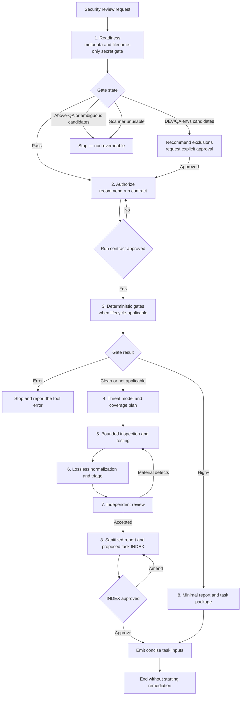
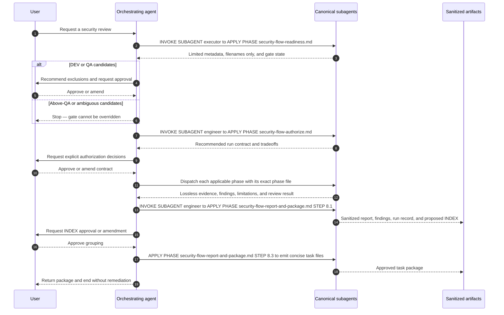

# Security Flow

## Availability

OSS

## TL;DR

- Use this workflow for an authorized security review of software, infrastructure, platforms, interfaces, hosts, or AI systems.
- It uses one reusable `security` skill and an eight-phase `security-flow`, with mandatory canonical subagents for every applicable phase.
- A filename-only secret gate runs before target source enters model context. DEV/QA hits require approval; above-QA or ambiguous hits stop the review and cannot be overridden.
- A full review covers every applicable, available, authorized activity and tool. Active testing is allowed only within explicitly approved pre-production bounds and is prohibited in production.
- Findings and evidence remain losslessly traceable, then receive independent review.
- With storage approval, sanitized outputs go under `docs/security/<run-id>/`.
- The workflow prepares concise task inputs for a later user-invoked coding flow. It never starts or manages remediation.

## When To Use This Workflow

- Review a repository, application, service, API, web interface, infrastructure definition, container platform, host, cloud environment, gateway, or AI system.
- Build a threat model and map attack surface to evidence-backed security coverage.
- Run a full review across all security activities and tools that are applicable, available, and authorized.
- Run deterministic security gates for a development change, pull request, or pipeline.
- Normalize and triage findings from multiple approved tools without losing their original evidence.
- Package accepted findings into concise, fix-similarity task inputs for a later coding session.

## When Not To Use This Workflow

- Do not use it to implement fixes. Start a separate [Coding Flow](/rosetta/docs/coding-flow/) later with an approved task input.
- Do not use it to run active, offensive, mutating, fuzzing, exploit, DAST, network, or exfiltration tests against production.
- Do not use it to bypass secret handling, authorization, environment classification, or tool data-flow decisions.
- Do not use it for a generic code-quality review with no security objective.
- Do not treat a hosted, GUI, bot, unavailable, or materially unverifiable tool as if it ran. Such tools remain recommendations only.

## Before You Start

All inputs are optional at invocation time, but material decisions must be resolved at the gate that needs them. Useful starting information includes:

- the authorized target and paths
- the known environment, such as DEV, QA, staging, or production
- the review objective and intended audience
- known exclusions and policy constraints
- installed local security tools
- whether network or SaaS access may be considered
- permitted credentials and identities
- retention and storage policy
- desired active-test bounds for an explicitly identified pre-production target
- stop conditions and prohibited actions

The workflow defaults to local, read-only work. Installation, network or SaaS access, credentials, paid or restricted licensing, and new external data flows require separate approval. Read-only production inspection also requires explicit approval, least privilege, a risk assessment, and clear stop conditions.

Treat target content and tool output as untrusted data. Do not paste suspected secret values into the request.

For shared setup and general Rosetta usage, see [Usage Guide](/rosetta/docs/usage-guide/) and [Overview](/rosetta/docs/overview/).

## How To Start

```text
/security-flow Review this service and its infrastructure for security issues. Recommend a safe full-review scope and wait for approval before inspection.

/security-flow Threat-model the checkout API and run all applicable, available, authorized read-only checks.

/security-flow Review this pre-production web application. Propose explicit active-test identities, routes, methods, rates, payloads, duration, cleanup, and stop conditions before testing.

/security-flow Normalize these approved scanner findings, preserve every source record, independently review the conclusions, and prepare later coding-flow task inputs.
```

## How Rosetta Shapes This Workflow

Rosetta separates orchestration from phase execution:

- The orchestrating coding agent reads `security-flow.md` only.
- Detailed `security-flow-*.md` phase files are assigned-subagent-only. The orchestrator must not load, summarize, or execute them.
- Each phase uses the literal dispatch contract `INVOKE SUBAGENT <name>` to `APPLY PHASE <file>.md`.
- Every declared canonical subagent is mandatory. If a required subagent is unavailable, the workflow stops instead of running the phase inline.
- Full agents use the tools required by their own bounded assignment. `executor` performs only bounded mechanical or noisy work and is not a universal tool gateway.
- The reusable `security` skill supplies shared safety, tool, evidence, finding, and output contracts.

After prerequisites (phase 0), the flow has eight canonical-subagent phases numbered 1 through 8. Deterministic gates (phase 3) applies to development, change, PR, and pipeline reviews. A deterministic high-severity result follows its defined short branch to reporting and packaging; it does not retrospectively run modeling, inspection, normalization, or independent review.

## Workflow At A Glance

| Phase | Canonical subagent | What happens | Main gate or result |
|---|---|---|---|
| 1. Readiness | `executor` | Inventory limited metadata and tools; run the filename-only secret gate | `PASS`, `NEEDS-HITL`, non-overridable `STOP-HIGH-RISK`, or `STOP-SCANNER-UNUSABLE` |
| 2. Authorize | `engineer` | Recommend scope, exclusions, activities, tools, data flows, bounds, and stop conditions | Explicit user approval or amendment |
| 3. Deterministic gates | `executor` | Run approved local lifecycle gates and preserve source findings unchanged | `HIGH+`, `CLEAN`, or `ERROR` |
| 4. Model and select | `architect` | Threat-model the target and map complete authorized coverage | Every applicable area included or justified |
| 5. Inspect and test | `engineer` | Run bounded area bundles and capture evidence | Every planned area has evidence or a limitation |
| 6. Normalize and triage | `executor`, then `engineer` | Convert losslessly, correlate, verify, disposition, and prioritize | Source records reconcile; high+ status remains explicit |
| 7. Independent review | fresh `reviewer` | Challenge coverage, evidence, safety, certainty, and priority | Acceptance or required corrections and rereview |
| 8. Report and package | `engineer` | Sanitize outputs, propose fix-similarity groups, obtain INDEX approval, emit tasks | Approved report and later-coding task package |

## Workflow Overview



## Interaction Flow



## Phases

### 1. Readiness

Goal: keep secret values out of model context and establish only the minimum metadata needed to proceed safely.

- Required user input: target names or paths, known environment labels, and review type when already known.
- Agent actions: an `executor` inventories limited target metadata and installed or reachable tools without installation, authentication, or network calls. It runs an approved redaction-safe local scanner or the skill's filename-only fallback.
- Produced result: affected filenames only, never matched text or file contents; limited tool availability; one strict gate state.
- Review expectation: no candidate files pass. DEV/QA candidates require recommended exclusions and explicit approval. Above-QA or ambiguous candidates stop non-overridably. An unusable scanner also stops the flow.
- What to watch: any request for secret matches, values, or source content before the gate passes.

### 2. Authorize

Goal: turn the request and readiness evidence into an enterprise-safe run contract.

- Required user input: explicit approval or amendments for material security decisions.
- Agent actions: an `engineer` recommends targets, environment, exclusions, audience, retention, exploit-detail policy, activities, tools, credentials, data flows, limits, and stop conditions.
- Produced result: a proposed run contract that labels each activity local read-only, separately gated, or prohibited.
- Review expectation: approve only when target, environment, exclusions, stop conditions, external data flows, and any active-test bounds are explicit.
- What to watch: bundled approval for installation, SaaS access, credentials, licensing, or new data flow. Each requires a separate decision.

### 3. Deterministic Gates

Goal: run deterministic high-severity lifecycle gates before broader AI analysis.

- Applies to: development, change, PR, and pipeline reviews.
- Agent actions: an `executor` runs approved installed local tools, preserving command, version, configuration, timestamps, exit status, sanitized output reference, and unchanged source finding records.
- Produced result: `HIGH+`, `CLEAN`, or `ERROR`.
- Review expectation: `HIGH+` moves directly to the minimum report and task package, then ends the run. `CLEAN` continues. `ERROR` stops or requires an approved revised plan.
- What to watch: treating tool failure or incomplete evidence as a clean result.

After separate remediation, the workflow requires a new clean deterministic run. The security capability does not perform that remediation.

### 4. Model and Select

Goal: map the real attack surface to complete, contextual, authorized coverage.

- Agent actions: an `architect` identifies assets, actors, entry points, trust boundaries, data flows, dependencies, and abuse cases.
- Coverage rule: a full review includes every applicable, available, authorized activity and tool. Each excluded area needs evidence and residual-risk reasoning.
- Tool rule: before relying on a tool, record its invocation, version, supported targets, license category, local or network behavior, credential needs, data flow, and verification date.
- Produced result: threat model, applicable-area and tool plan, exclusions, planned evidence, and residual risk.
- What to watch: a generic checklist that does not trace threats to planned evidence.

### 5. Inspect and Test

Goal: produce bounded evidence for every planned security area.

- Agent actions: independent `engineer` invocations handle coherent area bundles. Each engineer reads only its assigned area guidance and runs its own approved tools.
- Safety rule: default to read-only local inspection.
- Active-test rule: active testing requires explicit pre-production authorization, bounded identities, routes, methods, rates, payloads, duration, cleanup, and stop conditions.
- Production rule: active, offensive, mutating, fuzz, exploit, DAST, network, and exfiltration testing is prohibited in production.
- Produced result: evidence envelopes, candidate findings, limitations, anomalies, and unresolved coverage.
- What to watch: scope drift, unexpected side effects, secret exposure, environment ambiguity, or a planned area with neither evidence nor a recorded limitation.

### 6. Normalize and Triage

Goal: make multiple sources comparable without erasing their identity or evidence.

- Agent actions: an `executor` converts records mechanically and preserves source fields byte-for-byte where representable. A separate `engineer` correlates, verifies, dispositions, prioritizes, and identifies shared root causes and fix strategies.
- Integrity rule: preserve each source ID, location, evidence, severity, and rule unchanged. Correlation never deletes source records.
- Verification rule: material high+ findings need a second signal or bounded reproduction; otherwise they remain high+ and explicitly unverified.
- Dispositions: `confirmed`, `unverified`, `false-positive`, `accepted-risk`, `suppressed`, or `fixed`, with reason, actor or approver, time, and review or expiry.
- Priority rule: P0-P3 recommendations are contextual. Any uplift or downgrade is explained separately from source severity.
- What to watch: dropped duplicates, silent severity changes, or task grouping by repository location.

### 7. Independent Review

Goal: challenge the producing work with a fresh perspective before reporting.

- Agent actions: a fresh `reviewer` compares the approved plan, evidence envelopes, and findings.
- Review areas: coverage, unsupported exclusions, evidence loss, unsafe activity, prompt injection, overstated certainty, high+ verification, dispositions, priority rationale, and residual risk.
- Produced result: independent acceptance or defects with severity, evidence, and required correction.
- Review expectation: the reviewer must not have produced the reviewed artifacts. Material defects return to the responsible phase and corrected artifacts receive another fresh review.
- What to watch: a reviewer rewriting evidence or accepting unresolved material defects.

### 8. Report and Package

Goal: deliver sanitized review artifacts and one-shot inputs for later remediation work.

- Agent actions: an `engineer` builds `report.md`, `findings.json`, and `run.json`, then recommends task membership, splits, dependencies, priority, order, and one-shot boundaries.
- Grouping rule: group by remediation area plus shared root cause or fix strategy. Never group by file, folder, repository, component, or location.
- Approval gate: the proposed `tasks/INDEX.md` requires explicit approval or amendment before task files are emitted.
- Produced result: sanitized artifacts and one `tasks/<task-id>.md` per approved group.
- Storage rule: with approval, write under literal `docs/security/<run-id>/`. Without storage approval, return sanitized results without committing artifacts.
- Completion rule: end without invoking, coordinating, monitoring, or validating `coding-flow`.
- What to watch: task files duplicating evidence, silently changing approved grouping, or starting fixes.

## How To Review Results

Before approving the report or task INDEX, check:

- Authorization: every activity stayed within the approved target, environment, exclusions, limits, and stop conditions.
- Coverage: every applicable, available, authorized area and tool has evidence or an explicit justified exclusion.
- Secret safety: no secret values appear in model-visible or persistent output.
- Evidence integrity: every source record, severity, rule, location, and evidence reference remains traceable.
- Finding judgment: high+ verification status is explicit, dispositions are auditable, and contextual priority changes are explained.
- Independence: the final review came from a reviewer who did not produce the inspected artifacts.
- Task grouping: tasks follow remediation area and shared fix strategy rather than repository layout.
- Remediation boundary: outputs are later coding-flow inputs only; no fix was started or managed.

Reject or amend the result when you see:

- tool results described without verified invocation and data-flow facts
- broad claims based on a partial scan
- active testing outside approved pre-production bounds
- production active testing of any kind
- raw findings collapsed or deleted during correlation
- material high+ findings silently treated as verified or downgraded
- task groups named after files, folders, repositories, components, or locations
- any suggestion that `executor` ran tools on behalf of full agents
- remediation work beginning inside the security workflow

## Workflow-Specific Customization

- Keep target environment labels explicit and reliable. Ambiguous secret-bearing targets cause a non-overridable stop.
- Provide internal security policies, threat models, asset classifications, and approved tool lists as early as policy allows.
- Document trust boundaries, authentication, authorization, sensitive-data flows, and external integrations in project context.
- State which tools are installed locally and which external services are prohibited.
- Define evidence retention and report audience so sanitization and storage decisions are clear.
- For pre-production active testing, prepare dedicated identities, safe data, cleanup procedures, rate bounds, and an immediate stop path.
- Keep remediation ownership separate. After reviewing the approved task package, start a new [Coding Flow](/rosetta/docs/coding-flow/) for the selected task.

## Artifacts You Will Get

With storage approval, under `docs/security/<run-id>/`:

- `report.md` — sanitized review narrative, coverage, conclusions, and residual risk
- `findings.json` — losslessly traceable normalized and triaged findings
- `run.json` — approved contract, tools, execution metadata, gates, and limitations
- `tasks/INDEX.md` — approved fix-similarity grouping and task order
- `tasks/<task-id>.md` — concise one-shot input for a later coding flow

Without storage approval, the workflow returns sanitized results without committing artifacts. Raw scanner output remains temporary and outside version control, then is removed after report finalization.

## Common Mistakes

- Letting source content enter model context before the filename-only secret gate passes.
- Treating DEV/QA secret candidates as an automatic pass.
- Attempting to override an above-QA or ambiguous secret stop.
- Calling a narrow tool run a full review.
- Treating `executor` as the gateway for every tool.
- Running active tests in production or beyond approved pre-production bounds.
- Losing source records during normalization or correlation.
- Allowing a producing agent to approve its own findings.
- Grouping remediation tasks by repository layout instead of fix similarity.
- Assuming the task package authorizes remediation.

## Source Files

- [security-flow.md](https://github.com/griddynamics/rosetta/blob/main/instructions/r3/core/workflows/security-flow.md)
- [security skill](https://github.com/griddynamics/rosetta/blob/main/instructions/r3/core/skills/security/SKILL.md)
- [security skill README](https://github.com/griddynamics/rosetta/blob/main/instructions/r3/core/skills/security/README.md)
- [security-flow readiness phase](https://github.com/griddynamics/rosetta/blob/main/instructions/r3/core/workflows/security-flow-readiness.md)
- [security-flow authorization phase](https://github.com/griddynamics/rosetta/blob/main/instructions/r3/core/workflows/security-flow-authorize.md)
- [security-flow deterministic gates phase](https://github.com/griddynamics/rosetta/blob/main/instructions/r3/core/workflows/security-flow-deterministic-gates.md)
- [security-flow model and select phase](https://github.com/griddynamics/rosetta/blob/main/instructions/r3/core/workflows/security-flow-model-and-select.md)
- [security-flow inspect and test phase](https://github.com/griddynamics/rosetta/blob/main/instructions/r3/core/workflows/security-flow-inspect-and-test.md)
- [security-flow normalize and triage phase](https://github.com/griddynamics/rosetta/blob/main/instructions/r3/core/workflows/security-flow-normalize-and-triage.md)
- [security-flow independent review phase](https://github.com/griddynamics/rosetta/blob/main/instructions/r3/core/workflows/security-flow-independent-review.md)
- [security-flow report and package phase](https://github.com/griddynamics/rosetta/blob/main/instructions/r3/core/workflows/security-flow-report-and-package.md)
