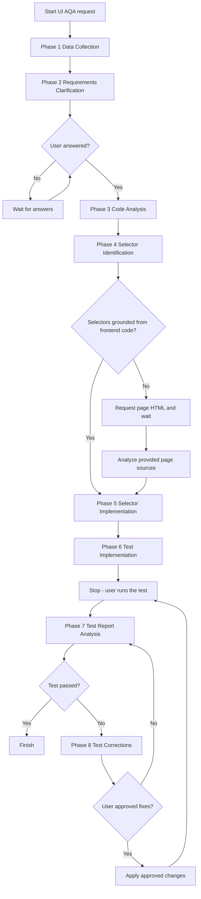
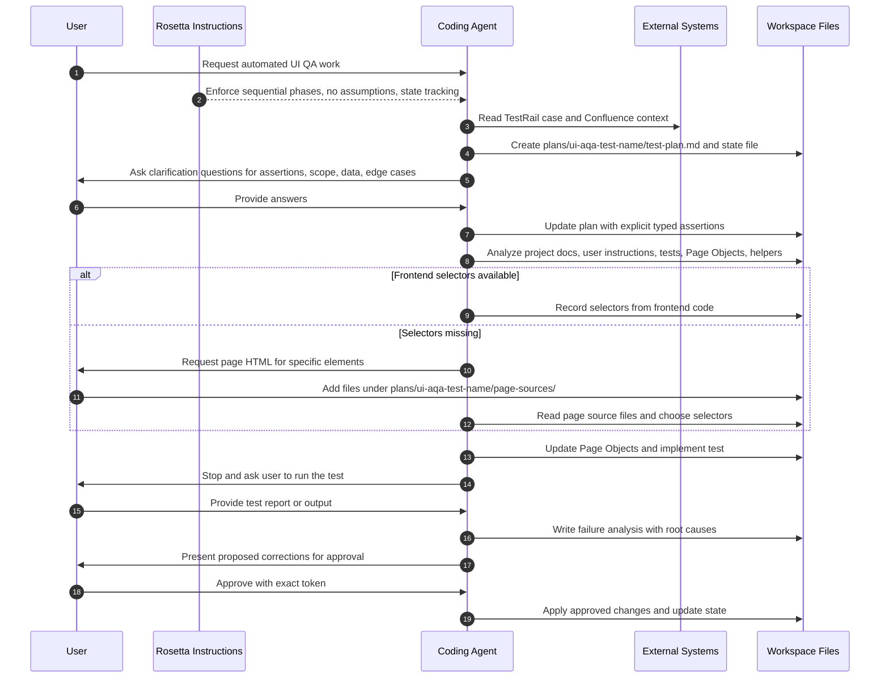

# UI AQA Flow

## TL;DR

Use `ui-aqa-flow` when you need Rosetta-guided automated UI test work tied to a real TestRail case or QA scenario. The workflow gathers TestRail and Confluence context, clarifies assertions, analyzes existing test architecture, identifies selectors without guessing, implements the test, then stops so you can run it and return the report.

This is a strict sequential workflow. Phases build on each other, `agents/TEMP/<FEATURE>/ui-aqa-state.md` is updated after each phase, and the coding agent must not skip ahead. Mandatory user interaction happens in Phase 2, Phase 6, Phase 7, and Phase 8. Phase 4 asks for page HTML only when frontend code or stable selectors are not available.

## When To Use This Workflow

- Automate a TestRail case against an existing UI.
- Add or update UI automation while reusing existing Page Objects and helpers.
- Build a test from TestRail steps plus Confluence context instead of starting from code guesses.
- Diagnose failing automated test output and prepare grounded fixes.
- Add selectors to Page Objects before test implementation when the current test layer is incomplete.

## When Not To Use This Workflow

- Do not use it for backend API test automation. Use [API AQA Flow](/rosetta/docs/api-aqa-flow/).
- Do not use it for manual test case authoring. Use [Test Case Generation](/rosetta/docs/testgen-flow/) when the goal is to generate scenarios or export them to TestRail.
- Do not use it for general product requirements work. Use [Requirements Documentation Authoring](/rosetta/docs/requirements-authoring-flow/).
- Do not use it for backend or non-test implementation. Use [Coding](/rosetta/docs/coding-flow/).
- Do not use it when you only need a quick explanation of the test architecture. Use [Code Analysis](/rosetta/docs/code-analysis-flow/).

## Before You Start

Prepare the inputs this workflow explicitly depends on:

- A TestRail case ID or another precise QA target.
- Confluence page IDs, URLs, or search terms for the feature under test.
- Access to the target repository test code.
- Access to existing Page Objects, similar tests, helper utilities, and project test conventions.
- `project_description.md` if the project uses it as the coding-standards source.
- Any files under `agents/user-instructions/` that define test creation rules, test report locations, or team-specific conventions.

You also get better results when the project already has strong shared Rosetta context. Keep shared setup in [Usage Guide](/rosetta/docs/usage-guide/#customization), especially `docs/CONTEXT.md`, `docs/ARCHITECTURE.md`, and `docs/TECHSTACK.md`.

## How To Start

Typical prompts:

```text
/ui-aqa-flow Automate TestRail case C12345 for the checkout confirmation flow.
```

```text
/ui-aqa-flow Create UI automation for the registration success scenario using TestRail case 5678 and Confluence page https://...
```

```text
/ui-aqa-flow Analyze this failing automated test report for case C9012 and prepare corrections.
```

```text
/ui-aqa-flow Extend the existing checkout automation with a new TestRail scenario and reuse current Page Objects.
```

## How Rosetta Shapes This Workflow

Rosetta provides the instructions. The coding agent executes them. Rosetta itself does not read your source code or test data.

For this workflow, the always-active Rosetta behavior changes the user experience in these ways:

- The coding agent is expected to work one phase at a time. It should not compress phases into one jump.
- If required inputs are missing, the agent must ask instead of guessing selectors, flows, test data, or expected results.
- Human review is built into the workflow, not added later. The agent must stop for answers, test execution, report handoff, and approval before corrections. The execution gate is mechanical — instructions like "skip the test run" are refused; only real execution results advance the flow.
- The workflow is state-driven. After each phase, the agent updates `agents/TEMP/<FEATURE>/ui-aqa-state.md` so the work can resume cleanly after interruptions.
- Existing project architecture wins over convenience. The agent must inspect existing tests, Page Objects, utilities, and coding standards before writing new automation; repository docs win over defaults on conflicts.
- If the feature or elements under test do not exist, the workflow hard-stops and escalates options instead of inventing selectors or modifying product source.
- Every tracked artifact passes a fail-closed sensitive-data scan before it is written.

## Workflow At A Glance

| Phase | What you provide | What the coding agent does | What you get | Mandatory workflow stop |
|---|---|---|---|---|
| 1. Data Collection | TestRail case, Confluence reference, slug confirmation | Reads external QA/business context and creates the test plan | `plans/ui-aqa-<test-name>/test-plan.md`, initial state file | None |
| 2. Requirements Clarification | Answers about assertions, data, edge cases, scope | Runs gap analysis over the plan and turns vague steps into explicit, typed, measurable assertions | Updated test plan with `### Explicit Assertions`, edge cases, test data rules | Mandatory user answers before Phase 3 |
| 3. Code Analysis | Repository test code, project docs, user instruction files | Analyzes framework, conventions, Page Objects, similar tests, helpers, optional frontend code | `plans/ui-aqa-<test-name>/code-analysis.md` with architecture findings and target test location | None |
| 4. Selector Identification | Frontend code if available, otherwise page HTML when requested | Maps test steps to UI elements and identifies missing selectors without guessing | Selector map in the plan, page-source request if needed | Mandatory user input only if selectors cannot be grounded from code |
| 5. Selector Implementation | Approval for any fragile selector | Adds selectors or Page Object methods using current project conventions | Updated Page Objects and test plan | None |
| 6. Test Implementation | Approved assertions and reusable test architecture | Implements the automated test, validates it locally (lint-clean), and stops before execution | Test file plus the `## Test Implementation` record in the plan | Mandatory user execution before Phase 7 |
| 7. Test Report Analysis | Test report path, logs, or output | Reads report, classifies failures per the UI taxonomy, analyzes root causes with evidence labels, inspects page source for selector errors | `plans/ui-aqa-<test-name>/failure-analysis.md` | Mandatory user handoff of report/output |
| 8. Test Corrections | Explicit approval for proposed fixes | Prepares before/after fixes, waits for exact approval tokens, applies approved changes with lint checks | Corrected test/Page Objects and re-test guidance | Explicit approval required before changes |

Recommended review still matters throughout the workflow, but those checks are advisory checkpoints, not extra mandatory stops.

## Workflow Overview



## Interaction Flow



## Phases

### Phase 1: Data Collection

Goal:
- Capture the external QA and business context and create the run's test plan.

What you provide:
- TestRail case ID or URL; Confluence page ID, URL, or search terms.
- Confirmation of the `<test-name>` slug the agent proposes (it never fabricates one).

What the agent does:
- Retrieves the test case and feature context via the configured vendor bindings.
- Cross-references TestRail steps against Confluence context and records access/truncation notes.
- Creates `plans/ui-aqa-<test-name>/test-plan.md` and seeds `agents/TEMP/<FEATURE>/ui-aqa-state.md`.

What to watch for:
- Confirm the right case and pages were used; access gaps are disclosed, never papered over.
- The slug you confirm names the run folder every later artifact lives in.

### Phase 2: Requirements Clarification

Goal:
- Convert vague test steps into explicit, typed, measurable assertions Phase 6 can validate against.

What you provide:
- Answers to the clarification questions (assertions, edge cases, test data, success criteria).

What the agent does:
- Runs gap analysis over the plan across five completeness dimensions (steps clarity, result measurability, test data, edge cases, success criteria).
- Asks structured questions; records declined/unanswered items explicitly.
- Writes the mandatory `### Explicit Assertions` list (typed: Presence / State / Content / Behavioral) into the plan.

What to watch for:
- This is a hard gate — the workflow waits for your answers.
- Declining most critical questions escalates instead of silently proceeding.
- Every assertion here is later implemented or explicitly recorded as uncovered — nothing is silently dropped.

### Phase 3: Code Analysis

Goal:
- Understand the existing test architecture and decide where the new test belongs.

What you provide:
- Usually nothing new; repository docs and `agents/user-instructions/` are read if present.

What the agent does:
- Analyzes framework, language, structure, coding standards, Page Object inventory, similar tests, and reusable utilities (read-only).
- Decides add-to-existing vs new-file for the test location, with rationale.
- Writes `plans/ui-aqa-<test-name>/code-analysis.md` (9 sections, including Conflicts and Coverage).

What to watch for:
- Conflicts between user instructions and repository docs are resolved in favor of repo docs and recorded.
- Missing optional inputs are disclosed in the Coverage section, never silently omitted.

### Phase 4: Selector Identification

Goal:
- Map every test step to UI elements and identify missing selectors without guessing.

What you provide:
- Page HTML captures only if frontend code is unavailable or selectors cannot be found (the agent sends verbatim capture instructions).

What the agent does:
- Builds the Interaction Map and checks existing Page Objects (exists / missing / unresolvable).
- Searches frontend source first (`data-testid` preferred, 4-tier strategy), then analyzes provided page sources.
- Flags fragile selectors with reasons and recommendations; writes the `## Selector Management` section into the plan (read-only phase — no code writes).

What to watch for:
- If the target elements genuinely do not exist in the app, the workflow hard-stops and asks you to choose how to proceed — it never invents selectors.
- Captured page HTML is scanned for tokens/PII before it is read.

### Phase 5: Selector Implementation

Goal:
- Add the identified selectors and helper methods to Page Objects, following project conventions exactly.

What you provide:
- Explicit approval for any selector flagged as fragile (or a stable alternative).

What the agent does:
- Extends existing Page Objects or creates new ones from existing structural templates; writes only page-object files.
- Records the implementation subsection in the plan; lint/format clean.

What to watch for:
- No fragile selector is committed silently.
- No test files or frontend source are touched in this phase.

### Phase 6: Test Implementation

Goal:
- Implement the automated test from the plan using Page Object methods only, then hand execution to you.

What you provide:
- Nothing new until the stop: then you run the test and return results.

What the agent does:
- Authors the test (no raw selectors, proper waits, project assertion style), lint-validates locally.
- Records the `## Test Implementation` record in the plan, including `### Uncovered Assertions` for anything that could not be implemented (with reasons).
- Provides the exact execution command and stops.

What to watch for:
- The execution gate cannot be bypassed by instruction — only actual results advance the workflow.
- A missing selector or Page Object method routes back to Phase 5; it is never authored inline here.

### Phase 7: Test Report Analysis

Goal:
- Turn your execution results into categorized failures with evidence-backed root causes.

What you provide:
- The test report path, logs, or output (or confirm it is under `agents/user-instructions/`).

What the agent does:
- Classifies each failure into exactly one UI taxonomy category (selector, timing, assertion, setup/data, app bug, test code, unknown).
- Labels every root cause `Confirmed` / `Assumption` / `Unknown` with a one-line evidence citation; selector failures cite captured page source.
- Notes slow/flaky indicators in the Patterns section; writes `plans/ui-aqa-<test-name>/failure-analysis.md` (read-only phase).
- On a clean run (0 failures) it records that in state instead of emitting an empty analysis.

What to watch for:
- This phase never edits code — "just fix it now" is refused and routed to Phase 8.

### Phase 8: Test Corrections

Goal:
- Fix the analyzed failures with your explicit approval, change by change.

What you provide:
- Exact approval tokens (`approved` / `approve` / `yes`) per change or named batch; partial approval applies only the named items.

What the agent does:
- Prepares one proposed change per fix (before/after code, root-cause reference, risk) — nothing is applied during preparation.
- Applies approved changes one at a time with lint checks; reverts on lint failure and re-presents.
- Caps retries at 3 cycles per failing change, then escalates; loops back to Phase 7 if the test still fails.

What to watch for:
- Comments and questions are review feedback, not approval.
- Only test and page-object files are in scope; anything else is refused and escalated.

## How To Review Results

- After Phase 1, verify the right case/pages were captured and the slug is what you want.
- After Phase 2, read the `### Explicit Assertions` list — it is the contract the test will implement.
- After Phase 3, sanity-check the test-location decision and the conflicts section.
- After Phases 4–5, review flagged fragile selectors before approving.
- After Phase 6, run the test yourself with the provided command and return real output.
- After Phase 7, check that every failure has a category, a root cause, and an evidence label.
- After Phase 8, re-run and confirm; approve further fixes only against the updated analysis.

## Workflow-Specific Customization

- Keep team test conventions, report locations, and custom matcher rules under `agents/user-instructions/` — Phase 3 reads them and Phase 6 applies them.
- Maintain `project_description.md` (framework, structure, standards) if your project uses it; repository docs always win on conflicts.
- Frontend `data-testid` coverage dramatically reduces Phase 4 round-trips — prefer adding stable hooks over approving fragile selectors.

## Artifacts You Will Get

Per run, under `plans/ui-aqa-<test-name>/`:

- `test-plan.md` — test case info, feature context, clarifications, `### Explicit Assertions`, `## Selector Management`, `## Test Implementation` record.
- `code-analysis.md` — architecture findings and the test-location decision.
- `page-sources/` — captured page HTML (only when requested).
- `failure-analysis.md` — categorized failures with root causes (when failures occurred).

Plus: `agents/TEMP/<FEATURE>/ui-aqa-state.md` (phase status, key artifacts, resume anchor) and the modified/created Page Object and test files.

## Common Mistakes

- Starting without a real TestRail case or equivalent QA source.
- Letting Phase 2 stay vague and then expecting correct assertions later.
- Skipping `agents/user-instructions/` even though it may define report locations or team-specific rules.
- Guessing selectors instead of grounding them from frontend code or provided HTML.
- Writing a new test outside the existing project structure because it feels faster.
- Approving corrections before checking whether the failure is a real product bug.
- Treating user comments as approval in Phase 8. This workflow requires explicit approval before fixes are applied.
- Forgetting that Phase 6 stops until the user runs the test and returns results.

## Source Files

Authoritative source workflow and phases:

- [ui-aqa-flow.md](https://github.com/griddynamics/rosetta/blob/main/instructions/r3/core/workflows/ui-aqa-flow.md)
- [ui-aqa-flow-data-collection.md](https://github.com/griddynamics/rosetta/blob/main/instructions/r3/core/workflows/ui-aqa-flow-data-collection.md)
- [ui-aqa-flow-requirements-clarification.md](https://github.com/griddynamics/rosetta/blob/main/instructions/r3/core/workflows/ui-aqa-flow-requirements-clarification.md)
- [ui-aqa-flow-code-analysis.md](https://github.com/griddynamics/rosetta/blob/main/instructions/r3/core/workflows/ui-aqa-flow-code-analysis.md)
- [ui-aqa-flow-selector-identification.md](https://github.com/griddynamics/rosetta/blob/main/instructions/r3/core/workflows/ui-aqa-flow-selector-identification.md)
- [ui-aqa-flow-selector-implementation.md](https://github.com/griddynamics/rosetta/blob/main/instructions/r3/core/workflows/ui-aqa-flow-selector-implementation.md)
- [ui-aqa-flow-test-implementation.md](https://github.com/griddynamics/rosetta/blob/main/instructions/r3/core/workflows/ui-aqa-flow-test-implementation.md)
- [ui-aqa-flow-test-report-analysis.md](https://github.com/griddynamics/rosetta/blob/main/instructions/r3/core/workflows/ui-aqa-flow-test-report-analysis.md)
- [ui-aqa-flow-test-correction.md](https://github.com/griddynamics/rosetta/blob/main/instructions/r3/core/workflows/ui-aqa-flow-test-correction.md)

Shared skills: [qa-knowledge](https://github.com/griddynamics/rosetta/tree/main/instructions/r3/core/skills/qa-knowledge), [qa-structure](https://github.com/griddynamics/rosetta/tree/main/instructions/r3/core/skills/qa-structure), [data-collection](https://github.com/griddynamics/rosetta/tree/main/instructions/r3/core/skills/data-collection)
