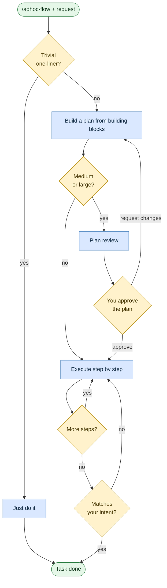

# Ad-hoc task
**Command:** `/adhoc-flow` · *[← All scenarios](/rosetta/user-guide/#scenarios-at-a-glance) · [User guide](/rosetta/user-guide/)*

> For small or unusual tasks that don't fit a fixed workflow. The agent assembles a custom plan from reusable building blocks, reviews it, and executes with tracking.

**Use this when** the task spans several concerns or doesn't match any specific scenario: lightweight docs, build scripts, cross-cutting chores, syncing, or one-off tooling.

**Not for:** real coding features/fixes ([Write or change code](/rosetta/user-guide/scenarios/coding/)), requirements ([Author requirements](/rosetta/user-guide/scenarios/requirements/)), or codebase analysis ([Analyze a codebase](/rosetta/user-guide/scenarios/analyze-a-codebase/)) — use the dedicated scenario, which is more thorough.

## Running it

```text
/adhoc-flow Write a quick script to parse these CSV files
/adhoc-flow Refactor logging across the payments, orders, and billing services
/adhoc-flow Sync the CHANGELOG with the last 10 merged PRs
```

## How it works

Instead of a fixed set of phases, it composes one from building blocks (discovery, planning, execution, review, validation, and so on) sized to the task, then loops through the plan — adapting it as it learns.





For a genuinely trivial one-liner it can just do the task after confirming it's trivial; anything bigger gets a plan, and medium or large work stops for your approval before execution. The plan is a living artifact — the agent updates it mid-run as things change.

## What you'll be asked to do

For medium and large tasks, **approve the plan** before execution. Keep your intent clear, and flag it if a discovery should change the scope.

## What it creates

A living plan plus a state file under `agents/TEMP/<feature>/`; other artifacts depend on which building blocks the plan uses.

## Related

Any of the dedicated scenarios if your task actually fits one — they're more thorough. [Get help](/rosetta/user-guide/scenarios/get-help/) if you're unsure.

## Sources

- Workflow: [`instructions/r3/core/workflows/adhoc-flow.md`](https://github.com/griddynamics/rosetta/blob/main/instructions/r3/core/workflows/adhoc-flow.md?plain=1)
- Skills: [`orchestration`](https://github.com/griddynamics/rosetta/blob/main/instructions/r3/core/skills/orchestration/SKILL.md?plain=1), [`reasoning`](https://github.com/griddynamics/rosetta/blob/main/instructions/r3/core/skills/reasoning/SKILL.md?plain=1), [`hitl`](https://github.com/griddynamics/rosetta/blob/main/instructions/r3/core/skills/hitl/SKILL.md?plain=1)

