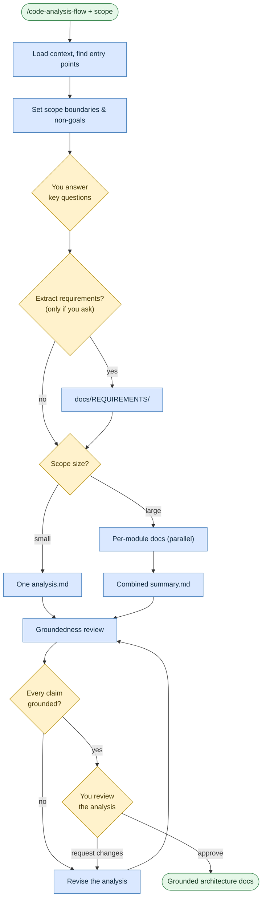

# Analyze a codebase
**Command:** `/code-analysis-flow` · *[← All scenarios](/rosetta/user-guide/#scenarios-at-a-glance) · [User guide](/rosetta/user-guide/)*

> Reverse-engineer an existing codebase into grounded architecture documentation — every claim traced to real code, with no changes and no suggestions.

**Use this when** you need to understand a system before planning, refactoring, testing, onboarding, or migrating it — or to extract requirements from existing code.

**Not for:** changing code ([Write or change code](/rosetta/user-guide/scenarios/coding/)) or authoring net-new requirements from scratch ([Author requirements](/rosetta/user-guide/scenarios/requirements/)).

## Running it

```text
/code-analysis-flow Explain how the authentication system works
/code-analysis-flow Document the architecture of the payment module
/code-analysis-flow Reverse-engineer requirements from the billing module
```

## How it works

It loads project context, sizes the job, asks only the questions that actually affect accuracy, then produces documentation — a single analysis for a small scope, or parallel per-module docs plus a summary for a large one.





The output is strictly grounded: components, data models, flows, edge cases, and Mermaid diagrams — with file-and-line references, never generated code, refactor suggestions, or speculation. Diagrams are colored to stay readable in both light and dark themes. A *reviewer* subagent checks that every claim links back to actual code.

Optionally (only if you ask), it runs a **requirements branch** that extracts testable requirements from the code into `docs/REQUIREMENTS/`.

## What you'll be asked to do

Answer the handful of high-impact clarifying questions, and approve the final analysis. Say so explicitly if you want the requirements branch — it's off by default.

## What it creates

Small scope → `docs/<feature>/analysis.md`. Large scope → `docs/<feature>/module-<module>.md` per module plus `docs/<feature>/summary.md`. The requirements branch adds `docs/REQUIREMENTS/`. It also drops a pointer into `agents/IMPLEMENTATION.md`, and tracks progress in a state file.

## Related

[Write or change code](/rosetta/user-guide/scenarios/coding/) once you understand the system · [Modernize](/rosetta/user-guide/scenarios/modernize/) uses similar analysis for migrations · [Author requirements](/rosetta/user-guide/scenarios/requirements/) for net-new requirements.

## Sources

- Workflow: [`instructions/r3/core/workflows/code-analysis-flow.md`](https://github.com/griddynamics/rosetta/blob/main/instructions/r3/core/workflows/code-analysis-flow.md?plain=1)
- Skills: [`reverse-engineering`](https://github.com/griddynamics/rosetta/blob/main/instructions/r3/core/skills/reverse-engineering/SKILL.md?plain=1), [`large-workspace-handling`](https://github.com/griddynamics/rosetta/blob/main/instructions/r3/core/skills/large-workspace-handling/SKILL.md?plain=1)

