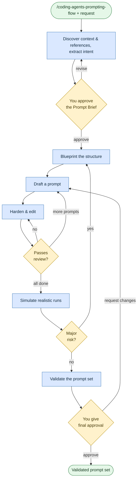

# Author agent prompts
**Command:** `/coding-agents-prompting-flow` · *[← All scenarios](/rosetta/user-guide/#scenarios-at-a-glance) · [User guide](/rosetta/user-guide/)*

> Author or adapt prompts for AI coding agents — skills, subagents, workflows, rules — through a discover → brief → blueprint → draft/harden → simulate → validate pipeline.

**Use this when** you're creating, refactoring, reviewing, or porting a prompt: a new skill, an agent, a workflow, a rule, or migrating a prompt from one IDE/agent to another.

**Not for:** writing application code ([Write or change code](/rosetta/user-guide/scenarios/coding/)).

## Running it

```text
/coding-agents-prompting-flow Author a new skill for API contract testing
/coding-agents-prompting-flow Refactor the debugging skill for brevity and stronger gates
/coding-agents-prompting-flow Adapt this Claude prompt for Cursor
```

> Like requirements authoring, this expects a strong model (Opus / GPT-5.6-sol-class or similar). The agent will ask you to switch if yours is too small.

## How it works

It treats prompts like software. It extracts a **Prompt Brief** you approve, designs a blueprint, then drafts and hardens each prompt one at a time, simulates realistic runs, and validates that the result traces back to your intent.





The draft/harden/edit loop is an automated review pass (not something you sit through). Adaptation requests — porting between agents or rule formats — load extra guidance for that.

## What you'll be asked to do

Provide the request plus any existing prompt, constraints, and audience; resolve the open questions; **approve the Prompt Brief** before design; and give **final approval** before anything is saved.

## What it creates

Analysis artifacts in the plan folder (`prompt-brief.md`, `open-questions.md`, `blueprint.md`, and a validation pack), and the finished prompts written to their target folders. Small jobs may just return the result in chat. A state file tracks progress.

## Related

[Get help](/rosetta/user-guide/scenarios/get-help/) to understand Rosetta's own skills and agents · contributing prompt changes is covered in [CONTRIBUTING](/rosetta/docs/contributing/#prompt-changes).

## Sources

- Workflow: [`instructions/r3/workflows/workflows/coding-agents-prompting-flow.md`](https://github.com/griddynamics/rosetta/blob/main/instructions/r3/workflows/workflows/coding-agents-prompting-flow.md?plain=1)
- Skill: [`coding-agents-prompt-authoring`](https://github.com/griddynamics/rosetta/blob/main/instructions/r3/core/skills/coding-agents-prompt-authoring/SKILL.md?plain=1)

