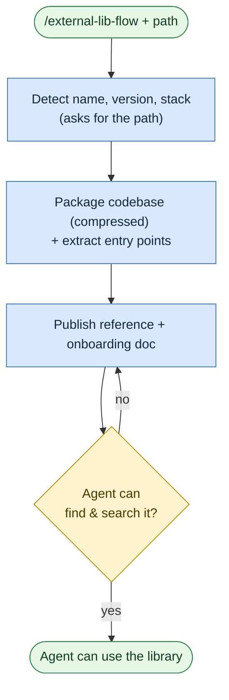

# Onboard a library
**Command:** `/external-lib-flow` · *[← All scenarios](/rosetta/user-guide/#scenarios-at-a-glance) · [User guide](/rosetta/user-guide/)*

> Teach the agent how to *use* an external or private library — without giving it source access during later work — by packaging the library into compact reference material plus a short learning guide.

**Use this when** your project depends on an internal SDK, shared library, or external client, and you want the agent to understand its API and structure for future tasks.

**Not for:** modernizing or rewriting the library ([Modernize](/rosetta/user-guide/scenarios/modernize/)) — this is usage-understanding only.

## Running it

```text
/external-lib-flow Teach AI about our internal authentication library at ../vendor/auth-sdk
/external-lib-flow Onboard the shared utilities package at ./libs/reporting-engine
```

The only thing it needs from you is the project path.

## How it works

It's a short, mostly hands-off routine: point it at the library, it detects the basics, packages the codebase into a compressed reference file (uses repomix), publishes a brief onboarding guide, and verifies the agent can find it later.





The library is packaged into a compressed XML file (built for the agent to grep, not for humans to read), and a short learning guide tells the agent how to look things up. An architecture rule is added so future sessions know to consult the reference instead of guessing.

## What you'll be asked to do

Provide (or confirm) the library path — that's the single required question — and confirm the detected metadata if prompted.

## What it creates

In `refsrc/`: `<project-name>.xml` (the compressed codebase) and `<project-name>-onboarding.md` (the short learning guide). It also adds a rule to `docs/ARCHITECTURE.md` telling the agent to use these via search, and tracks progress in a state file.

## Related

[Write or change code](/rosetta/user-guide/scenarios/coding/) then uses the onboarded library · [Modernize](/rosetta/user-guide/scenarios/modernize/) if you're migrating onto it.

Prerequisites: repomix (MCP or CLI).

## Sources

- Workflow: [`instructions/r3/workflows/workflows/external-lib-flow.md`](https://github.com/griddynamics/rosetta/blob/main/instructions/r3/workflows/workflows/external-lib-flow.md?plain=1)
- Skills: [`reverse-engineering`](https://github.com/griddynamics/rosetta/blob/main/instructions/r3/core/skills/reverse-engineering/SKILL.md?plain=1)

