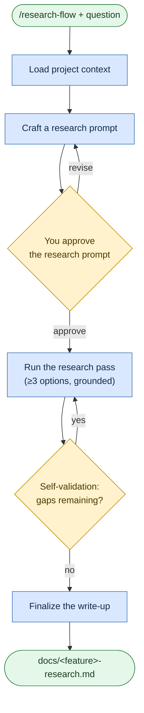

# Research a question
**Command:** `/research-flow` · *[← All scenarios](/rosetta/user-guide/#scenarios-at-a-glance) · [User guide](/rosetta/user-guide/)*

> Systematic, grounded investigation tied to your project — the agent first writes the research prompt (which you approve), then runs it and produces a documented answer.

**Use this when** you need deep investigation or a technology comparison before choosing an approach, grounded in your project's context.

**Not for:** simple lookups or single-source questions — just ask the agent directly.

## Running it

```text
/research-flow Compare event sourcing vs CRUD for our order service
/research-flow Investigate OAuth 2.0 implementation options for our stack
/research-flow Research vector database options for our RAG pipeline
```

## How it works

The twist is **meta-prompting**: the agent doesn't research off your one-line question. It crafts a focused research prompt, shows it to you (because that prompt controls what gets answered), and only then runs a dedicated research pass that weighs multiple options.





It prioritizes accuracy over speed, compares at least three options, and ends with a self-validation pass. It won't touch your `CONTEXT.md` / `ARCHITECTURE.md` — it only produces the research document.

## What you'll be asked to do

Review and approve the **research prompt** before the research runs — this is your lever on what the investigation will and won't cover. Answer any questions it raises about assumptions.

## What it creates

`plans/<feature>/research-prompt.md` (the approved direction) and the final `docs/<feature>-research.md`, plus a state file.

## Related

[Analyze a codebase](/rosetta/user-guide/scenarios/analyze-a-codebase/) for internal investigation · [Write or change code](/rosetta/user-guide/scenarios/coding/) to act on the findings.

Prerequisites: documentation search tools (DeepWiki, Context7).

## Sources

- Workflow: [`instructions/r3/core/workflows/research-flow.md`](https://github.com/griddynamics/rosetta/blob/main/instructions/r3/core/workflows/research-flow.md?plain=1)
- Skills: [`research`](https://github.com/griddynamics/rosetta/blob/main/instructions/r3/core/skills/research/SKILL.md?plain=1), [`reasoning`](https://github.com/griddynamics/rosetta/blob/main/instructions/r3/core/skills/reasoning/SKILL.md?plain=1)

