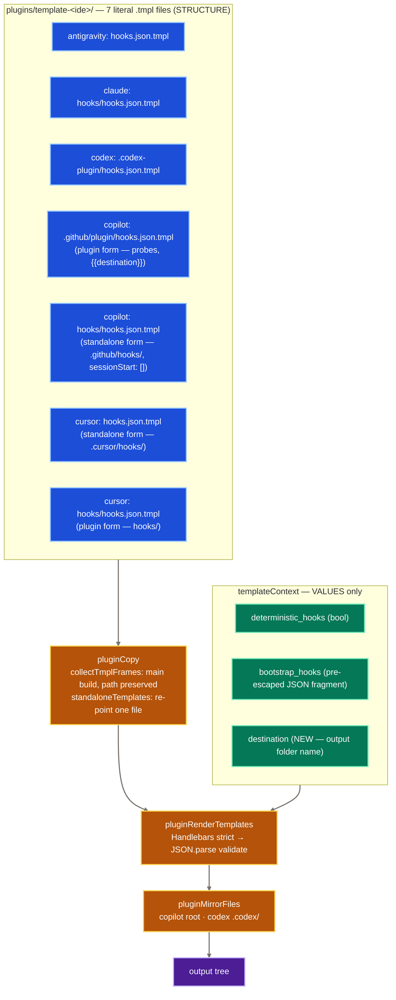

# hooks.json generation — architecture

**Status:** design, for owner decision. No code changed by this document.
**Scope:** how `hooks.json` documents are produced for 7 IDE targets × N plugin sets.
**Branch:** `feat/315-plugin-sets` · **Baseline:** `492b6a78~1` (pre-refactor) · **Oracle:** `agents/TEMP/315-golden/`
**Settled before this document:** D25 (the 7 literal per-IDE `hooks.json.tmpl` files are kept; the `HOOK_LAYOUTS` shape table goes) and D23 (hook modules are all-or-nothing per set). Neither is relitigated here.

**Relationship to the two prior documents in this folder.** `hooks-redesign.md` and `hooks-complete.md` are the rejected defect registers. This document does not supersede their *findings* and does not repeat them: it decides the mechanism they stopped short of. Checked for contradiction — none found. `hooks-complete.md`'s F2 (VS Code never receives Copilot bootstrap, camel `sessionStart`) is §6 F1 here; its F3 (`core-copilot`'s plugin-path entry is a permanent no-op on the `commands/coding-flow.md` guard) is §1.5 here, and this document decides the replacement guard. Its F1 — *no hook document Rosetta ships inside a marketplace plugin has ever been verified to load* — is broader than hooks.json generation, is not addressed by this design, and remains open.

---

## 0. Two corrections to the brief

Both are load-bearing for the design. Everything else in the brief that I could check, checked out.

**C1 — `<set>-copilot/hooks/hooks.json` and `<set>-cursor/hooks.json` are NOT staging sources.** The brief calls the 60-byte file "staging source for the `copilot-standalone` target". It is not. `plugin-copy.ts:106-108` reads standalone templates from `spec.preservedSource` — the shared `plugins/template-copilot/` directory — never from the main plugin's *output*:

```
if (spec.standaloneTemplates && fs.existsSync(sourceDir)) {
  for (const [srcRel, targetPath] of spec.standaloneTemplates) {
    const srcAbs = path.join(sourceDir, srcRel);
```

with `sourceDir = spec.preservedSource` (`plugin-copy.ts:97`) and `copilot-standalone`'s `preservedSource` resolving to `template-copilot` via `familyOf()` (`targets.ts:667`, `targets.ts:287-289`). The two builds are independent; they merely render the same source file.

So `<set>-copilot/hooks/hooks.json` and `<set>-cursor/hooks.json` are **incidental emissions**: `collectTmplFrames` (`plugin-copy.ts:163-190`) walks the whole preserved tree and registers every `.tmpl` it finds, so a template that exists in the tree for the standalone build's benefit also renders into the main build's output. They are dead weight in the marketplace plugin — nothing reads them (Copilot reads `.github/plugin/hooks.json`; Cursor's manifest points at `./hooks/hooks.json`, `targets.ts:333`). They are shipped in golden and `FR-VAR-0030` mandates the Copilot one, so **they stay**.

*Consequence for Q6:* do **not** teach `collectTmplFrames` to skip standalone-form templates in a main build. That would delete two golden files and break `FR-VAR-0030.AC2`. Keep the walk exactly as it is.

**C2 — the Copilot destination literal appears 14 times in ONE template, not across both.** Verified by count: `.github/plugin/hooks.json.tmpl` contains `core-copilot` **14** times (7 bash + 7 powershell probes); `hooks/hooks.json.tmpl` contains it **0** times. The standalone form addresses hooks by a plain relative path (`node ".github/hooks/read-once.js"`) and needs no destination at all.

This is the direct answer to owner item 1 ("standalone = copied into agent folder — do we need to even pass path in that case?"): **no**. And to item 7 ("ONE is used in plugin mode and another if you unpack to local folder. Those must be different."): the two forms differ in *addressing*, and the original expressed that difference by having two files.

---

## 1. The decision

> **One template file per emitted hook document. The file's path in the preserved tree is its identity. Code supplies values, never structure.**

There is no routing problem to solve, because the original architecture did not have one: a document's shape lives in the file that produces it, and the file's location decides where it lands. The `#315` refactor created the routing problem by moving shape into a table keyed on bare IDE identity (`targets.ts:662` — `HOOK_LAYOUTS[name] ?? null`, 7 values for 9 documents) and then matching template frames back to that single value by filename suffix (`plugin-assemble-hooks-json.ts:132`, `:139-153`). Two documents owned by one spec necessarily collapsed.

This is not a new principle. It is written down in the code the refactor left standing:

- `plugin-assemble-cursor-bootstrap.ts:4` — *"Cursor template has no `{{{bootstrap_hooks}}}` placeholder — payload generated but not injected."*
- `plugin-assemble-cursor-bootstrap.ts:38` — *"Generator ALWAYS generates full cursor bootstrap. **Template decides injection.**"*
- `FR-HOOK-0007` (Approved) — *"Hooks generated for all IDEs always, regardless those are used or not. **Template engineer decides to include it or solve it differently.**"*

The uniform-assembly / template-decides-delivery split is the owner's own stated contract. `HOOK_LAYOUTS` moved the deciding half back into TypeScript.

### 1.1 Structure



### 1.2 The 7 templates and where each lands

Restored verbatim from `492b6a78~1` except where the "change" column says otherwise. `<set>` is the output folder name; `<v>` the variant suffix.

| # | Template (under `plugins/template-<ide>/`) | Form | Addressing it emits | Bootstrap slot in the file | Renders to | Change vs `492b6a78~1` |
|---|---|---|---|---|---|---|
| 1 | `antigravity/hooks.json.tmpl` | plugin | `node hooks/<m>.js`, `timeout: 30` | none (`FR-VAR-0082`) | `<set>-antigravity/hooks.json` | none |
| 2 | `claude/hooks/hooks.json.tmpl` | plugin | `node "${CLAUDE_PLUGIN_ROOT}/hooks/<m>.js"` | `SessionStart` / `matcher:"startup"` → `[{{{bootstrap_hooks}}}]` | `<set>-claude/hooks/hooks.json` | none |
| 3 | `codex/.codex-plugin/hooks.json.tmpl` | plugin | `node .codex/hooks/<m>.js` | `SessionStart` / `matcher:"startup|resume"` | `<set>-codex/.codex-plugin/hooks.json` **+ mirror → `.codex/hooks.json`** | none |
| 4 | `copilot/.github/plugin/hooks.json.tmpl` | **plugin** | marketplace probe, `$root/hooks/<m>.js`, bash + powershell | `sessionStart` (flat) → `[{{{bootstrap_hooks}}}]` | `<set>-copilot/.github/plugin/hooks.json` **+ mirror → root `hooks.json`** | **`core-copilot` → `{{destination}}` at 14 sites** |
| 5 | `copilot/hooks/hooks.json.tmpl` | **standalone** | `node ".github/hooks/<m>.js"` — no probe | **literal `"sessionStart": []`** | `<set>-copilot/hooks/hooks.json` (incidental, see C1) **and** `<set>-copilot-standalone/.github/hooks/hooks.json` via `standaloneTemplates` | none |
| 6 | `cursor/hooks.json.tmpl` | **standalone** | `node .cursor/hooks/<m>.js` | none | `<set>-cursor/hooks.json` (incidental, see C1) **and** `<set>-cursor-standalone/.cursor/hooks.json` via `standaloneTemplates` | none |
| 7 | `cursor/hooks/hooks.json.tmpl` | **plugin** | `node hooks/<m>.js` | none | `<set>-cursor/hooks/hooks.json` | none |

Two asymmetries are real and must survive. Copilot's **root** `hooks.json` is the live plugin document (mirror of #4); Cursor's **root** `hooks.json` is the standalone form and is inert in plugin mode. Six of the seven rhyme; Cursor's root does not. That is exactly the "presume load-bearing" case the brief warns about — verified against `targets.ts:333` (`{ field: 'hooks', requires: '@hooks', value: './hooks/hooks.json' }`) and `targets.ts:372` / `:409` (the two `mirrors`).

### 1.3 Template variables — the complete set

Three, and only three. Rendering is strict (`plugin-render-templates.ts:49-51`), so anything else throws.

| Variable | Kind | Who writes it | Which templates use it |
|---|---|---|---|
| `deterministic_hooks` | boolean | `generate.ts:198` from `release.deterministicHooks` / `--deterministic-hooks` | all 7 (`{{#if}}` gate) |
| `bootstrap_hooks` | raw pre-escaped JSON fragment, comma-joined entries | the 5 `pluginAssemble<Ide>Bootstrap` processors | 2, 3, 4 only |
| **`destination`** *(new)* | string, the output folder name | **`generate.ts:206`** — `createPluginFrame(spec, build.vfs, { ...baseTemplateContext, destination: spec.destination })` | **4 only** |

`hooks_json` is removed from `baseTemplateContext` (`generate.ts:200`).

### 1.4 Q1 — how `destination` reaches the template

`{{destination}}` (double-stache), substituted at the 14 sites where `.github/plugin/hooks.json.tmpl` currently hardcodes `core-copilot`. Seven bash occurrences carry `.../plugins/{{destination}}`; seven powershell occurrences carry `...\plugins\{{destination}}` — the surrounding path separator already differs per shell in the literal, so no transformation helper is needed.

**Why this is needed at all.** Only `rosetta` and `core` declare hooks (D23), so only three destinations ever reach this template today: `core-copilot`, `rosetta-copilot`, `rosetta-copilot-light`. Verified against the current build: `rosetta-copilot/.github/plugin/hooks.json` contains `rosetta/plugins/rosetta-copilot` ×8 and `rosetta/plugins/core-copilot` ×0. Restoring the literal unchanged would make `rosetta-copilot` and `rosetta-copilot-light` probe `core-copilot`'s directory — a real regression the table did fix. It is kept.

**Escaping.** Handlebars double-stache HTML-escapes `& < > " ' \` =`. A destination is `<set>-<family><suffix>`; set names are validated at pre-flight against `/^[a-z0-9]+(?:-[a-z0-9]+)*$/` (`plugin-sets.ts:202`), families and suffixes are generator constants, so no escapable character can occur and `{{ }}` renders byte-identically to the former literal. **Assumption to assert, not assume:** `destinationSuffix` is read from `plugins.json` and is *not* currently pattern-validated. Migration step 8 adds that check.

**Rejected — a `{{copilotProbe "read-once"}}` helper.** It removes 14 near-duplicate 300-character strings, which is genuinely tempting. It dies on the requirement that produced this whole exercise: the probe string is the thing verified against `docs/hooks/copilot.md`, and a reviewer must be able to read it in the template. A helper puts it back in TypeScript, which is the sin being undone. Duplication is the cost of reviewability here, and a Handlebars partial has the same defect with extra indirection.

### 1.5 Q2 — the Copilot bootstrap probe's guard filename

**Fact.** `bootstrap-manifest.ts:56` and `:64` guard on `commands/coding-flow.md`. `<set>-copilot/commands/coding-flow.md` is **absent** for the `core` set (that workflow moved to the `workflows` set) and **present** for `rosetta`. Verified in the current build. So the probe is a permanent no-op for every `core`-based Copilot plugin: it emits no `Rosetta Plugin Path` context at all, in either shell.

**Decision: guard on `.github/plugin/plugin.json`.**

```
if [ -f "$root/.github/plugin/plugin.json" ]; then …
if (Test-Path "$root\.github\plugin\plugin.json") { … }
```

Rationale, and note this is *not* the obvious `plugin.json` — Copilot's marketplace manifest is **not** at the plugin root. Verified: `<set>-copilot/` contains `.github/ commands/ hooks/ hooks.json rules/ skills/` and no root `plugin.json`; the manifest is at `.github/plugin/plugin.json`, alongside the very document the probe lives in.

That makes it the strongest available guard: it is emitted unconditionally by `pluginCopy`'s manifest overlay for every Copilot spec, it is content-independent (survives any set split, any folder rename inside the set), and it is the file whose *presence* is precisely the proposition the probe is testing — "a Rosetta Copilot plugin is installed at this root."

Rejected alternatives:
- `commands/coding-flow.md` (status quo) — set-dependent; already broken. Dies.
- `rules/bootstrap-alwayson.md` — works for both bootstrap-declaring sets today, but couples an install-location probe to instruction-source content. A future bootstrap set without that rule silently re-breaks it. Dies on the same failure mode as the incumbent.
- `-d "$root"` (bare directory test) — simplest, but a stale or partially-deleted directory passes. Weaker for one saved token.
- Guard on `hooks/read-once.js` (mirroring the per-module probes) — the module probes correctly guard on the file they execute; this probe executes nothing, so borrowing that guard couples it to the hook list.

**Scope note.** This is a *fix*, not a restore: `492b6a78~1` had the same literal, correct then because one set existed. Under §6 discipline I flag it rather than sneaking it in — but unlike the Findings items, it is a defect *created by* the set split and therefore inside `#315`'s blast radius. Owner may split it into its own commit; see Open Question OQ-1.

### 1.6 Q3 — render validation

Add to `pluginRenderTemplates`, immediately after `const rendered = compiled(templateContext)` (`plugin-render-templates.ts:54`):

> If `outputTarget` ends with `.json`, `JSON.parse(rendered)`. On failure, record a **hard** error naming target, file and parser message, and do not emit the frame.

This is the property `FR-GEN-0011` claimed only a built object could give — and it is strictly stronger, because it also catches a malformed `{{{bootstrap_hooks}}}` raw injection, which `JSON.stringify` of a built object cannot (`parsePayloadEntries` at `plugin-assemble-hooks-json.ts:108-117` guards only the bootstrap fragment, and only while the assembler runs).

**Hard, not soft, and the distinction is principled.** `FR-GEN-0010` makes *render* failures soft (missing template, unplumbed variable → warn, drop frame, continue): those are recoverable authoring states and the run's other 48 folders are still useful. Post-render JSON invalidity is different in kind — it means a document that *did* render is unparseable, which can only be a template-authoring bug or a corrupt payload, and shipping it silently disables every hook in that plugin. `generate.ts:259` already has the hard-error path. Both soft and hard already set exit ≠ 0 (`generate.ts:270`), so the practical difference is whether the rest of the run is trusted; it should not be.

### 1.7 Q4 — what survives of `hook-layouts.ts`, and what leaves `PluginSpec`

| Symbol | Fate | Why |
|---|---|---|
| `HOOKS_PSEUDO_FOLDER` (`hook-layouts.ts:24`) | **keep** — move to `spec/targets.ts` or a new `spec/hooks.ts` | consumed by `manifestConditionalFields` (`targets.ts:333`) and `buildManifestOverlay` (`plugin-copy.ts:39`); the import-cycle comment that put it here still applies |
| `HOOK_LAYOUTS`, `HookLayout`, `HookBinding`, `BootstrapBinding` | **delete** | the shape they hold now lives in the 7 files |
| `COPILOT_PLUGIN_PATH`, `copilotProbeBash`, `copilotProbePowershell` (`:85-102`) | **delete** | the templates carry these literals; `bootstrap-manifest.ts` has its own, differently-bodied pair and does not import these |
| `command()`, `cursorEntry()`, `copilotPluginEntry()`, `plainHooks`, `versionedHooks` | **delete** | entry and envelope shapes are template text |
| `buildHooksDocument` (`plugin-assemble-hooks-json.ts:40-94`) | **delete** | + `withMatcher`, `parsePayloadEntries`, `HOOKS_JSON_KEY` |
| `emitsHooksJson` | **keep, resignature** | genuine per-set logic (kept per the brief); see below |
| `pluginAssembleHooksJson` (`:126-154`) | **delete the processor** | its frame-drop half moves into `pluginCopy`; see §1.8 |
| `modulesForTarget` (`targets.ts:267-281`) | **keep, reparameterize** | see §1.9 |
| `PluginSpec.hookLayout` (`types.ts:173`) | **delete field** | |
| `PluginSpec.hookModules` (`types.ts:168`) | **keep** | read by `pluginSyncBundles:42` to decide which `.js` bundles ship and to sweep undeclared ones — independent of document shape |
| `PluginSpec.mirrors` (`types.ts:150`), `.standaloneTemplates` (`:143`), `.hookFolder` (`:163`), `.bundleSource` | **keep unchanged** | see §1.10 |

New `emitsHooksJson`:

```
emitsHooksJson(spec) := spec.hookModules.length > 0 || spec.bootstrap
```

Equivalent to today's three-clause version for every configuration that exists. The old `layout.bootstrap?.payload === 'inject'` clause (`plugin-assemble-hooks-json.ts:32`) existed only to stop a `bootstrap:true` set with an empty module list from emitting a Copilot-standalone shell; under D23 that configuration cannot occur, and the `|| spec.bootstrap` disjunction keeps `FR-SET-0070.AC7` (valid-but-entry-less document for a bootstrap-less target) alive.

### 1.8 Q5 — where the per-document routing lives, and where the frame-drop goes

**Routing:** in the file paths. `collectTmplFrames` preserves the relative path (`plugin-copy.ts:175`, `:182-183`), and `standaloneTemplates` re-points one named file at one named output (`targets.ts:462`, `:519`). Both mechanisms already exist, both already work, and neither needs a change. The defect was never in the routing — it was in `plugin-assemble-hooks-json.ts:130-137` overwriting whatever the routing had produced.

**Frame-drop for hookless sets:** fold into `pluginCopy`. It already computes `emitsHooksJson` for the manifest overlay (`plugin-copy.ts:40`) and it is the processor that *creates* the `.tmpl` frames. Declining to create a frame is cleaner than creating and then filtering it, and it removes the last reason for `pluginAssembleHooksJson` to exist.

Concretely: in `collectTmplFrames` and in the `standaloneTemplates` loop, skip a file whose basename is `hooks.json.tmpl` when `!emitsHooksJson(spec)`. Raw disk copy is unaffected — `copyDirRecursive` already excludes `.tmpl` for all targets (`plugin-copy.ts:198-201`).

*Rejected:* keeping a slim `pluginDropHooksDocuments` processor. Viable and a smaller diff, but it leaves a processor whose entire job is to undo work the previous processor just did, and a second place that must agree with `pluginCopy:40` about what `emitsHooksJson` means.

### 1.9 Replacing `modulesForTarget`'s layout dependency

`modulesForTarget` (`targets.ts:267-281`) narrows a set's declared module list to what the target can actually invoke, then re-expands support modules. It is needed: Antigravity's bundle directory holds 5 files while `core`/`rosetta` declare 8 modules, and without narrowing `pluginSyncBundles` fails the run on missing bundles (`plugin-sync-bundles.ts:58-64`). Verified: `src/hooks/dist/bundles/antigravity/` = 5 files; `<set>-antigravity/hooks/` ships 4.

Its only use of the layout is `const bound = new Set(layout.bindings.flatMap(b => b.modules))`. Replace with a five-entry constant keyed on IDE **family** (standalones invoke the same modules as their parent):

```
TARGET_HOOK_MODULES: Readonly<Record<string, readonly string[]>> = {
  claude:      [read-once-reset, dangerous-actions, read-once, loose-files,
                md-file-advisory, codemap-refresh, lint-format-advisory],
  codex:       [ …same seven… ],
  copilot:     [ …same seven… ],
  cursor:      [ …same seven… ],
  antigravity: [dangerous-actions, read-once],
}
```

This is *not* the table coming back in disguise. It holds no event names, no matchers, no entry shape, no envelope, no bootstrap slot, no grouping — it holds "which hook modules this IDE's templates invoke", which is a **bundle-shipping** fact consumed by `pluginSyncBundles`, not a document-shape fact. Four of five entries are identical; only Antigravity differs.

**The consistency test is what makes it safe** (§4, T5): scan the **raw text** of `plugins/template-<family>/**/hooks.json.tmpl` for `<name>.js` tokens and assert set-equality with `TARGET_HOOK_MODULES[family]`. Raw, not rendered — at `deterministic_hooks=false` the rendered document names no modules at all, yet bundles must still ship. Drift becomes a loud test failure rather than a silent missing bundle.

*Rejected — derive from `fs.readdirSync(bundleSourceDir)`.* Zero table, but it re-hides the "wrong bundleSource ships zero bundles" failure that `plugin-sync-bundles.ts:54-64` was explicitly changed to make loud. *Rejected — parse the template at build time.* Single source of truth, but it puts a regex over Handlebars source into the production path; the same regex in a test costs nothing and fails loudly.

### 1.10 Q6 — `mirrors`, `standaloneTemplates`, `collectTmplFrames`

All three keep their current shape. Each was already correct; none participated in the defect.

- **`mirrors`** — a post-render byte-identical copy. Two uses: `targets.ts:372` copilot `.github/plugin/hooks.json` → root, `targets.ts:409` codex `.codex-plugin/hooks.json` → `.codex/hooks.json`. Golden confirms both pairs share an md5 (`087cc84b…` ×2, `a3c9c1f2…` ×2). *Note:* `FR-VAR-0030`'s statement says the root copy is "expressed as an additional `SpecEntry` (`fileRename()` target `"."`)"; the implementation uses `mirrors`. Same observable output. Flagged in §5.
- **`standaloneTemplates`** — `Array<[sourceRelPath, targetPath]>`. This *is* the per-document routing mechanism, and it is the right shape: it names one source file and one destination, explicitly, per standalone spec. Keep.
- **`collectTmplFrames`** — recursive walk, relative path preserved as both `sourcePath` and `target`. Correct once templates carry identity; see C1 for why it must keep emitting the two incidental documents. Only change: the `emitsHooksJson` skip from §1.8.

---

## 2. Categorized diff — original template vs today's `HOOK_LAYOUTS` output

### 2.1 Method, and its one caveat

For each of 9 emitted documents (7 templates; #5 and #6 each land in two places), I rendered the **original template** from `492b6a78~1` with Handlebars (`strict:true`, matching `plugin-render-templates.ts:49-51`), then deep-compared the parsed result against **today's generated file** — key order included. Both `--deterministic-hooks true` and `false`, `core` set. Today's tree built with `npm --prefix src/rosettify-plugins start -- --release r3 --deterministic-hooks <v> --source $PWD --output <scratch>`.

**Caveat, stated so no one reads more into this than it proves:** `bootstrap_hooks` was extracted from today's output and fed back into the original template, so bootstrap-slot equality for documents 2, 3 and 4 holds **by construction**. This isolates *shape*. The payload delta (category (b)) is asserted separately in §2.4 against golden.

Lengths below are JS string lengths (characters). On-disk byte counts are larger where the payload contains non-ASCII; both are given for the rows where it matters.

### 2.2 `--deterministic-hooks true`

| # | Document | orig render | today | structural diffs | Verdict |
|---|---|---|---|---|---|
| 1 | `core-antigravity/hooks.json` | 542 | 542 | **0** | (a) whitespace only |
| 2 | `core-claude/hooks/hooks.json` | 7766 | 7965 | **0** | (a) whitespace only |
| 3 | `core-codex/.codex-plugin/hooks.json` | 8168 | 8409 | **0** | (a) whitespace only |
| 4 | `core-copilot/.github/plugin/hooks.json` | 28723 | 28858 | **0** | (a) whitespace only |
| 5a | `core-copilot/hooks/hooks.json` | 1524 | 28858 | **32** | **DEFECT — see §2.5** |
| 5b | `core-copilot-standalone/.github/hooks/hooks.json` | 1524 | 1524 | **0** | (a) whitespace only |
| 6a | `core-cursor/hooks.json` | 1054 | 982 | **9** | **DEFECT — see §2.6** |
| 6b | `core-cursor-standalone/.cursor/hooks.json` | 1054 | 1054 | **0** | (a) whitespace only |
| 7 | `core-cursor/hooks/hooks.json` | 982 | 982 | **0** | (a) whitespace only |

### 2.3 `--deterministic-hooks false`

| # | Document | orig render | today | structural diffs | Verdict |
|---|---|---|---|---|---|
| 1 | `core-antigravity/hooks.json` | 68 | 68 | **0** | identical bytes |
| 2 | `core-claude/hooks/hooks.json` | 6255 | 6454 (6512 B) | **0** | (a) whitespace only |
| 3 | `core-codex/.codex-plugin/hooks.json` | 6707 | 6948 (7006 B) | **0** | (a) whitespace only |
| 4 | `core-copilot/.github/plugin/hooks.json` | 24070 | 24205 (24437 B) | **0** | (a) whitespace only |
| 5a | `core-copilot/hooks/hooks.json` | 60 | 24205 (24437 B) | **4** | **DEFECT — see §2.5** |
| 5b | `core-copilot-standalone/.github/hooks/hooks.json` | 60 | 60 | **0** | identical bytes |
| 6a | `core-cursor/hooks.json` | 37 | 34 | **0** | (a) whitespace only |
| 6b | `core-cursor-standalone/.cursor/hooks.json` | 37 | 34 | **0** | (a) whitespace only |
| 7 | `core-cursor/hooks/hooks.json` | 37 | 34 | **0** | (a) whitespace only |

The Cursor defect is invisible at `false` — all three documents legitimately reduce to `{"version":1,"hooks":{}}` because Cursor's layout has no bootstrap slot and the `{{#if}}` block is gated off. The 37→34 delta is category (a): the template emits `"hooks": {\n\n  }` where `JSON.stringify` emits `"hooks": {}`.

**Every difference in both tables is accounted for. There is no uncategorized cell.**

### 2.4 Category (b) — the intended payload shrink, asserted against golden

Not visible above (held constant by method). Measured golden → today at `deterministic_hooks=false`, the posture golden was built at:

| Document | golden | today | delta |
|---|---|---|---|
| `core-claude/hooks/hooks.json` | 9416 B | 6512 B | 5 `SessionStart` entries → 3 |
| `core-codex/.codex-plugin/hooks.json` | 7112 B | 7006 B | — |
| `core-copilot/.github/plugin/hooks.json` | 35977 B | 24437 B | 5 `sessionStart` entries → 3 |
| `core-antigravity/hooks.json` | 68 B | 68 B | none |
| `core-copilot-standalone/.github/hooks/hooks.json` | 60 B | 60 B | none (md5 match) |
| `core-cursor*` (3 documents) | 37 B | 34 B | category (a) |

The two dropped entries are `__rules_index__` and `__workflows_index__` (`bootstrap-manifest.ts:22-25`), removed per `FR-HOOK-0004` (Approved). **Intended, not a regression.** Category (c) — bootstrap body-text changes from the set split — rides inside the same figures and is likewise intended.

### 2.5 The Copilot defect, itemized

`core-copilot/hooks/hooks.json` must be the standalone form and is instead a byte-identical copy of the plugin form.

At `false`, 4 diffs — all one fault:
```
$.hooks.sessionStart: LENGTH 0 -> 3
$.hooks.sessionStart[0..2]: ONLY-IN-NEW  (plugin_files_mode, bootstrap_alwayson, marketplace plugin-root probe)
```
At `true`, 32 diffs — the same 4, plus 28 of the form:
```
$.hooks.PreToolUse[0].hooks[0]: KEYS [type,command] -> [type,bash,powershell]
```
i.e. every one of the 7 entries lost its plain relative `"command": "node \".github/hooks/<m>.js\""` and gained the marketplace bash/powershell probe pair. In an extracted repo, `$HOME/.vscode/agent-plugins/...` does not exist, so **every hook silently no-ops** and the session-start payload fires a second time on top of whatever the standalone rules already deliver.

Root cause, exactly: `plugin-assemble-hooks-json.ts:128` reads one `spec.hookLayout`; `:130-137` matches every frame ending `hooks.json.tmpl`; `:139-153` writes one `hooks_json` for all of them.

### 2.6 The Cursor defect, itemized

`core-cursor/hooks.json` must carry `.cursor/hooks/` addressing (standalone form) and instead carries `hooks/` (plugin form). All 9 diffs are the same substitution:
```
$.hooks.beforeReadFile[0].command: "node .cursor/hooks/read-once.js" -> "node hooks/read-once.js"
… ×9 across beforeReadFile, beforeTabFileRead, preCompact, preToolUse[0..1], postToolUse[0..3]
```
Same root cause. Lower impact today because the affected document is inert in plugin mode (C1) — but it is the same bug, and it proves the collapse is not Copilot-specific.

### 2.7 Independent confirmation — the committed content gate

`plans/issue-315-plugin-sets/verify/ac_hooks_content.py` (requirement `NFR-0012`) reaches the same two conclusions from a completely different direction, asserting inter-document relations rather than diffing:

| Tree | Posture | Result |
|---|---|---|
| `agents/TEMP/315-golden` | false | **ALL PASS**, 28 assertions |
| current build | false | 12 failures / 72 passed — 9 Copilot collapse + 3 golden cross-check |
| current build | true | 12 failures / 72 passed — 9 Copilot collapse + **3 Cursor collapse** |

At `--posture true` the gate independently finds the Cursor defect this document derives in §2.6. **Making this gate go green in both postures is the acceptance test for the migration.**

---

## 3. Migration path

Each step is independently verifiable. **Steps 1–2 alone fix both defects**; everything after is deletion, hardening and hygiene.

Why 1–2 suffice: with literal templates restored, `pluginAssembleHooksJson` still runs and still writes `templateContext.hooks_json`, but no template references it. Handlebars `strict:true` throws on *missing* variables, never on extra ones, so an unused context key is inert. `bootstrap_hooks` is already written by all five assemblers on every run. Nothing else is required for correct output.

| # | Step | Verify |
|---|---|---|
| **1** | Restore the 7 templates from `492b6a78~1` into `plugins/template-<ide>/` at identical relative paths, replacing `{{{hooks_json}}}`. In `template-copilot/.github/plugin/hooks.json.tmpl` only, substitute `{{destination}}` for `core-copilot` at all 14 sites. **Also restore the 7 fixtures** under `tests/fixtures/sample-plugins/template-*/` — they are `{{{hooks_json}}}` today. `plugin-render-templates.test.ts` and `plugin-copy.test.ts` render those fixtures and must plumb `destination` in their contexts once fixture #4 carries it, or strict mode throws; `plugin-assemble-hooks-json.test.ts` is deleted with its module at step 3. | `git show 492b6a78~1:<path>` diff = only the 14 substitutions; unit suites green |
| **2** | Plumb `destination` — `generate.ts:206`, add `destination: spec.destination` to the `createPluginFrame` context. Remove `hooks_json` from `baseTemplateContext` (`generate.ts:200`) at this step or step 6. | build both postures; `ac_hooks_content.py` **ALL PASS** at `--posture true` and `--posture false`; §2 diff tables show 0 structural diffs in all 18 cells |
| **3** | Move the frame-drop into `pluginCopy` (§1.8); delete `pluginAssembleHooksJson` from all 7 pipelines and delete the module. | `<set>-{workflows,qe,search,modernization}-*` still emit no `hooks.json` and no `hooks/` folder |
| **4** | Add `TARGET_HOOK_MODULES` (§1.9); reparameterize `modulesForTarget` to take a module list instead of a `HookLayout`. | `<set>-antigravity/hooks/` still ships exactly 4 `.js`; all others 8 |
| **5** | Delete `HOOK_LAYOUTS`, `HookLayout`, `HookBinding`, `BootstrapBinding`, `COPILOT_PLUGIN_PATH`, `copilotProbe*`, and the entry/envelope helpers. Relocate `HOOKS_PSEUDO_FOLDER`; delete `hook-layouts.ts`. **Also rewrite the comment at `plugin-emit-distribution-root.ts:22-23`** — *"(Contrast HOOK_LAYOUTS, correctly a table — EVERY target emits hooks, only the values differ.)"* is the rejected argument and becomes a dangling reference; its surrounding point about composing behaviour only where it applies stands on its own. | `tsc` clean; `grep -r HOOK_LAYOUTS src/` empty |
| **6** | Drop `PluginSpec.hookLayout` (`types.ts:173`); drop `hooks_json` from the context if not already. | `tsc` clean |
| **7** | Post-render `JSON.parse` validation, hard error (§1.6). | negative test: a fixture template with a stray comma fails the run naming target + file |
| **8** | Copilot bootstrap probe guard → `.github/plugin/plugin.json` (`bootstrap-manifest.ts:56`, `:64`). Add a pattern check for `variant.destinationSuffix` in `plugin-sets.ts` alongside the set-name check at `:202`. | `core-copilot`'s probe guard now names a file that exists in the built output |
| **9** | **Regenerate and commit the `src/rosettify-plugins/plugins/` tree.** Steps 1–8 verify against scratch builds; the committed 49-folder tree still carries the regression, and `ac_hooks_content.py` defaults `--tree` to `plugins/`. Regenerate with `--release r3` at the shipped default posture and commit. | `ac_hooks_content.py` with no `--tree` argument: ALL PASS |
| **10** | Tests per §4; requirements per §5 (including the collateral locations in §5.12). | full suite green; `ac_hooks_content.py` green both postures, default tree and scratch |

**Rollback.** Steps 1–2 are a template edit and a one-line context addition — revert either independently. Steps 3–6 are deletions of code that is dead once 1–2 land. Step 7 can be feature-flagged off if a legitimate non-JSON `.json` output turns up (none exists today). Step 8 is two string literals.

---

## 4. How it is tested

**Why the PR passed.** `NFR-0001`'s parity gate compares **path sets only** (`ASSUMPTIONS.md` AC-2: *"the generated output file-path set must equal the set derived from … that target's mapping contract; content is not compared"*). A document going 60 B → 24443 B keeps its path, so every gate was green. Paths-only cannot see a shape change at a fixed path — which is exactly what the two hook forms are.

| id | Test | Catches |
|---|---|---|
| **T1** | **`ac_hooks_content.py` in CI, both postures.** Already written and validated in both directions (§2.7). This is the primary gate. | the exact defect class, plus any future form collapse |
| **T2** | **14 parsed-JSON snapshot tests** — 7 templates × 2 postures, `core` set, compared structurally (parse + deep-equal, key order included) against checked-in expected documents. Structural rather than byte comparison so `JSON.stringify`-vs-template whitespace never causes churn. | any unintended shape change in any single document |
| **T3** | **Per-document identity assertion.** For every spec that owns >1 `hooks.json` template, assert the rendered documents are pairwise distinct wherever the posture makes them distinguishable. Generalizes `NFR-0012`'s Copilot/Cursor criteria to any future target. | a re-introduced generic-suffix match |
| **T4** | **Post-render JSON validity**, positive and negative (step 7). | malformed template text; malformed `bootstrap_hooks` |
| **T5** | **`TARGET_HOOK_MODULES` ↔ template consistency** (§1.9): raw-text scan of `template-<family>/**/hooks.json.tmpl` for `<name>.js`, set-equality assertion. | table drifting from templates |
| **T6** | **`{{destination}}` coverage.** Assert no built `hooks.json` under `<dest>/` contains `plugins/<other-dest>`. One-line grep-style assertion over the built tree. | the hardcoded-folder-name regression returning |
| **T7** | **Golden cross-check at `--posture false`**, already in `ac_hooks_content.py`. Keep `agents/TEMP/315-golden/` for as long as it remains meaningful. | drift from verified pre-#315 behavior |

Together T1+T2+T3 would each independently have failed the `#315` PR.

---

## 5. Requirements impact — proposed replacement text

Swept by phrase, not by id — the sweep was **run**, not assumed:

```
grep -rn -i 'HOOK_LAYOUTS\|hook layout\|hookLayout\|single.placeholder\|one.placeholder\|raw.injection\|serializing a built\|seven layouts\|one layout per\|coding-flow\|pluginAssembleHooksJson\|hooks_json\|buildHooksDocument\|layout' docs/requirements/plugin-generator/*.md
```

§5.1–5.11 cover the units the design decides. **§5.12 lists every remaining hit** — 32 further locations to edit across 10 files, plus 19 checked-and-unrelated, most of them in `<notes>`, `<rationale>` and `<implementationNotes>` nodes, which read as normative in this corpus. Files touched in total: `MODEL.md`, `FR-GEN.md`, `FR-VAR.md`, `FR-HOOK.md`, `FR-SET.md`, `FR-ARCH.md`, `GLOSSARY.md`, `REFERENCES.md`, `NFR.md`, `ASSUMPTIONS.md`, `STRUCTURES.md`, `CHANGES.md`, `TRACE.md`.

### 5.1 `DATA-CFG-0008` (`MODEL.md:246`) — RETIRE

It exists solely to specify the shape table, and its AC1 ("exactly one layout per IDE target identity — seven in total") is the unit that *mandates* the defect: seven layouts cannot describe nine documents. Under D25 it is retired, not corrected. Following the `FR-HOOK-0003` precedent (record kept, `status: Deprecated`, `implementation: Removed`, `implementationNotes` carrying the reason):

```
  <status>Deprecated</status>
  <changed>2026-09-03</changed>
  <implementation>Removed</implementation>
  <implementationNotes>2026-09-03 (Deprecated): the per-target hooks.json layout table is removed. It
  keyed one layout per bare IDE target identity — seven entries — while the generator emits NINE
  distinct hook documents: Copilot and Cursor each own both a plugin form and a standalone form. A
  structure that cannot address the document it is describing could only produce one document per
  target, so the two forms collapsed into byte-identical copies (measured: the Copilot standalone
  form went from 60 bytes to 24443, an exact copy of the plugin form). Hook document structure
  returns to seven literal `hooks.json.tmpl` files, one per emitted document, where the file's path
  in the preserved template tree is its identity and no lookup is needed to route it. The table's
  three special cases (`bootstrap: null`, `payload: 'empty'`, per-binding `flat`) were each a
  symptom of the same misfit. The JSON-validity property the table was adopted for is provided
  instead by post-render validation (FR-GEN-0011), which is strictly stronger because it also
  covers raw bootstrap injection. Record kept, not deleted, because FR-VAR-0070, FR-HOOK-0005 and
  FR-SET-0070 reference it; those references are redirected to FR-GEN-0011 and FR-VAR-0071.</implementationNotes>
```

Every `DATA-CFG-0008` cross-reference must be redirected in the same pass — at minimum `FR-VAR-0070` (statement ×2 + rationale), `FR-VAR-0071` (rationale), `FR-GEN-0010` (statement), `FR-GEN-0011` (statement), `FR-HOOK-0005` (statement ×3 + rationale), `FR-SET-0070` (`depends` + statement ×2).

### 5.2 `FR-GEN-0011` (`FR-GEN.md:134`) — REWRITE to render-then-validate

Currently mandates the defect ("exactly one raw-injection placeholder and no control flow", "no literal hook entry") and justifies it by a validity property that does not require it.

```xml
<req id="FR-GEN-0011" type="FR" level="System" ticketId="315" classification="technical">
  <title>Literal hook-configuration templates and post-render validation</title>
  <statement>Each emitted hook configuration document shall be produced by its own literal
  Handlebars template file, whose path in the preserved template tree determines the output
  document it produces. A template shall carry the document's complete structure — envelope, event
  keys, matchers, grouping and entry commands — as literal text, together with the release
  conditional that gates the deterministic hook entries and, where that target delivers bootstrap
  through session-start hooks, one raw-injection placeholder for the assembled bootstrap payload. A
  target that emits more than one DISTINCT hook document shall provide one template per distinct
  document, and no template shall be given its CONTENT by matching its filename — a document's
  structure comes from the file at that path and from nowhere else. An alternate-name copy of an
  already-rendered document is the same document at a second path and needs no template of its own
  (FR-VAR-0031). Whether a spec emits hook configuration AT ALL is a separate, per-set decision
  (FR-SET-0070) applied uniformly to every hook template of that spec, and may be taken by
  recognising the hook-template filename. Generator code
  shall supply VALUES only — the effective deterministic-hooks value, the pre-escaped bootstrap
  payload fragment, and the spec's output folder name where a target's hook commands must address a
  fixed install location — and shall not compose the document. Rendering shall be strict, so a
  placeholder the context does not plumb shall throw rather than render empty. Immediately after
  rendering, every document whose output path denotes JSON shall be parsed; a document that does
  not parse shall raise a HARD error naming the target, the output file and the parser message, and
  shall not be emitted. This validation is distinct from, and stricter than, the warn-and-continue
  handling FR-GEN-0010 applies to render failures.</statement>
  <rationale>Where a document's structure lives decides whether the generator can tell two documents
  apart. Holding structure in generator code keyed on target identity cannot express a target that
  emits two documents of different FORMS — Copilot's and Cursor's marketplace and standalone forms —
  and collapsing them is silent, because both keep their paths. A literal template per document
  makes the distinction structural: there is nothing to route, and each file stays diffable against
  the per-IDE verified specification in docs/hooks/. The JSON-validity guarantee that previously
  justified composing the document in code is obtained instead by parsing what was rendered, which
  is strictly stronger: it also covers a malformed raw bootstrap injection, which serializing a
  built object cannot detect. Validity therefore no longer depends on template authoring
  discipline, and the trailing-comma idiom is checked rather than trusted.</rationale>
  <source>Sources</source>
  <priority>Must</priority>
  <status>Draft</status>
  <approved_by></approved_by>
  <changed>2026-09-03</changed>
  <verification>Test</verification>
  <acceptance>
    <criteria>Given: a target whose templates produce more than one hook document When: generated
    Then: each template-rendered document comes from its own template file, and documents of
    different FORMS are not byte-identical wherever the effective deterministic-hooks value makes
    them distinguishable; alternate-name copies of a rendered document are governed by FR-VAR-0031
    and NFR-0012, not by this criterion.</criteria>
    <criteria>Given: any hook configuration template When: inspected Then: it carries the document's
    literal structure, and generator code contains no per-target table of event keys, matchers,
    entry shapes or envelopes.</criteria>
    <criteria>Given: a hook configuration template rendered with any combination of an effective
    deterministic-hooks value, a bootstrap flag and a hook list of any length including zero When:
    the rendered output is parsed Then: it is valid JSON.</criteria>
    <criteria>Given: a template that renders to malformed JSON When: the generator runs Then: it
    raises a hard error naming the target and the output file, and emits no document for it.</criteria>
    <criteria>Given: a template referencing a variable the context does not plumb When: rendered
    Then: rendering throws rather than producing empty text.</criteria>
  </acceptance>
  <implementation>ToBeModified</implementation>
  <implementationNotes>ToBeModified: supersedes the assembled-document form. The seven literal
  hooks.json.tmpl files are restored under src/rosettify-plugins/plugins/template-&lt;ide&gt;/ at the
  paths git ref 492b6a78~1 held them; plugin-assemble-hooks-json.ts and spec/hook-layouts.ts are
  removed; plugin-render-templates.ts gains the post-render JSON.parse check as a hard error. The
  Copilot plugin-form template is the only one carrying a generator-supplied value beyond the
  release conditional and the bootstrap payload: {{destination}} at the fourteen sites where its
  install-location probes name the plugin's own output folder, plumbed from PluginSpec.destination
  in generate.ts. Nine documents are emitted from seven templates plus two mirrors.</implementationNotes>
  <depends>FR-GEN-0010, FR-ARCH-0048, FR-VAR-0071, FR-VAR-0031, NFR-0012</depends>
</req>
```

### 5.3 `FR-VAR-0071` (`FR-VAR.md:29`) — REWRITE the rationale

The statement is correct. The rationale asserts the defect as design: *"The two template frames are now byte-identical single-placeholder files: the difference between the forms lives in the assembled document … (DATA-CFG-0008), not in the template text."*

```xml
  <rationale>Marketplace install and in-repo extraction resolve hook paths from different roots, so
  the two distributions need separate hook configuration FILES at different locations AND different
  CONTENT. The difference between the forms lives in the template text: the marketplace form
  addresses its hook bundles through the fixed install-location probe and carries the session-start
  bootstrap payload, while the standalone form addresses them by a plain repository-relative path
  and carries an empty session-start array, because a standalone distribution delivers bootstrap
  through its own auto-loaded rule files and would otherwise double-deliver. Holding that difference
  in generator code keyed on target identity is what allowed the two forms to collapse into
  byte-identical copies; holding it in two files makes them structurally incapable of collapsing.
  The standalone form needs no output-folder-name parameter at all, since it addresses nothing by
  install location.</rationale>
```
Add an acceptance criterion:
```xml
    <criteria>Given: a target providing both forms When: generated Then: the standalone-form document
    carries no marketplace install-location probe and an empty session-start array, and the
    marketplace-form document carries neither the in-repo extraction path nor the standalone
    form's addressing.</criteria>
```

### 5.4 `FR-VAR-0030` (`FR-VAR.md:132`) — AC4 is correct; flip the record

AC4 (*"`hooks/hooks.json` … contains the standalone-form hooks with `"sessionStart": []`"*) is right and currently failing. **No text change to the ACs.** Credit where due: the existing `implementationNotes` (`FR-VAR.md:149-157`) already record AC4 as failing *and* diagnose it exactly — *"`HOOK_LAYOUTS` … keys the assembled document by TARGET, not by template path, so every `hooks.json.tmpl` under the copilot target shares that target's one assembled document."* That is the same root cause this document derives independently in §2.5. Under this design the note is replaced with an `Implemented` record citing `ac_hooks_content.py`.

Two wording corrections in the same pass:
- statement: *"expressed as an additional `SpecEntry` (`fileRename()` target `"."`) and not a bespoke layout step"* → the implementation uses the declarative `mirrors` field (`targets.ts:372`), consumed generically by `pluginMirrorFiles` (`plugin-mirror-files.ts:9-10`, *"after rendering, copy specific frames to alternate-name target paths … Reads mirror pairs from `spec.mirrors` (declarative data on PluginSpec)"*; composed at `targets.ts:747`). Same observable output — both files exist, byte-identical — and the same reason `FR-VAR-0031` gives for rejecting `fileRename()`. The requirement should name the mechanism that exists.
- rationale: add that `hooks/hooks.json` is not read in marketplace mode — Copilot reads `.github/plugin/hooks.json` — so it is a shipped artifact of the shared template tree, retained for parity and because the standalone build renders the same source file (see C1, F4).

### 5.4a `FR-VAR-0031` (`FR-VAR.md:161`) — same mechanism correction, and reconcile with `FR-VAR-0030`

`NotStarted`, and its AC2 (*"the root `hooks.json` is produced by a `SpecEntry` alternate-name copy, not by `fileRename()`"*) asserts a mechanism the implementation does not use. Its *intent* — both files exist, neither is consumed by a rename — is satisfied by `mirrors`. Rewrite AC2 to state the property rather than the implementation:

```xml
    <criteria>Given: the generation design When: inspected Then: the root `hooks.json` is produced by
    a declarative copy that leaves `.github/plugin/hooks.json` in place, not by a rename that would
    consume it.</criteria>
```
and move the record to `Implemented`. `FR-VAR-0030` and `FR-VAR-0031` state the same root-copy rule twice; consider folding `FR-VAR-0031` into `FR-VAR-0030` and deprecating it, following the `FR-HOOK-0006` merge precedent in `CHANGES.md:502-508`. Owner call — noted, not assumed.

### 5.5 `FR-SET-0070` (`FR-SET.md:287`) — trim AC1/AC2 per D23

AC1 and AC2 specify arbitrary per-set subsets (`core` with two named hooks; `workflows` with four and no bootstrap). `plugins.json` declares only two configurations: all six modules with `bootstrap: true` (`rosetta`, `core`), or the empty list with `bootstrap: false` (`workflows`, `qe`, `search`, `modernization`). No partial list exists and none is tested. The statement's *"no plugin of that set shall carry a hook entry its list does not name"* stays (it is AC4 and remains true).

```xml
    <criteria id="FR-SET-0070.AC1" ears="event" when="a set declares the bootstrap flag set and the
      full hook module list" system="the generator" shall="render, for every target whose templates
      bind those modules, a hook configuration carrying that target's session-start bootstrap block
      where its template provides one, and an entry for each bound module"/>
    <criteria id="FR-SET-0070.AC2" ears="event" when="a set declares the bootstrap flag unset and an
      empty hook list" system="the generator" shall="write neither a `hooks/` folder nor a
      `hooks.json` in any of that set's target outputs"/>
```
AC2 as rewritten duplicates AC3 (`qe`); merge them, keeping AC3's id if TRACE prefers. Also amend the statement clause *"Which of the requested modules a given target actually binds … is that target's layout (DATA-CFG-0008)"* → *"is determined by that target's hook configuration templates, and the module list used for bundle shipping is asserted against those templates (FR-GEN-0011)."*

### 5.6 `FR-HOOK-0007` (`FR-HOOK.md:122`) — correct the probe-guard criterion

The statement is correct, and its closing sentence (*"Template engineer decides to include it or solve it differently"*) is the principle this design restores. But its AC at `FR-HOOK.md:138` **pins the broken literal**: *"the `copilot` one is an agentPlugins-base probe (`commands/coding-flow.md`) resolving to `$root`"*. That AC must be corrected, not merely supplemented — replace the parenthetical with `` (`.github/plugin/plugin.json`) ``. Then add: 

```xml
    <criteria>Given: a target whose plugin-path entry probes a fixed install location When: that
    entry is emitted Then: the file it guards on is one every plugin of every set carries at that
    location — not a document contributed by any particular set's instruction folders.</criteria>
```
And a `<notes>` entry recording the finding: the guard was `commands/coding-flow.md`, which after the `#315` set split is absent from every `core`-based Copilot plugin, making the entry a permanent no-op there while working for `rosetta`.

### 5.7 `FR-VAR-0070` (`FR-VAR.md:9`) — restate the delivery conjunction without the table

Statement text *"that target's hook layout declares a bootstrap slot whose payload discriminant is `inject`"* and *"Which targets carry which slot is data (DATA-CFG-0008)"* → *"that target's hook configuration template provides a bootstrap placeholder"* and *"Which targets carry that placeholder is visible in the template itself"*. The unit's substance — uniform assembly, size-check for all, no delivery-strategy field, no control-flow branch — is unchanged and correct, and is precisely what "template decides injection" means.

### 5.8 `FR-GEN-0010` (`FR-GEN.md:105`) — drop the assembled-value clause

*"and the pre-serialized hook configuration the assembler publishes (FR-GEN-0011); the set's bootstrap flag and hook list reach the output through that assembled value rather than as template variables"* → the context is release variables, the per-target bootstrap payload, and the spec's output folder name. Add that the post-render JSON validation of `FR-GEN-0011` is a hard error distinct from this unit's warn-and-continue handling.

### 5.9 `FR-HOOK-0005` (`FR-HOOK.md:96`) — remove the table deference

Three clauses defer the event key / matcher / grouping / envelope to `DATA-CFG-0008`. Redirect to the per-IDE templates and `FR-GEN-0011`. The escaping and IDE-schema-conformance substance is unchanged. Keep the `FR-ARCH-0005` no-identity-branching clause: this design has no `switch (spec.name)` either — selection is by which file exists in which template folder.

### 5.10 `NFR-0001` (`NFR.md`) / `ASSUMPTIONS.md` AC-2 & OQ-4 — record the gap

`NFR-0001` is not wrong, it is insufficient, and `OQ-4` says the opposite: *"Hook JSON is covered by this general structural rule like any other output."* It is not — a paths-only oracle is blind to a form collapse at a fixed path. Amend `OQ-4` to point at `NFR-0012` and note `NFR-0001` explicitly does not cover hook-configuration content.

### 5.11 `NFR-0012` (`NFR.md:31`) — no change needed

Correct as written, `Implemented`, and validated in both directions. Recommend promoting it from `Draft` to `Approved` and naming it in CI at both postures.

### 5.12 Collateral references — results of the phrase sweep

Run over `docs/requirements/plugin-generator/*.md` for `HOOK_LAYOUTS`, `hookLayout`, `hook layout`, `hooks_json`, `pluginAssembleHooksJson`, `buildHooksDocument`, `raw.injection`, `single placeholder`, `one layout per`, `serializing a built`, `coding-flow`. These are hits **outside** the units already covered above. Titles, rationales, `<notes>` and `<implementationNotes>` read as normative in this corpus, so each needs editing.

| Location | Text to fix | Fix |
|---|---|---|
| `MODEL.md:117` (`DATA-CFG-0006` notes) | *"All 7 hooks.json.tmpl files under these folders are the single line `{{{hooks_json}}}`, rendered from the assembled document rather than from literals."* | **Direct statement of the defect.** Replace: all 7 carry the document's literal structure, one per emitted document. |
| `MODEL.md:120` (same `<notes>`) | *"Each `hooks.json.tmpl` renders from the building set's declared bootstrap flag and hook list rather than from literals (FR-SET-0070, FR-GEN-0011)."* | Replace: renders from its own literal structure, gated by the release conditional; the set's declaration decides *whether* the document is emitted, not its shape. |
| `MODEL.md:26` (`DATA-CFG-0001` **statement**) | *"…and the target's hook layout (DATA-CFG-0008))"* | Remove the clause, or → *"and the target's hook configuration templates"*. Normative text, not a note. |
| `MODEL.md:41` (`DATA-CFG-0001` implNotes) | `PluginSpec` field list includes `hookLayout` | Remove `hookLayout` from the list. |
| `MODEL.md:181` (`DATA-CFG-0007` **statement**) | *"the event and matcher each module binds to are per-IDE data held in `HOOK_LAYOUTS` and are not declared here, so one declaration serves every IDE target"* | → *"…are carried by each target's hook configuration templates and are not declared here"*. The property asserted — one declaration serves every target — is unchanged and still holds. |
| `MODEL.md:182` (`DATA-CFG-0007` rationale) | *"keeping the binding in `HOOK_LAYOUTS` is what lets one set declaration serve all seven targets"* | → *"keeping the binding in each target's template…"*. |
| `MODEL.md:183` (`DATA-CFG-0007` evidence) | cites `spec/hook-layouts.ts HOOK_LAYOUTS` | → the seven `template-<ide>/**/hooks.json.tmpl` files and `TARGET_HOOK_MODULES`. |
| `MODEL.md:46` (`DATA-CFG-0001` notes) | `PluginProcessor` list includes `pluginAssembleHooksJson` | Remove. |
| `MODEL.md:45` (`DATA-CFG-0001` depends) | `depends="DATA-CFG-0007, DATA-CFG-0008"` | Drop `DATA-CFG-0008`. |
| `MODEL.md:188` (`DATA-CFG-0007.AC4`) | *"resolving its event and matcher from that target's `HOOK_LAYOUTS` bindings rather than from the descriptor"* | → *"resolving its event and matcher from that target's hook configuration templates rather than from the descriptor"*. |
| `FR-ARCH.md:388` (`FR-ARCH-0013`-area rationale) | cross-file processor list includes `pluginAssembleHooksJson` | Remove; the processor is deleted. |
| `FR-ARCH.md:929` (`FR-ARCH-0048` statement) | *"using the `templateContext` (release variables plus the assembled bootstrap payload placeholder values)"* | Add the spec's output folder name as a third context value. Also add the post-render JSON validation obligation, or cross-reference `FR-GEN-0011`. **Status `Approved`** — needs owner re-approval. |
| `FR-GEN.md:129` (`FR-GEN-0010` implNotes) | context described as `{ release, deterministic_hooks, bootstrap_hooks, hooks_json }` | → `{ release, deterministic_hooks, bootstrap_hooks, destination }`. |
| `FR-GEN.md:145` (`FR-GEN-0011` AC) | *"Given: a raw-injection placeholder When: rendered Then: the JSON fragment is inserted verbatim, unescaped."* | Still true for `bootstrap_hooks`; keep, but scope it to the bootstrap payload. |
| `FR-GEN.md:154` (`FR-GEN-0011` notes) | *"The assembler is the reason validity is structural rather than editorial. `HOOK_LAYOUTS` … owns the per-IDE event and matcher shape…"* | Replace wholesale; validity now comes from post-render parsing. Covered by the §5.2 rewrite but the `<notes>` node must be edited separately. |
| `FR-HOOK.md:138` (`FR-HOOK-0007` AC) | copilot probe guard `commands/coding-flow.md` | §5.6. |
| `FR-HOOK.md:140` (`FR-HOOK-0007` AC) | *"not injected into output because the cursor layout declares no bootstrap slot (DATA-CFG-0008, FR-VAR-0070)"* | → *"because the Cursor hook templates carry no bootstrap placeholder"*. |
| `FR-HOOK.md:144-155` (`FR-HOOK-0007` implNotes) | names `HOOK_LAYOUTS`, `copilotProbeBash/Powershell`, `COPILOT_PLUGIN_PATH`, and the closing *"the decider is now `HOOK_LAYOUTS.cursor.bootstrap === null`"* | Rewrite: probe literals live in the Copilot plugin template; the Cursor decider is the absence of a placeholder in the template — which is what the criterion said before the refactor changed it. |
| `FR-VAR.md:10` (`FR-VAR-0070` **title**) | *"Uniform bootstrap assembly; delivery decided by set flag and target layout"* | → *"…by set flag and the target's hook template"*. Titles read as normative in this corpus. |
| `FR-VAR.md:21` (`FR-VAR-0070` AC) | *"a target whose hook layout declares no bootstrap slot, or declares one that never carries a payload"* | → *"a target whose hook template carries no bootstrap placeholder, or carries a literal empty session-start array"*. |
| `FR-VAR.md:25` (`FR-VAR-0070` implNotes) | layout-slot phrasing | Restate against templates. |
| `FR-VAR.md:44` (`FR-VAR-0071` implNotes) | *"`hook-layouts.ts` carries a d…"* (per-form layout) | Rewrite: the two forms are two template files. |
| `FR-VAR.md:122` (`FR-VAR-0020` implNotes) | *"`HOOK_LAYOUTS.cursor.bootstrap` is null, so…"* | Restate against the template. |
| `FR-VAR.md:404` (`FR-VAR-0082`/`0083` rationale) | *"this target's `HOOK_LAYOUTS` entry…"* | Restate: the Antigravity template carries no bootstrap placeholder. |
| `FR-VAR.md:420-426` (`FR-VAR-008x` implNotes) | `HOOK_LAYOUTS.antigravity declares bootstrap: null`; *"`HOOK_LAYOUTS.antigravity` binds only `dangerous-actions` and `read-once` and `modulesForTarget` … intersects the set's list with what the layout binds"*; *"the exclusion is layout data"* | Restate against `TARGET_HOOK_MODULES` (§1.9) and the template. The *behaviour* asserted is unchanged and still holds. |
| `FR-SET.md:299-306, 319, 322` (`FR-SET-0070` statement + AC6/AC7) | five uses of "that target's layout" | Restate as "that target's hook configuration templates". §5.5. |
| `FR-SET.md:324-329` (`FR-SET-0070` implNotes) | `hookLayout`, `buildHooksDocument`, `HOOK_LAYOUTS` | Rewrite against the restored pipeline. |
| `FR-SET.md:335` (`FR-SET-0070` notes) | *"A target whose `HOOK_LAYOUTS` bootstrap slot is `null` or `empty` — Cursor, Cursor-standalone, Copilot-standalone and Antigravity — emits a valid but ENTRY-LESS `hooks.json`…"* | Same four targets, same behaviour; restate the cause as the template's placeholder (absent for Cursor ×2 and Antigravity; a literal `[]` for Copilot-standalone). |
| `GLOSSARY.md:47` (`PluginProcessor`) | list includes `pluginAssembleHooksJson` | Remove. |
| `REFERENCES.md:61` (`INT-IDE-0002` implNotes) | *"HOOK_LAYOUTS.cursor.bootstrap being null"* | Restate against the template. |
| `NFR.md:161` (**`NFR-0007`**, not NFR-0010 — verified) | two-tier processor enumeration lists `pluginAssembleHooksJson` alongside `pluginRenderTemplates` | Remove `pluginAssembleHooksJson`. |

**Checked and unrelated** (grep hits on the word "layout" that mean *directory* layout, not hook layout — no edit needed): `GLOSSARY.md:16`, `:21`, `:34` · `SCOPE.md:5`, `:12` · `FR-CLI.md:320` · `FR-COPY.md:391` · `FR-VAR.md:204`, `:206` · `REFERENCES.md:45`, `:46`, `:56` · `NFR.md:7` · `ASSUMPTIONS.md:9`, `:20`, `:74` · `STRUCTURES.md:111`, `:138` · every `coding-flow` hit outside `FR-HOOK.md:148` (they are workflow-rename examples). `NFR.md:179` (`NFR-0011`, *"a Handlebars engine whose raw-injection and conditional semantics match the current templates"*) becomes **more** accurate under this design, not less — no edit.

**`STRUCTURES.md` needs almost nothing — and is independent corroboration.** It was never updated by the refactor and already describes exactly the architecture this document proposes:

- `STRUCTURES.md:26-27` — *"`hooks/hooks.json.tmpl` [P] plugin-form template"* / *"`hooks.json.tmpl` [P] standalone-form template (root; consumed by cursor-standalone)"*
- `STRUCTURES.md:38-40` — *"`hooks/hooks.json.tmpl` [P] standalone-form hook template"* / *"`hooks/hooks.json` [G] ← rendered from `hooks/hooks.json.tmpl`; standalone-form (`sessionStart: []`)"*
- `STRUCTURES.md:31` — *"`hooks/hooks.json` is the standalone-form rendered output (distinct content; `"sessionStart": []`)"*

Two documents derived from *different* material — the committed structure spec and the git baseline — describe the same design. Only two edits needed: line 27's *"consumed by cursor-standalone"* should also note that the main Cursor build renders it too (C1), and line 46's *"produced as an alternate-name duplication (`SpecEntry`, FR-COPY-0033, FR-VAR-0031)"* carries the same mechanism drift as `FR-VAR-0030`/`0031` (§5.4, §5.4a) — it is `mirrors`.

### 5.13 `CHANGES.md` / `TRACE.md`

One `CHANGES.md` entry in the house style (dated, `**Files:**`, `**Source:**`, bulleted) covering: `DATA-CFG-0008` deprecated; `FR-GEN-0011` rewritten to render-then-validate; `FR-VAR-0071` rationale corrected; `FR-VAR-0030` and `FR-VAR-0031` moved to `Implemented` with the `mirrors` mechanism named; `FR-SET-0070` AC1/AC2 trimmed to declared reality; `FR-HOOK-0007` probe-guard criterion added; `FR-VAR-0070`/`FR-GEN-0010`/`FR-HOOK-0005` cross-references redirected; `NFR-0012` promoted to `Approved`; `ASSUMPTIONS.md` `OQ-4` corrected. `TRACE.md` rows for every id above.

**Full list of units this design touches:** `DATA-CFG-0008` (retire) · `FR-GEN-0011` (rewrite) · `FR-GEN-0010` · `FR-VAR-0070` · `FR-VAR-0071` · `FR-VAR-0030` · `FR-VAR-0031` · `FR-VAR-0020` · `FR-VAR-0082`/`0083` · `FR-HOOK-0005` · `FR-HOOK-0007` · `FR-SET-0070` · `DATA-CFG-0001` · `DATA-CFG-0006` · `DATA-CFG-0007` · `FR-ARCH-0048` (Approved — needs re-approval) · `FR-ARCH-0013` · `INT-IDE-0002` · `NFR-0007` · `NFR-0012` (promote) · `GLOSSARY.md` PluginProcessor term · `STRUCTURES.md` §cursor/§copilot · `ASSUMPTIONS.md` AC-2 / OQ-4. Unaffected and explicitly checked: `FR-HOOK-0004` (the payload index drop this design preserves), `FR-VAR-0082` (Antigravity's no-hook bootstrap), `FR-ARCH-0005` (no identity branching — this design has none), `FR-HOOK-0020`/`0022` (bundle shipping, reparameterized but unchanged in contract).

---

## 6. Findings, not fixed here

Deviations from the verified IDE specs, and pre-existing defects. **None is designed away by this document.**

> **OWNER DECISION 2026-09-03 — F1, F2 and F3 are BY DESIGN, not defects, and are not to be fixed.**
> Copilot and Cursor deliver bootstrap through **rules**, deliberately (`FR-VAR-0070`, Approved).
> Enabling those hook registrations would **double-deliver** instructions that the auto-loaded rules
> already carry — that is the defect, not the current state. Read the three rows below as *records of
> intentional design*, not as a backlog. What they describe is instead captured as **unit-level schema
> tests** (§7, OQ-4) covering the switched-off shapes, so the knowledge survives without enabling
> anything. The remaining rows (F4-F8) are genuine records; F8 is addressed by migration step 8.

| id | Finding | Evidence | Impact |
|---|---|---|---|
| **F1** | Copilot's bootstrap registers under camelCase `sessionStart` only. `docs/hooks/copilot.md:70-71` records `SessionStart` (Pascal) firing in **VS Code + CLI** and `sessionStart` (camel) in the **CLI only**. So the Copilot bootstrap has never fired in VS Code. | `copilot.md:70-71`; original template line 4; `HOOK_LAYOUTS` copilot `bootstrap.event` | Identical before and after `#315` — **not a regression**. Fixing it means registering both keys, which changes verified output; out of scope for a restore. |
| **F2** | Copilot's `preCompact` is likewise camel-only. `copilot.md:82`: `PreCompact` fires in **CLI, both casings; ✗ VS Code**. `read-once-reset` therefore never runs on compaction in VS Code. | `copilot.md:82`; original template line 6 | Pre-existing. Same shape as F1. |
| **F3** | Cursor's `sessionStart` is verified working with `additional_context` (`cursor.md:54`, ✅ Run 2), yet neither Cursor template registers a bootstrap, while `pluginAssembleCursorBootstrap` builds a full Cursor payload and discards it. The code says so itself: *"payload generated but not injected"*. | `plugin-assemble-cursor-bootstrap.ts:4`, `:38`; `cursor.md:54` | Pre-existing and deliberate (`FR-VAR-0070`). But an assembled-and-discarded payload is a capability sitting one template line away. Worth a decision. |
| **F4** | `<set>-cursor/hooks.json` is inert in marketplace mode — the manifest points at `./hooks/hooks.json` (`targets.ts:333`) — yet it is emitted, and it carries `.cursor/hooks/` addressing that is wrong for a plugin install. Copilot's `<set>-copilot/hooks/hooks.json` is the mirror-image case. | `targets.ts:333`, `:372`; C1 | Both are golden behavior and `FR-VAR-0030` mandates the Copilot one. Retained. Removing them is a separate decision. |
| **F5** | The Copilot plugin template duplicates a ~300-character probe string 14 times; the bootstrap probe in `bootstrap-manifest.ts` is a 15th near-copy with a different body. This duplication is what let the guard filename rot unnoticed. | template #4; `bootstrap-manifest.ts:53-66` | Accepted cost of reviewability (§1.4). If it ever needs collapsing, a Handlebars partial *file* (still text, still diffable) beats a TypeScript helper. |
| **F6** | Golden ships **no** `.js` hook bundles for `core-antigravity` (no `hooks/` directory at all); today's build ships 4. Caused by the pre-`#315` silent `return p` on a missing bundle directory, now a loud error (`plugin-sync-bundles.ts:54-64`). | `agents/TEMP/315-golden/core-antigravity/` listing | Outside hooks.json scope. An **intended `#315` fix**, not a regression — recorded so a golden diff does not re-raise it. |
| **F7** | `FR-VAR-0030`'s statement names a mechanism (`SpecEntry` + `fileRename()` target `"."`) that the implementation does not use (`mirrors`). Output is identical. | `FR-VAR.md:134` vs `targets.ts:372` | Documentation drift. Text proposed in §5.4. |
| **F8** | `variant.destinationSuffix` is read from `plugins.json` without a pattern check, while `set.name` is validated (`plugin-sets.ts:202`). Harmless today (`""`, `"-light"`), but `destination` becomes a template variable under this design. | `plugin-sets.ts:202`; §1.4 | Addressed by migration step 8; listed here because it is a latent input-validation gap, not a hooks defect. |

---

## 7. Open questions — ALL DECIDED BY THE OWNER, 2026-09-03

**Decisions, recorded. Do not re-open any of these.**

- **OQ-1 → FIX, as its own commit.** The probe guard becomes `.github/plugin/plugin.json`, landed as a
  separately revertible commit in this PR. Migration step 8.
- **OQ-2 → plumb `destination` unconditionally**, per the recommendation below.
- **OQ-3 → keep `agents/TEMP/315-golden/`** through this PR; revisit once T2's checked-in expected
  documents exist.
- **OQ-4 → F1/F2/F3 are NOT defects and are NOT to be "fixed". They are by design.** Copilot and
  Cursor deliver bootstrap through **rules**, deliberately (`FR-VAR-0070`, Approved;
  `docs/ARCHITECTURE.md`'s standalone table; the owner's standing instruction "we used rules").
  Registering Copilot PascalCase events or wiring Cursor's `sessionStart` would **double-deliver**
  instructions the auto-loaded rules already carry — a defect, not an improvement. §6 is amended
  accordingly.
  Also settled: **`docs/hooks-verify.md` does not gate this work.** It is the protocol by which the
  per-IDE hook *spec documents* were authored and empirically sealed; it governs those documents,
  not generator code that consumes them.
  **What IS required instead:** unit-level schema tests, in their own location, that do **not** run
  the generator and do **not** write any `hooks.json`. They assert the per-IDE document envelope and
  entry shapes — **including the registrations that are currently switched OFF** (Copilot PascalCase,
  Cursor `sessionStart`) — so that if those are ever enabled we already know the shapes are correct.
  Remember **Copilot is ONE plugin serving every Copilot variant** (VS Code, JetBrains, CLI) from a
  single document, which is why `FR-HOOK-0005` mandates `additionalContext` at both top level and
  nested; a schema assertion must hold for all variants simultaneously.

### 7.1 Original text, retained for the reasoning

**OQ-1 — Is the Copilot probe-guard change (§1.5, step 8) in scope for this commit?** It is a *fix*, not a restore: `492b6a78~1` carried the same broken literal. It is inside `#315`'s blast radius (the set split is what broke it) and the restore touches the adjacent file. Default recommendation: land it as its own commit in the same PR so it is separately revertible and separately reviewable against `docs/hooks/copilot.md`. Alternative: defer entirely, on the ground that a no-op probe is not a regression.

**OQ-2 — Should `{{destination}}` be plumbed for all specs or only where used?** Recommended: plumb it unconditionally in `generate.ts:206`. Strict mode punishes a *missing* variable, never an extra one, so a uniform context has no cost and no per-target conditional. The alternative — a `destination` field only on the Copilot spec — reintroduces exactly the per-target-field-nobody-else-reads pattern `plugin-emit-distribution-root.ts:18-24` argues against.

**OQ-3 — Retire `agents/TEMP/315-golden/` after this lands?** It is the only oracle for pre-`#315` behavior and `ac_hooks_content.py`'s golden cross-check depends on it. It also freezes a bootstrap payload that `FR-HOOK-0004` has already intentionally changed, so its usefulness is narrowing. Recommendation: keep through this PR; revisit once T2's checked-in expected documents exist.

**OQ-4 — F1/F2/F3 (the casing and Cursor-bootstrap findings): fix, or record and move on?** Each is a real behavioral gap against a verified IDE spec, each predates `#315`, and each changes output. They belong in their own issue with their own verification run against `docs/hooks-verify.md`. Recommendation: record now, schedule separately.
