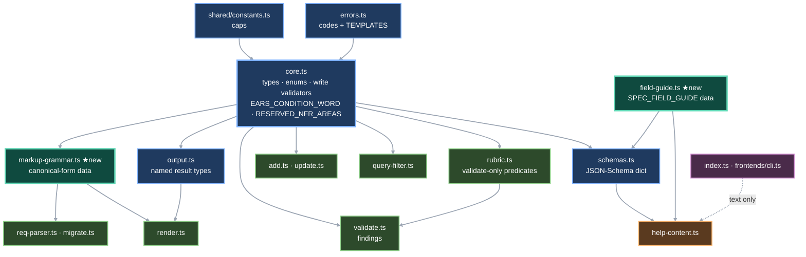

<CRITICAL ATTRIBUTION="DO NOT COMPACT/OPTIMIZE/SUMMARIZE/REPHRASE, PASS AS-IS">

# Tech Specs — Specs Template Update

Target state for the rosettify `specs` command after the requirement-unit model change.
Requirements source (authoritative): `docs/requirements/rosettify/SPECS.md`, **21 in-scope units**.
⚠ **Approval state:** 9 of the 21 currently carry `status="Draft"` with empty `approved_by` after the latest amendment round — see §14 G5. Content is decided; the approval record is not. Resolve before the implementation gate.
Companion: `SPECS-TEMPLATE-UPDATE-PLAN.md` (HOW/sequence). Design rationale: `architecture-notes.md`.
Discovery: `discovery-notes.md`. This file owns **WHAT** — contracts, shapes, criteria. No steps, no sequencing.

## TLDR

1. `AcceptanceCriterion` becomes the EARS object `{id, ears, when?|while?|where?|if?, system, shall}` — Given/When/Then is gone.
2. `Spec` gains `subsystem`, `component`, `evidence[]`; `level` narrows to the enum `System|Subsystem|Component`.
3. `SpecsDocument.component` → `SpecsDocument.system`; new `purged_ids: string[]`; the nine ISO quality-characteristic codes are pre-registered in every document, **recommended not mandatory**.
3b. `purge` records each purged id in `purged_ids` before removing the spec, and uniqueness spans live specs **and** that registry — purge erases content, never identity.
4. New write errors: `invalid_ears`, `duplicate_criterion_id`, `id_type_mismatch` (add **and** update), `invalid_level`. **`invalid_nfr_area` does not exist** — an off-vocabulary NFR area is accepted and warned by validate.
5. `render` gains `format=xml` emitting the canonical unit markup; `migrate` reads that form only and skips anything else with a stated reason. One shared grammar module makes them provable inverses.
6. Per-field authoring guidance is single-sourced in `field-guide.ts`, emitted as both schema `description`s and a help `field_guide` section.
7. `query` gains 5 filter keys: `level`, `subsystem`, `component`, `ears`, `evidence`. Spec cap 1000 → 10000.
8. Two new modules: `markup-grammar.ts` (data-only canonical-form definition), `field-guide.ts` (guidance data).
9. Requirement ids appear in **code comments only** — never in any emitted string.
10. `npm run typecheck` compiles `src/**` only; `tests/` is excluded. Fixture repair is Test-phase work, not implementation-phase work.

## Contents

1. Scope & traceability
2. ASR / NFR
3. Architecture & component design
4. Data models
5. Contracts — new & changed signatures
6. Canonical markup contract (render ⇄ migrate)
7. Validate findings contract
8. Query filter contract
9. Help content contract
10. Error handling strategy
11. Testing strategy & test data
12. Dependencies
13. Assumptions & decided resolutions
14. Known pre-existing gaps (not in scope)
15. Tech summary — files affected

---

## 1. Scope & traceability

21 in-scope ids, each with its owning module. `FR-SPECS-0026` (semantic search) is out of scope — intentional `Draft` placeholder.

| Requirement | impl tag | Owner module | Secondary files |
|---|---|---|---|
| FR-SPECS-0001 spec-unit schema | ToBeModified | `core.ts` | `schemas.ts`, `add.ts`, `errors.ts` |
| FR-SPECS-0002 document schema (`system`, `purged_ids`, reserved areas) | ToBeModified | `core.ts` | `output.ts`, `info.ts`, `render.ts`, `schemas.ts`, `help-content.ts`, `index.ts` |
| FR-SPECS-0004 id format, area registration, recommended codes | ToBeModified | `core.ts` | `add.ts`, `migrate.ts`, `validate.ts`, `help-content.ts` |
| **FR-SPECS-0005 uniqueness spans live specs + `purged_ids`** | ToBeModified | `core.ts` (`validateUniqueIds`) | `write.ts` (call site, unchanged) |
| FR-SPECS-0006 statement & acceptance content rules | ToBeModified | `rubric.ts` | `validate.ts`, `core.ts` |
| FR-SPECS-0007 size limits | ToBeModified | `shared/constants.ts` | `core.ts`, `validate.ts`, `help-content.ts` |
| FR-SPECS-0008 field authoring guidance | NotStarted | **`field-guide.ts` (new)** | `output.ts`, `schemas.ts`, `help-content.ts` |
| FR-SPECS-0009 identifier stability (`immutable_id`, `id_type_mismatch`, registry-backed never-reuse) | ToBeModified | `core.ts` | `add.ts`, `update.ts`, `purge.ts`, `errors.ts` |
| FR-SPECS-0010 add | ToBeModified | `add.ts` | `core.ts` |
| FR-SPECS-0012 query | ToBeModified | `query-filter.ts` | `help-content.ts` |
| **FR-SPECS-0013 update (catalog gains `invalid_type`, `id_type_mismatch`)** | ToBeModified | `update.ts` | `core.ts` |
| **FR-SPECS-0016 purge records `purged_ids`** | ToBeModified | `purge.ts` | `core.ts` |
| FR-SPECS-0021 validate | ToBeModified | `validate.ts` | `rubric.ts`, `core.ts` |
| FR-SPECS-0022 graph | Implemented | `graph.ts` — **no code change**; prose-only requirement edit | — |
| FR-SPECS-0023 render (`format=xml`) | ToBeModified | `render.ts` | **`markup-grammar.ts` (new)**, `output.ts`, `schemas.ts`, `errors.ts`, `index.ts`, `frontends/cli.ts`, `help-content.ts` |
| FR-SPECS-0024 info | ToBeModified | `info.ts` | `output.ts`, `schemas.ts` |
| FR-SPECS-0025 migrate | ToBeModified | `req-parser.ts` | `markup-grammar.ts`, `migrate.ts`, `output.ts` |
| FR-SPECS-0050 named result types | ToBeModified | `output.ts` | `schemas.ts` |
| FR-SPECS-0060 help content | ToBeModified | `help-content.ts` | `schemas.ts` |
| FR-SPECS-0061 help notes | ToBeModified | `help-content.ts` | — |
| FR-SPECS-0071 path convention string | ToBeModified | `help-content.ts` (`specs_file`) | — |

**FR-SPECS-0071 is a missing string, not a reword.** `SPECS.md:957` names the recommended convention `docs/REQUIREMENTS/<system>/specs.json`, "documented in help"; `SPECS.md:864` requires help to carry "the documented path form". `help-content.ts:48-51` today carries neither the path form nor the word `system`. Verified: `grep -rn REQUIREMENTS src/` → 0 hits.

---

## 2. ASR / NFR

| # | Constraint | Verification |
|---|---|---|
| ASR1 | `npm run typecheck` green after every phase; `npm run build` green | CI command |
| ASR2 | vitest 90 % line **and** branch coverage (`vitest.config.ts:12-15`) over `src/**`, excluding `src/bin/**`, `src/frontends/**` | `npm run test:coverage` |
| ASR3 | No requirement id / ticket id / internal path / module name in any emitted string | `tests/unit/specs/leakage.test.ts` + new deny-list scan (§9) |
| ASR4 | Zero network calls; ESM; Node ≥ 22; TS strict | existing project posture |
| ASR5 | Write path stays all-or-nothing and single-write (FR-SPECS-0030, FR-SPECS-0070) | existing `write.ts` unchanged |
| ASR6 | `validate` mutates nothing (FR-SPECS-0021.AC9) | read-only assertion test |
| ASR7 | render ⇄ migrate round trip is lossless for canonical units | round-trip test (§11) |
| ASR8 | No new runtime dependency; no XML library — hand-rolled string emit + the existing scanner | `package.json` diff empty |

---

## 3. Architecture & component design

Two new leaf modules. Everything else is an edit in place. No module is removed.



### 3.1 Module boundary rule (binding)

> A check whose verdict **rejects a write** lives in `core.ts` and returns `errorCode | null`.
> A check whose verdict becomes a **`SpecFinding`** lives in `rubric.ts` and returns `boolean` or a list.
> `validate.ts` never decides — it only wraps `rubric.ts`/`core.ts` verdicts into findings.

Precedent, not invention: `validate.ts:100-119` already imports six `core.ts` validators to build *error* findings, and error-severity `checkAcceptanceComplete` already lives in `rubric.ts` under the header "structural, not phrasing, but colocated here" (`rubric.ts:88-89`). The boundary is **caller**, never severity. `rubric.ts` imports from `core.ts`; never the reverse. `rubric.ts`'s file-header comment is rewritten in the same commit so it stops claiming "phrasing only".

### 3.2 Why two new leaf modules

- **`markup-grammar.ts`** — FR-SPECS-0023 and FR-SPECS-0025 are inverses (`SPECS.md:675`). One declarative definition of the canonical shape makes drift inexpressible. It holds **data only**; emit logic stays in `render.ts`, parse logic in `req-parser.ts`. It imports only types from `core.ts`, so it cannot create a cycle.
- **`field-guide.ts`** — `help-content.ts:22` already imports `specsSchemasDict` from `schemas.ts`. Defining guidance in `help-content.ts` and consuming it from `schemas.ts` is therefore a **module cycle**. The guidance data must be a leaf both import.

---

## 4. Data models

### 4.1 Enums & constants — `core.ts`

```ts
export const EARS_PATTERNS = ["ubiquitous","event","state","optional","unwanted"] as const;
export type EarsEnum = (typeof EARS_PATTERNS)[number];
export const LEVELS = ["System","Subsystem","Component"] as const;
export type LevelEnum = (typeof LEVELS)[number];
```

`EARS_CONDITION_WORD: Readonly<Record<EarsEnum, ConditionWord | null>>` where
`ConditionWord = "when" | "while" | "where" | "if"`:
`ubiquitous→null`, `event→"when"`, `state→"while"`, `optional→"where"`, `unwanted→"if"` (`SPECS.md:233`).
Single source for the write check, the validate check, the xml emitter, and the parser.

`RESERVED_NFR_AREAS: readonly AreaEntry[]` — the nine, in this order, with these exact names (`SPECS.md:157`):

| code | name | code | name | code | name |
|---|---|---|---|---|---|
| PERF | performance efficiency | SEC | security | REL | reliability |
| USE | usability | MAIN | maintainability | PORT | portability |
| COMP | compatibility | FUNC | functional suitability | SAFE | safety |

`shared/constants.ts`: `SPECS_MAX_SPECS = 10000` (was `1000`, `constants.ts:20`); new `SPECS_MAX_EVIDENCE_PER_SPEC = 50`. All other caps unchanged.

### 4.2 `AcceptanceCriterion` — `core.ts` (replaces `{given, when, then}`)

```ts
export interface AcceptanceCriterion {
  id: string; ears: EarsEnum;
  when?: string; while?: string; where?: string; if?: string;
  system: string; shall: string;
}
```

`if` and `while` are legal TypeScript **property** names (reserved only as statement keywords). Do not rename them — the JSON field names are fixed by `SPECS.md:59-62`. `id` required, format `<spec-id>.AC<n>`, unique within the unit, assigned when omitted, validated when supplied (`SPECS.md:56-57`). `system` and `shall` required non-empty.

### 4.3 `Spec` — `core.ts` (delta only)

| Field | Type | Default | Requirement |
|---|---|---|---|
| `level` | `LevelEnum` (was `string`) | `"System"` | FR-SPECS-0001 AC7 |
| `subsystem` | `string` | `""` | FR-SPECS-0001 AC9 |
| `component` | `string` | `""` | FR-SPECS-0001 AC9 |
| `evidence` | `string[]` | `[]` | FR-SPECS-0001 AC8 |
| `acceptance` | `AcceptanceCriterion[]` | required non-empty | FR-SPECS-0001 |

`KNOWN_SPEC_FIELDS` (`core.ts:128-150`) gains `subsystem`, `component`, `evidence`. `REQUIRED_STRING_FIELDS` unchanged (`level` stays out — it is defaulted, not validated for presence).

Empty `subsystem`/`component` means **unknown**, never not-applicable (`SPECS.md:231`).

### 4.4 `SpecsDocument` — `core.ts`

| Field | Change | Requirement |
|---|---|---|
| `system: string` | renamed from `component` (`SPECS.md:92`) | FR-SPECS-0002 |
| `purged_ids: string[]` | **new**, default `[]` — ids of purged specs, retained so an id is never reused (`SPECS.md:97`) | FR-SPECS-0002, 0009, 0016 |

`newDocument(system?: string)` — parameter renamed; seeds `purged_ids: []` and calls `ensureReservedAreas(doc)` before returning.

**No size cap on `purged_ids`** — decided, do not add one. An entry is ~20 bytes and growth is bounded by deliberate human action: purge already requires `--force` plus no remaining references. It is deliberately absent from `validateSizeLimits` and from the help `limits` section.

Legacy documents predate the field. Every read site uses `doc.purged_ids ?? []`; `loadSpecs` (`core.ts:353-360`) back-fills it to `[]` alongside the existing `previous_version` back-fill, so the shape is normalised once at the boundary.

### 4.5 `SpecFieldGuide` — `output.ts` (new named type, FR-SPECS-0008 / FR-SPECS-0050)

```ts
export interface SpecFieldGuide { field: string; type: string; required: boolean; default: string; guidance: string; }
```

Data lives in `field-guide.ts` as `SPEC_FIELD_GUIDE: readonly SpecFieldGuide[]`. Registered in `specsSchemasDict` under key `SpecFieldGuide`.

### 4.6 Renamed / widened existing types

| Type | Change | Requirement |
|---|---|---|
| `SpecDocumentSummary` | `component` → `system` (`output.ts:16`) | FR-SPECS-0050 |
| `SpecInfoResult` | `component` → `system` (`output.ts:204`) | FR-SPECS-0024 |
| `SpecRenderResult` | `format: "markdown"\|"text"\|"xml"` (`output.ts:127`) | FR-SPECS-0023 |
| `SpecSkipped` | shape **unchanged** `{source, reason}`; semantics change from whole-file exclusion to **per-unit** skip | FR-SPECS-0025 AC4/AC5/AC10 |

**`SpecSkipped` directive.** `output.ts:216-223` currently documents it as "a whole source file excluded … as opposed to a per-`<req>` issue (which goes in `warnings` instead)". FR-SPECS-0025 requires per-unit entries with a stated reason, and `SPECS.md:674` names the shape as exactly `{ source, reason }`. **Keep two fields — do not add a unit-id field.** Two skipped units from one file produce two entries sharing a `source`; the unit is identified inside `reason`. The false comment is corrected in the same commit as the behavior.

`SpecRenderResult.format` stays an **inline string union**. Rule: *a string union is named only when referenced by more than one declaration.* `format` appears once; FR-SPECS-0050's explicit type list (`SPECS.md:837`) names no format type, so naming it would add a dictionary entry no requirement asks for. (`Severity`/`EdgeKind` are named because they are reused.)

---

## 5. Contracts — new & changed signatures

### 5.1 `core.ts` — write-path validators (return `errorCode | null`)

| Signature | Rejects with | Requirement |
|---|---|---|
| `validateEars(v: unknown): string \| null` | `invalid_ears` | 0001 AC6 |
| `validateLevel(v: unknown): string \| null` | `invalid_level` | 0001; see §13 D1 |
| `validateCriteria(spec: Spec): string \| null` | `missing_required_field` (no `system`/`shall`), `duplicate_criterion_id`, `invalid_ears` | 0001 AC4/AC5/AC6 |
| `assignCriterionIds(specId: string, criteria: AcceptanceCriterion[]): AcceptanceCriterion[]` | — (pure; fills omitted ids with the next free `<specId>.AC<n>`) | 0001 AC3 |
| `validateIdTypeConsistency(id: string, type: unknown): string \| null` | `id_type_mismatch` | 0009 AC2/AC3 |
| `ensureReservedAreas(doc: SpecsDocument): void` | — (idempotent; appends any of the nine missing from `doc.areas`, preserving existing entries and their names) | 0004 AC4/AC7 |
| `validateAreaRegistration(spec, doc)` **modified** | `unknown_area`; now treats a reserved code as registered even when absent from `doc.areas` | 0004 AC3/AC4 |
| `validateUniqueIds(doc)` **modified** | `duplicate_id`; the seen-set is seeded from `doc.purged_ids ?? []` before walking `doc.specs`, so a live id colliding with either a live id **or** a purged one is rejected | 0005, 0009, 0016 |
| `checkStringLimits` **modified** | `isNameLike` gains `"system"` (`core.ts:311`) | 0007 AC3 |
| `validateSizeLimits` **modified** | adds `evidence.length > SPECS_MAX_EVIDENCE_PER_SPEC`; **no `purged_ids` cap** | 0007 AC7 |

`assignCriterionIds` semantics: "next free" = lowest `n ≥ 1` such that `<specId>.AC<n>` is not already claimed by a criterion in the same unit (supplied ids are claimed first, then omitted ones filled in array order). Never renumbers a supplied id.

`ensureReservedAreas` is called from `newDocument()` and from the write-path build in **`add.ts`** and `migrate.ts`. **Never** from a read path — `validate` and `info` must not mutate (FR-SPECS-0021.AC9). A legacy document therefore materialises the nine on its next write, and `validateAreaRegistration`'s reserved-awareness keeps read-only passes clean in the meantime.

`newDocument()` alone is **not sufficient** for FR-SPECS-0004.AC7 ("pre-registered in every document"): a document that already exists is never re-created, so without the `add.ts` call site it would never be backfilled. That is why `add.ts`'s build calls it too (§5.3).

### 5.2 `rubric.ts` — validate-only predicates

| Signature | Finding | Severity | Requirement |
|---|---|---|---|
| `checkCriterionEars(c: AcceptanceCriterion): boolean` | condition word matches declared `ears` | error | 0006 AC1/AC2 |
| `checkSingleConditionWord(c: AcceptanceCriterion): boolean` | at most one of `when/while/where/if` present & non-empty | error | 0006 AC3 |
| `checkCriterionIdFormat(specId: string, c: AcceptanceCriterion): boolean` | id matches `^<specId>\.AC\d+$` | error | 0021, §13 D2 |
| `checkAcceptanceComplete(spec: Spec): boolean` **modified** | ≥1 criterion **and** every criterion has non-empty `system` and `shall` | error | 0006 AC6, 0021 |
| `findLocationGaps(spec: Spec): SpecLocationGap[]` | missing / unstated location | error or warning | 0006 AC10-12 |
| `checkEvidencePresence(spec: Spec): boolean` | `source==="Sources"` ⇒ `evidence.length>0` | warning | 0021 AC4 |
| `checkRecommendedNfrArea(spec: Spec): boolean` | NFR whose area ∈ the nine | warning | 0004, 0021 |
| `checkMeasurableNfr`, `checkModalVerbs`, `findDuplicateStatements` | **unchanged bodies** | warning | 0021 |
| ~~`checkEars(statement)`~~ | **DELETED** — statements are no longer EARS-checked | — | 0006 (D5) |

`SpecLocationGap` is a local (non-exported-to-help) return shape: `{ field: "subsystem" \| "component"; severity: Severity }`. It is not a result type and therefore not subject to FR-SPECS-0050's dictionary rule.

`checkEars` is **deleted, not renamed**, so no existing test can keep passing against a repurposed function.

**`findLocationGaps` truth table** (`SPECS.md:231`, AC10-12):

| `level` | `subsystem` | `component` | outcome |
|---|---|---|---|
| Component | "" | any | error (subsystem) |
| Component | any | "" | error (component) |
| Component | set | set | clean |
| Subsystem | "" | — | error (subsystem) |
| Subsystem | set | — | clean |
| System | "" | "" | **warning** (unstated location) |
| System | either set | — | clean |

### 5.3 `add.ts` / `update.ts`

`prepareItem(raw, index)` (`add.ts:33-94`) gains, in this order after the existing enum checks and **before** the `Spec` literal: `validateLevel`, `validateIdTypeConsistency`. After the literal, replacing nothing: `assignCriterionIds` then `validateCriteria`. Every one pushes onto the existing `rejects: RejectRef[]` — see §10.

`cmdAdd`'s `build` callback (`add.ts:108-139`) calls **`ensureReservedAreas(doc)` before `autoRegisterAreas(doc, newIds)`** (`add.ts:128`), mirroring `migrate.ts`. Required by FR-SPECS-0004.AC7 — an existing document is never re-created, so `newDocument()` alone would never backfill it. Ordering matters only in that both must precede `validateAreaRegistration` (`add.ts:130`).

Purged-id collisions need no `add.ts` work: `validateUniqueIds` runs over the post-batch document inside the shared write gate (`write.ts:74`), so seeding its seen-set from `purged_ids` (§5.1) covers add, update and migrate at once (FR-SPECS-0016's add-reuses-a-purged-id criterion).

`update.ts` gains, on the merged spec after `validateVerification` (`update.ts:117-121`): `validateType(merged.type)`, then `validateIdTypeConsistency(existing.id, merged.type)`, then `validateLevel(merged.level)`, then `assignCriterionIds`+`validateCriteria` when the patch touched `acceptance`. `validateType` on the update path is a **required consequence** of FR-SPECS-0009 AC3, not a bonus fix: today `update.ts:104-121` validates only source/priority/verification and never `type` (verified).

Guarded-field and normative-edit behaviour (`update.ts:92-132`) is untouched. `evidence` edits are **not** normative (`SPECS.md:68`) — since the normative test is `patchWithoutId["statement"] !== undefined || patchWithoutId["acceptance"] !== undefined`, this already holds with no change; do not add `evidence` to that condition.

`update.ts`'s file-header comment (`update.ts:4-11`) currently asserts that `invalid_type` is add-only. Adding `validateType` to this path makes that false — the comment is corrected in the same commit, exactly as the `SpecSkipped` comment is (§4.6).

### 5.3b `purge.ts` — purged-id registry (FR-SPECS-0016, FR-SPECS-0009)

Inside `cmdPurge`'s `build` callback (`purge.ts:25-55`), after the `referenced_by_others` gate passes and **before** the `doc.specs` filter at `purge.ts:52`:

```ts
doc.purged_ids = [...new Set([...(doc.purged_ids ?? []), ...purgeable])];
```

Dedupe on append: a re-purge cannot occur (an absent spec lands in `missing`, `purge.ts:29-32`), but the union keeps the field idempotent under any future call path. `SpecPurgeResult` shape is unchanged — `{ purged, missing }` (`SPECS.md:454`). `affected: []` stays as it is: a purged spec no longer exists to stamp.

The registry is written on the purge path only. No read path touches it, and `validateUniqueIds` reads it without mutating.

### 5.4 `markup-grammar.ts` (new, data only)

| Export | Purpose |
|---|---|
| `CANONICAL_ATTR_ORDER: readonly string[]` | `<req>` attribute sequence (§6.1) |
| `CANONICAL_ATTR_LINES: readonly (readonly string[])[]` | line grouping for emit (§6.1) |
| `CRITERION_ATTR_ORDER: readonly string[]` | `id, ears, <condition word>, system, shall` |
| `ELEMENT_FIELDS: readonly string[]` | `title, statement, rationale, evidence, acceptance, implementationNotes, notes` |
| `MARKUP_TO_FIELD: Readonly<Record<string,string>>` | `depends→depends_on`, `ticketId→ticket_id`, `implementationNotes→implementation_notes` |
| `FIELD_TO_MARKUP: Readonly<Record<string,string>>` | inverse of the above |
| `EVIDENCE_SEPARATOR = ", "` | join on emit, split on parse (`SPECS.md:674`) |
| re-export `EARS_CONDITION_WORD` from `core.ts` | so both consumers reach it through one import |

`EARS_CONDITION_WORD` is **declared in `core.ts`** (Phase 0) and only re-exported here. Declaring it in this module would make Lane B depend on Lane C.

### 5.5 `field-guide.ts` (new, data only)

`SPEC_FIELD_GUIDE: readonly SpecFieldGuide[]` — one entry per spec-unit field (21 after the additions) and per criterion field (8), in schema order. `schemas.ts` looks guidance up by `field` name to fill each property `description`; `help-content.ts` re-exports the array as its `field_guide` section.

Guidance content is fixed by `SPECS.md:290` per field. Constraints on every string:
- directive instruction addressed to the caller; states what the value must **contain**, not what the field is named;
- **no** markup notation, file format, requirement id, ticket id, internal path, or design rationale (AC6).

### 5.6 `query-filter.ts`

`FILTER_KEYS` (`query-filter.ts:29-42`) gains 5 → 16 total: `level`, `subsystem`, `component`, `ears`, `evidence`. `matchFieldValue` (`query-filter.ts:245-272`) gains one `case` each — see §8.

---

## 6. Canonical markup contract (render ⇄ migrate)

Single source: `markup-grammar.ts`. Governing template: `instructions/r3/core/skills/requirements-authoring/assets/ra-requirement-unit.md:26-48`.

### 6.1 `<req>` attribute order — DECIDED, do not re-derive

**Canonical-template order wins**, i.e. the approval group, then `depends`, then `related`, then `implementation`:

```
id · type · level · [subsystem] · [component]
ticketId · classification
source
priority · verification
status · approved_by · changed
[depends] · [related]
implementation
```

Each row above is one emitted line. `[…]` attributes are omitted when empty.

FR-SPECS-0023's phrase "ordered by how often they change, **ending with** the approval group" (`SPECS.md:625`) is loose phrasing — it conflicts with the template, which puts `depends`/`implementation` after the approval group. **The round trip with `migrate` governs, so template order wins.** AC4 is the only testable pin and it constrains only that `status`, `approved_by`, `changed` share one line with `changed` as a calendar date — satisfied under either reading. This resolution is recorded here so nobody re-derives it from the requirement text.

Parsers must never depend on line breaks or attribute order — `req-parser.ts` reads attributes by name.

### 6.2 Field-by-field emit rules (FR-SPECS-0023)

| Rule | Detail | AC |
|---|---|---|
| single-value ⇒ attribute; prose/structured ⇒ element | per `ELEMENT_FIELDS` | AC3 |
| `subsystem`, `component` | attributes immediately following `level`; omitted when empty | AC11 |
| `depends_on` | emitted as attribute `depends`, comma-space joined | AC6 |
| `related` | own attribute, adjacent to `depends`, omitted when empty | — |
| `changed` | UTC **calendar date** `YYYY-MM-DD` (slice the stored ISO timestamp; storage stays ISO8601 UTC) | AC4 |
| approval group | `status`, `approved_by`, `changed` on one line | AC4 |
| criterion | self-closing `<criteria …/>`, attributes in order `id`, `ears`, condition word, `system`, `shall`; condition word omitted for `ubiquitous` | AC3 |
| `evidence` | single `<evidence>` element joining stored locations with `EVIDENCE_SEPARATOR`; **element omitted entirely when the list is empty** | AC5 |
| escaping | `&`, `<`, `>` in element text; `&`, `<`, `>`, `"` in attribute values | — |

Emitted skeleton (illustrative, 3 lines max per spec rules):

```xml
<req id="FR-CHK-0001" type="FR" level="Component" subsystem="cart" component="totals"
     status="Approved" approved_by="someone" changed="2026-08-10" depends="FR-CHK-0002"
     implementation="Implemented"> … </req>
```

### 6.3 `migrate` parse rules (FR-SPECS-0025)

- Read the **canonical shape only**. Fold attribute names via `MARKUP_TO_FIELD`.
- Split the `<evidence>` element into one entry per location (AC3).
- **Skip with a stated reason, never infer** (AC4/AC5): a unit whose single-value fields are carried as child elements; a unit whose `<criteria>` is prose rather than pattern attributes. Each skip is one `SpecSkipped` entry.
- Legacy bracket-form `implementation` parsing (`req-parser.ts:207-239`, `normalizeImplementation`) is **removed** — canonical form only.
- `splitGwt` (`req-parser.ts:170-202`) and prose `extractAcceptance` (`req-parser.ts:272-300`) are **removed**; `KNOWN_TAGS`/`extractKnownTags` (`req-parser.ts:43-47,97-105`) shrink to `ELEMENT_FIELDS`.
- Areas encountered in ids are registered (`autoRegisterAreas`, unchanged), and `ensureReservedAreas` runs on the assembled document.
- An imported NFR whose area is outside the nine is **imported normally** — `invalid_nfr_area` does not exist. `validate` reports the recommendation afterwards.
- `migrated` counts only canonical units (AC10). File-level failures stay `source_not_found` / `migrate_parse_error`.

### 6.4 markdown / text renderings (FR-SPECS-0023)

Fields shown per spec: `id`, `title`, `statement`, `level` **with its `subsystem` and `component`**, `priority`, `status`, `acceptance`, `evidence`, `depends_on`, `related`. Timestamps local (`formatLocal`).

Each criterion reads in the order **pattern, condition, responder, outcome** (AC10), e.g.
`1. [event] when the cart changes — the system shall recompute the total`.
For `ubiquitous` the condition segment is absent: `1. [ubiquitous] — the system shall …`.

`cmdRender`'s format guard (`render.ts:124`) admits `xml`; anything else → `invalid_format` (AC8). `renderSpecs`'s `format` parameter widens to the three-value union.

---

## 7. Validate findings contract (FR-SPECS-0021)

`SpecFinding = { id, check, severity, message }` — unchanged shape. `check` values below are the stable strings tests assert on.

| `check` | Severity | Source | Requirement |
|---|---|---|---|
| `schema_completeness` | error | `core.validateRequired` | 0021 AC1 |
| `id_format` | error | `core.validateIdFormat` | 0004 |
| `area_registration` | error | `core.validateAreaRegistration` (reserved-aware) | 0004 AC3 |
| `source_enum` / `priority_enum` / `verification_enum` | error | `core.*` | 0001 |
| `level_enum` | error | `core.validateLevel` | 0001 |
| `uniqueness` | error | id counts | 0005 |
| `reference_integrity` | error | id set | 0005 |
| `depends_acyclic` | error | `enumerateCycles` | 0005 AC6 |
| `criterion_id_format` | error | `rubric.checkCriterionIdFormat` | 0021, D2 |
| `duplicate_criterion_id` | error | per-unit id counts | 0021 AC3 |
| `criterion_ears` | error | `rubric.checkCriterionEars` + `checkSingleConditionWord` | 0006 AC2/AC3, 0021 AC2 |
| `acceptance_completeness` | error | `rubric.checkAcceptanceComplete` | 0006 AC6 |
| `location_completeness` | **error** | `rubric.findLocationGaps` (Subsystem/Component) | 0006 AC10/AC11 |
| `size_limits` | error | `sizeLimitIssue` + doc total | 0007 |
| `location_completeness` | **warning** | `rubric.findLocationGaps` (System, neither named) | 0006 AC12 |
| `measurable_nfr` | warning | `rubric.checkMeasurableNfr` | 0006 AC5, 0021 AC13 |
| `modal_verbs` | warning | `rubric.checkModalVerbs` | 0006 AC7, 0021 AC5 |
| `missing_evidence` | warning | `rubric.checkEvidencePresence` | 0021 AC4 |
| `recommended_nfr_area` | warning | `rubric.checkRecommendedNfrArea` | 0004, 0021 |
| `duplicate_statement` | warning | `rubric.findDuplicateStatements` | 0021 |
| ~~`ears_pattern`~~ | **REMOVED** | was `validate.ts:139-141` | 0006 (D5) |

`ok === (error_count === 0)`. Warnings never block approve (`approve.ts` unchanged — it inherits the new checks through `runValidation`).

`sizeLimitIssue` (`validate.ts:53-66`) gains the evidence-length branch.

Messages must name the omission, never judge quality (`SPECS.md:570`). `acceptance_completeness`'s current message "Acceptance is empty, or a criterion is missing given/when/then." (`validate.ts:131`) becomes "…or a criterion is missing its responder or outcome."

---

## 8. Query filter contract (FR-SPECS-0012)

| Key | Match semantics | AC |
|---|---|---|
| `level` | exact against `spec.level`, mirroring `type`/`status` | AC13 pattern |
| `subsystem` | exact against `spec.subsystem` | — |
| `component` | exact against `spec.component` | AC13 |
| `ears` | true when **any** criterion's `ears` equals the value | AC6 |
| `evidence` | `present` ⇒ `evidence.length > 0`; `absent` ⇒ `=== 0`; **any other value ⇒ `invalid_query`** | AC7, D6 |

Comma-OR, `-` negation, quoting and free-text behaviour are inherited unchanged. Unknown **key** ⇒ `invalid_filter` (AC9); malformed **value** on a known key ⇒ `invalid_query` (AC10). `query.ts` needs no edit (thin wrapper).

---

## 9. Help content contract (FR-SPECS-0060 / 0061 / 0071 / 0008)

All in `help-content.ts`. Every string below is subject to §10's leakage rule.

| Section | Change | Requirement |
|---|---|---|
| `description`, `specsToolDef.description` | "component's requirements" → "system's requirements"; "one JSON document per component" → "per system" | 0002 |
| `specs_file.convention` | one JSON document per system | 0002, 0060 |
| `specs_file.path_form` **(new key)** | the documented recommended path form `docs/REQUIREMENTS/<system>/specs.json`, stated as a recommendation, not enforced | **0071** |
| `terms` **(new section)** | `system`, `subsystem`, `component`, `area`, `level`, criterion `system`; plus "a large solution is decomposed into several systems, one per business reason" | 0060 AC7 |
| `concepts.spec_unit` | field list updated: `level`, `subsystem`, `component`, `evidence`; "acceptance (Given/When/Then criteria)" removed | 0060 |
| `concepts` | five criterion patterns + each one's condition word; criterion sub-ids; evidence and when a unit needs it; statement-as-rule vs criteria-as-samples; Draft = complete & ready for review | 0060 AC3 |
| `concepts.areas` | the nine codes **pre-registered and recommended**, and that **any registered area is accepted** on any type | 0060 AC4 |
| `field_guide` **(new section)** | `SPEC_FIELD_GUIDE` from `field-guide.ts` | 0008 AC1/AC2 |
| `limits` | `max_specs` 10000; new `max_evidence_per_spec` | 0007 AC9 |
| `query_notation.keys` | 11 → 16 keys | 0012 |
| `render` subcommand `args["--format"]` | markdown \| text \| xml | 0023 |
| `specsNotes` | 12 → ≥18 entries covering every bullet at `SPECS.md:899-918` | 0061 AC1 |

New notes required beyond today's 12 (`help-content.ts:25-38`): reserved-and-recommended NFR codes with any-registered-area accepted; statement-carries-the-rule-not-a-one-trigger-sentence; one pattern + its condition word + responder + outcome per criterion; sub-ids auto-assigned and the stable target a test claims; evidence = one path and line range per source location, expected on code-derived units; render returns markup as well as markdown. The existing `migrate` note ("one-time import of legacy markdown spec blocks") is **replaced** — migrate now imports the shape render emits and skips anything else with a reason. The existing **purge note is amended** (FR-SPECS-0061): purge permanently removes the spec and **its id stays taken forever** — a purged id is never given to a different spec.

`help/index.ts` and `registry/types.ts` need **no change**: `HelpCommandDetail` carries an index signature, so `terms` and `field_guide` pass through (`registry/types.ts:127-134`).

---

## 10. Error handling strategy

### 10.1 Error codes

| Code | Const | Status | Requirement |
|---|---|---|---|
| `invalid_ears` | `ERR_INVALID_EARS` | **new** | 0001 AC6 |
| `duplicate_criterion_id` | `ERR_DUPLICATE_CRITERION_ID` | **new** | 0001 AC5 |
| `id_type_mismatch` | `ERR_ID_TYPE_MISMATCH` | **new** | 0009 AC2/AC3 |
| `invalid_level` | `ERR_INVALID_LEVEL` | **new**; now named by FR-SPECS-0001 (`SPECS.md:68`) and in add's catalog | 0001, 0010 |
| ~~`invalid_nfr_area`~~ | — | **DOES NOT EXIST. Do not implement.** | 0004 (deleted) |
| `immutable_id` | existing | unchanged, now owned by 0009 | 0009 AC1 |
| `duplicate_id` | existing | unchanged code, **widened trigger**: also fires when an id collides with `purged_ids` | 0005, 0016 |
| `invalid_type` | existing | unchanged code, **new call site**: the update path (`SPECS.md:387` catalog) | 0013 |

Add's catalog (`SPECS.md:315`) now names `invalid_ears`, `invalid_level`, `duplicate_criterion_id` and `id_type_mismatch`; update's (`SPECS.md:387`) names `invalid_type` and `id_type_mismatch`. Code and catalogs agree — the earlier drift is closed.

Each new code gets a `TEMPLATES` entry (`errors.ts:82-113`) in generic prose with no id, path, or module name. `ERR_INVALID_FORMAT`'s JSDoc (`errors.ts:62`, "not markdown|text") is corrected to include `xml`; its template text is already generic.

### 10.2 Aggregation — binding

FR-SPECS-0030 (`SPECS.md:689`): a failing batch writes nothing and returns **one** human-readable string enumerating **every** failing item with its reason. The builder already exists — `aggregate(code, rejects)` in `aggregate.ts:17-20`, with `RejectRef = { ref, reason }`.

> **Every new per-item check pushes onto `rejects` and returns a `RejectRef`. None may `return err(...)` or short-circuit the batch.**

`prepareItem` (`add.ts:33-94`) is the correct home for all four new checks: each is decidable from the item alone, so none needs post-`autoRegisterAreas` document state, and `prepareItem`'s outcome flows into the `rejects` array by construction (`add.ts:112-123`). `update.ts` already pushes rather than returns (`update.ts:95-121`) — follow that shape.

### 10.3 Leakage rule — binding

Requirement ids belong in **code comments only**. Permitted: the file-header `// Implements FR-SPECS-XXXX (…)` line and per-function JSDoc `/** FR-SPECS-XXXX — … */`, matching the existing convention (`rubric.ts:1,23`; `errors.ts:8-67`). Forbidden in: any help string, note, schema `description`, error template, finding `message`, or other emitted value (`SPECS.md:875`, FR-ARCH-0016 as scoped by FR-SPECS-0043). New modules carry the same header style.

---

## 11. Testing strategy & test data

### 11.1 Phase boundary — READ THIS BEFORE ESCALATING

`npm run typecheck` is `tsc --noEmit` with **no `-p`**, so it resolves `tsconfig.json`, whose `"include": ["src/**/*.ts"]` and `"exclude": [..., "tests"]` (`tsconfig.json:18-19`) mean **`tests/` is never type-compiled**. `tsconfig.build.json:3` excludes `tests` and `**/*.test.ts` too. `vitest.config.ts` declares no `typecheck` block, so vitest transpiles without type checking.

⇒ **`npm run typecheck` stays green through implementation with zero test edits. `npm run test` WILL fail between the implementation and test phases** — `pretest` builds `src` fine, then vitest runs old-shape fixtures whose `c.given` and `doc.component` are now `undefined` at runtime. **That is expected and is not a blocker.** Fixture repair is Test-phase task #1.

### 11.2 Fixture strategy

Rewrite `tests/fixtures/specs.ts` in place, **keeping every exported name** (`makeAcceptance`, `makeSpec`, `makeDoc`, `makeAddItem`) so not one import line in the 22 dependent unit-test files changes. `makeAcceptance` returns `{id:"FR-CHK-0001.AC1", ears:"event", when:"…", system:"…", shall:"…"}`; `makeSpec` gains `subsystem:""`, `component:""`, `evidence:[]`; `makeDoc` renames `component:"checkout"` → `system:"checkout"`. This single file unblocks compile-and-run for 22 of 27 unit files.

### 11.3 Coverage targets by file

| File | Test file | New coverage needed |
|---|---|---|
| `core.ts` | `core.test.ts` (72 cases) | `validateEars`, `validateLevel`, `validateCriteria`, `assignCriterionIds`, `validateIdTypeConsistency`, `ensureReservedAreas`, reserved-aware area registration, `system` name cap, evidence cap, cap 10000 (existing cases at `core.test.ts:379-380,422` assert 1000 — rewrite) |
| `rubric.ts` | `rubric.test.ts` (23) | rewrite: `checkEars` cases deleted; new criterion/location/evidence/NFR-area predicates |
| `validate.ts` | `validate.test.ts` (18) | rewrite: every row of §7, both severities of `location_completeness`, `ears_pattern` absence |
| `req-parser.ts` | `req-parser.test.ts` (40) | near-total rewrite to attribute form; legacy-bracket and GWT cases deleted |
| `render.ts` | `render.test.ts` (18) | `format=xml` per AC3-AC6/AC11, criterion order AC10, `invalid_format` AC8 |
| `add.ts` | `add.test.ts` (30) | id auto-assignment, `duplicate_criterion_id`, `invalid_ears`, `invalid_level`, `id_type_mismatch`, multi-item aggregation |
| `update.ts` | `update.test.ts` (23) | `invalid_type` (new), `id_type_mismatch`, criterion re-validation on patch |
| `query-filter.ts` | `query-filter.test.ts` (42) | 5 new keys + `evidence:` bad value ⇒ `invalid_query` |
| `migrate.ts` | `migrate.test.ts` (15) | canonical import, per-unit skip entries, off-vocabulary NFR imported normally |
| `help-content.ts` | `help-content.test.ts` (6) | note count/topics grow; top-level key list gains `terms`, `field_guide` |
| `schemas.ts` | `schemas.test.ts` (3) | required-type list gains `SpecFieldGuide` |
| `purge.ts` | `purge.test.ts` (9) | id recorded in `purged_ids` before removal; `purged`/`missing` unchanged; **add reusing a purged id ⇒ `duplicate_id`** (FR-SPECS-0016); dedupe on repeated append |
| `info.ts`, `output.ts` | resp. tests | `system` key assertions |
| `field-guide.ts` | **new** `field-guide.test.ts` | AC1 completeness vs `KNOWN_SPEC_FIELDS`, AC2 all five keys present, AC3 parity with `specsSchemasDict`, AC4/AC5 content, AC6 deny-list |
| `markup-grammar.ts` | **new** `markup-grammar.test.ts` | round trip: `renderSpecs(doc, specs, "xml")` → parser → deep-equal the source `Spec[]` |
| leakage | `leakage.test.ts` (7) | `field_guide` + `terms` covered automatically by the existing `JSON.stringify(specsHelpContent)` scan; **add** the AC6 notation deny-list |

**AC6 gap (must not be missed):** `leakage.test.ts:17-20`'s four regexes match requirement ids, ticket ids, internal paths and module names — **nothing about notations or file formats**. FR-SPECS-0008.AC6 additionally forbids naming a markup notation or file format in guidance. New assertion: no `SPEC_FIELD_GUIDE[].guidance` matches `/\b(JSON|XML|YAML|markdown|markup|file)\b/i`.

**AC7 mechanical enforcement:** derive the expected field list from `KNOWN_SPEC_FIELDS` (`core.ts:128-150`), never a hand-written list, so adding a spec field without guidance fails.

### 11.4 Test data

Happy: canonical FR with all five `ears` patterns across five criteria; NFR `NFR-PERF-0001` in a never-edited registry; `level=Component` with both names; unit with two evidence locations.
Edge: criterion with omitted `id` mid-array (id assignment must skip claimed numbers); `subsystem` set at `level=System` (clean, not a warning); `evidence` exactly 50; title exactly 256; criterion `system` exactly 256 / 257; `NFR-CLI-0001` (accepted + warned); document with 10000 vs 10001 specs.
Error: `ears:"eventually"`; two criteria sharing `.AC1`; criterion missing `shall`; `level:"Module"`; add `type:"NFR"` under `FR-…` id; update patching `type` to a nonsense string; batch of 3 where items 2 and 3 both fail (one aggregated string naming both); **add reusing a purged id ⇒ `duplicate_id`**; **legacy document with no `purged_ids` key read, purged from, and written back**.
Round trip: a unit carrying every optional attribute and every element, rendered to xml and re-parsed.
Skip: source mixing canonical and element-form units — canonical imported, each non-canonical listed with its reason.

---

## 12. Dependencies

No new runtime or dev dependency. Unchanged: `commander`, `pino`, `@modelcontextprotocol/sdk`; `typescript` 6, `vitest` 4.
Internal, unchanged and relied upon: `shared/doc-io.ts` (generic over `Doc`, no field references), `shared/envelope.ts`, `shared/graph.ts`, `shared/time.ts`, `shared/actor.ts`, `registry/*` (`ToolDef` shape and `HelpCommandDetail`'s index signature), `frontends/mcp.ts`.
Downstream consumer to leave alone: `commands/plan/*` shares `shared/*` only.

---

## 13. Assumptions & decided resolutions

Decided at the design gate. **Do not re-open.**

| # | Question | Decision |
|---|---|---|
| D1 | out-of-enum `level` | new code `invalid_level`, by symmetry with `invalid_type`/`invalid_source`/`invalid_priority`/`invalid_verification`. **Now backed by requirement text** (`SPECS.md:68`, `SPECS.md:315`) — the earlier caveat is withdrawn |
| D9 | `purged_ids` size cap | **none**. ~20 bytes per entry; growth is bounded by deliberate human action (`--force` plus no remaining references). Absent from `validateSizeLimits` and from help `limits` |
| D10 | where the registry is enforced | `validateUniqueIds` in `core.ts`, reached by every write through the shared gate at `write.ts:74` — not per-subcommand |
| D2 | malformed (vs duplicate) criterion id | **validate finding only**, error severity, owned by FR-SPECS-0021. The duplicate stays a write refusal (FR-SPECS-0001 AC5) |
| D3 | migrate × off-vocabulary NFR area | imported normally; `validate` warns. Dissolved by the `invalid_nfr_area` deletion |
| D4 | legacy bracket `implementation` parsing | **removed**; canonical form only |
| D5 | xml attribute order | canonical-template order: approval group → `depends` → `related` → `implementation` (§6.1) |
| D6 | `evidence:` value outside `present\|absent` | `invalid_query` (key known, value malformed) |
| D7 | reserved-area materialisation | `ensureReservedAreas` on write paths + `newDocument()`; reserved-aware `validateAreaRegistration`; **never** on a read path |
| D8 | AC6 test surface | deny-list scan appended to the existing leakage test |
| A1 | `changed` storage | stays ISO8601 UTC; the calendar date is a render-time projection (`SPECS.md:625`) |
| A2 | criterion string caps | `id`/`system` under the 256 name cap, `shall`/condition word under the 20000 string cap; **no new size constants** beyond `SPECS_MAX_EVIDENCE_PER_SPEC` |
| A3 | `subsystem`/`component` on the unit | fall under the 20000 string cap — FR-SPECS-0007 names only `id` and `system` for the name cap; do not extend |
| A4 | stale plugin cache | `~/.claude/plugins/cache/rosetta/rosetta/3.1.6/` still carries the OLD Given/When/Then template. **Canon is the repository**: `instructions/r3/core/skills/requirements-authoring/assets/ra-requirement-unit.md` + that skill's `SKILL.md` |
| A5 | instructions layer untouched | the authoring skill's id grammar stays firm (`NFR-[ISO]-####`) on purpose: instructions **prescribe**, the tool **permits**. Same words, different level. **Do not "fix" the skill** |

`checkStringLimits`'s `keyHint` recursion means adding `"system"` to `isNameLike` (`core.ts:311`) also puts the *document's* `system` field under the 256 cap. Intended and harmless — recorded so a reviewer does not read it as a defect.

---

## 14. Known pre-existing gaps — recorded, NOT in scope

| # | Gap | Evidence | Disposition |
|---|---|---|---|
| G1 | `add.ts`'s area-registration loop early-returns on the first failing spec, so a batch with two unknown areas names only one — partial aggregation against FR-SPECS-0061's "aggregates every problem at once" | `add.ts:129-132` | **Out of scope.** FR-SPECS-0030's letter ("its reason", singular, per failing item) is satisfied. Do not refactor. New checks go in `prepareItem`, which aggregates by construction |
| ~~G2~~ | FR-SPECS-0006 vs FR-SPECS-0004 on out-of-vocabulary areas | — | **RESOLVED.** `SPECS.md:236` now reads "an unregistered area, or a `type` disagreeing with its own id prefix" on the write side and lists the non-ISO area among the validate-reported recommendation violations. The two units agree; no precedence rule is needed |
| ~~G3~~ | `invalid_level` unbacked; add/update catalogs incomplete | — | **RESOLVED.** FR-SPECS-0001 names `invalid_level` (`SPECS.md:68`); add's catalog gained `invalid_ears`, `invalid_level`, `duplicate_criterion_id`, `id_type_mismatch` (`SPECS.md:315`); update's gained `invalid_type`, `id_type_mismatch` (`SPECS.md:387`) |
| G4 | FR-SPECS-0002's `implementationNotes` cites `write.ts` and `shared/doc-io.ts`, neither of which references the renamed field | `SPECS.md:119`; `grep .component` → 11 sites in 6 files, neither of those | Cosmetic requirement-note error; correct when those units are next touched |
| **G5** | **9 of the 21 in-scope units carry `status="Draft"` with empty `approved_by` after the amendment rounds: FR-SPECS-0001, 0002, 0005, 0006, 0009, 0010, 0013, 0016, 0061** | `SPECS.md` lines 19, 111, 182, 208, 226, 320, 392, 459, 896 | **Governance blocker, not a technical one.** The content is decided and specified here; the approval record is not. Implementing against `Draft` units contradicts the project's own spec-before-code posture. Must be resolved at the implementation gate — re-approval is an authoring-flow action, outside this plan's scope |
| G6 | FR-SPECS-0016's `implementationNotes` cites `aggregate.ts` and `frontends/cli.ts`; neither changes for the registry (`aggregate.ts` is already used for `referenced_by_others`; the `--force` flag already exists) | `SPECS.md:466` | Cosmetic; the real new file is `purge.ts` only |

---

## 15. Tech summary — files affected

**New (2):** `src/commands/specs/markup-grammar.ts`, `src/commands/specs/field-guide.ts`.

**Modified (17):** `shared/constants.ts` · `commands/specs/`: `core.ts`, `errors.ts`, `output.ts`, `schemas.ts`, `info.ts`, `add.ts`, `update.ts`, **`purge.ts`**, `rubric.ts`, `validate.ts`, `query-filter.ts`, `render.ts`, `req-parser.ts`, `migrate.ts`, `help-content.ts`, `index.ts` · `frontends/cli.ts`.

**Unchanged, deliberately (11 in-command + shared):** `aggregate.ts`, `approve.ts`, `delete.ts`, `deprecate.ts`, `get.ts`, `graph.ts`, `implemented.ts`, `query.ts`, `reopen.ts`, `restore.ts`, `write.ts`; `shared/doc-io.ts`, `shared/envelope.ts`, `shared/graph.ts`, `shared/time.ts`, `registry/*`, `commands/help/*`, `frontends/mcp.ts`.

`write.ts` stays unchanged **and** is load-bearing for the registry: its post-batch gate `validateSizeLimits(doc) ?? validateUniqueIds(doc) ?? validateReferences(doc) ?? validateDependsAcyclic(doc)` (`write.ts:74`) is the single choke point every write subcommand passes through, so teaching `validateUniqueIds` about `purged_ids` covers add, update and migrate with no per-command edit. `commands/plan/core.ts` has its own separate `validateUniqueIds` (`plan/core.ts:327`) — do not touch it.

**Tests (Test phase):** `tests/fixtures/specs.ts` first, then the 27 `tests/unit/specs/*.test.ts` files, two new test files (`field-guide.test.ts`, `markup-grammar.test.ts`), plus `tests/e2e/specs.e2e.test.ts` and `tests/e2e/mcp.e2e.test.ts` (criterion-shape payloads at `mcp.e2e.test.ts:682-712`).

</CRITICAL>
