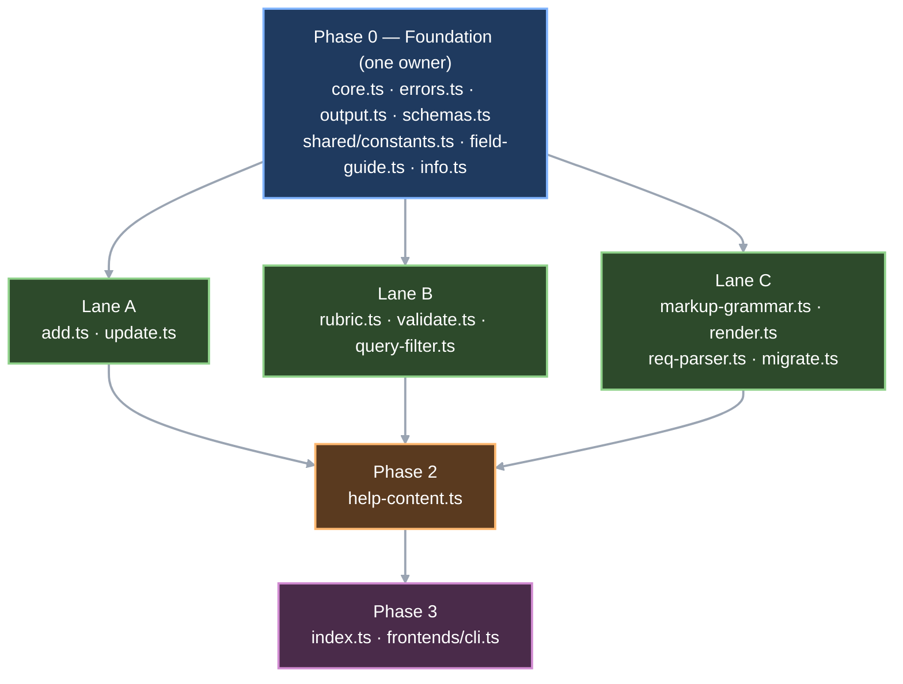

# Architecture Notes — Specs Template Update

Design for the 17 in-scope requirements of `docs/requirements/rosettify/SPECS.md` against
`src/rosettify/src/commands/specs/`. Builds on `discovery-notes.md` (same folder); every claim below
is either verified in this pass (marked **V**) or carried from discovery on trust (marked **D**).

Canon for the requirement-unit model: `instructions/r3/core/skills/requirements-authoring/assets/ra-requirement-unit.md`
(**V**, read end to end). The cached plugin skill copy is stale and was not consulted.

Scope of this document: internal structure and the resolved degrees of freedom. It does not
pre-write the tech specs or the plan (phase 4 owns those).

---

## 0. Standing constraints (restated once; every lane inherits them)

| # | Constraint | Where it comes from | Design consequence |
|---|---|---|---|
| C1 | Requirement ids live in **code comments only** — never in a help string, note, schema `description`, error template, or any emitted value | `SPECS.md:846` (FR-SPECS-0060), FR-ARCH-0016; enforced by `tests/unit/specs/leakage.test.ts:17-20` (**V**) | Traceability goes in the file-header `// Implements FR-SPECS-XXXX (...)` line and per-function JSDoc `/** FR-SPECS-XXXX — ... */`, matching the existing convention (`rubric.ts:1`, `rubric.ts:23`, `errors.ts:8-67`) |
| C2 | The four warning-tier checks stay **text heuristics**, reported as the omission each detects, never as a judgment of quality | `SPECS.md:541`; locked as D15 in `requirements-authoring-flow-state.md:82` | `checkMeasurableNfr`, `checkModalVerbs`, `findDuplicateStatements` and the new evidence-provenance check are not "improved". Their bodies change only where the field they read changed |
| C3 | Error reporting **aggregates** | Normative home is **FR-SPECS-0030** `SPECS.md:689` ("a single human-readable error string that enumerates every failing item ... together with its reason"), already built as `aggregate.ts:17-20` (**V**). FR-SPECS-0061 `SPECS.md:889` only requires the *note* saying so | New write checks push onto the existing `rejects: RejectRef[]` array; they never `return err(...)` early. See R1 |
| C4 | The data model is fixed by approved requirements | `SPECS.md:23-68`, `SPECS.md:88-103` | Not a degree of freedom. Nothing below re-opens it |
| C5 | No capability beyond the approved requirements | task brief | Anything that looks missing is filed in §7, not designed in |

---

## 1. The genuine forks

### F1 — Where the new criterion validators live

The new checks are per-criterion and cross-field: condition word must match `ears`; at most one
condition word; sub-id format `<spec-id>.AC<n>` and uniqueness within the unit; `system`/`shall`
non-empty; location completeness against `level`; NFR area vocabulary; `type`-vs-id-prefix
consistency.

The premise that `rubric.ts` holds "pure matchers over a statement string" is **only half true**
(**V**): `findDuplicateStatements` takes `Spec[]` (`rubric.ts:72`) and `checkAcceptanceComplete`
takes a whole `Spec` (`rubric.ts:94`), and that file's own header calls the latter
"structural, not phrasing, but colocated here" (`rubric.ts:88-89`). So `rubric.ts` already accepts
Spec-shaped, cross-field input, and severity is *not* what separates the two modules.

| Option | Pros | Cons |
|---|---|---|
| **A — split by caller: `core.ts` = write-path validators returning `code \| null`; `rubric.ts` = validate-only pure predicates; `validate.ts` wraps into `SpecFinding`** | Matches the boundary the code already draws (`validate.ts:100-119` imports six `core.ts` validators for *error* findings, **V**); the enforcement split of FR-SPECS-0006 maps one-to-one onto write-rejection vs validate-report; no new module, no new import edge | `rubric.ts` grows to ~180 lines and stops being "phrasing only" — its header comment must be rewritten or it lies |
| B — new `criterion-checks.ts` holding every criterion-level check regardless of caller | One obvious place to look for anything criterion-shaped; smallest diff to `rubric.ts` | Splits the write path across `core.ts` + `criterion-checks.ts` for no reason; a fourth import edge into `add.ts`/`update.ts`/`validate.ts`; invents a module boundary no requirement asks for |
| C — inline in `add.ts` (write) and `validate.ts` (validate) | Zero new exports; each check sits next to its only caller | Duplicates the ears↔condition-word map in two files — exactly the drift F2 exists to prevent; makes the checks untestable except through a command envelope, against the 90% branch bar |

**Chosen: A.** The rule to state in the plan: *a check whose verdict rejects a write lives in
`core.ts` and returns an error code or `null`; a check whose verdict becomes a `SpecFinding` lives in
`rubric.ts` and returns a boolean or a list; `validate.ts` never decides, it only wraps.*
`rubric.ts`'s header comment is updated in the same commit so the file's contract stays accurate.

Assignment:

| Check | Module | Returns | Reported as |
|---|---|---|---|
| `ears` enum membership | `core.ts` | `invalid_ears` | write rejection |
| criterion `system`/`shall` present | `core.ts` | `missing_required_field` | write rejection |
| criterion id format + uniqueness within unit | `core.ts` | `duplicate_criterion_id` / see Q2 | write rejection |
| criterion id auto-assignment when omitted | `core.ts` (pure helper), called from `add.ts` | assigned id | — |
| NFR area vocabulary | `core.ts` | `invalid_nfr_area` | write rejection |
| `type` vs id prefix | `core.ts` | `id_type_mismatch` | write rejection (**both** add and update — see §7 M1) |
| `level` enum membership | `core.ts` | see Q1 | write rejection |
| condition word matches declared `ears` | `rubric.ts` | boolean | validate **error** |
| more than one condition word | `rubric.ts` | boolean | validate **error** |
| criterion id format / per-unit duplicate (read path) | `rubric.ts` | list | validate **error** |
| location completeness against `level` | `rubric.ts` | severity-bearing list | validate **error** (Subsystem/Component) or **warning** (System, `SPECS.md:220`) |
| evidence provenance (`source==="Sources"` and empty) | `rubric.ts` | boolean | validate **warning** |

Note the deliberate duplication of the criterion-id and vocabulary checks across both paths: the
write path rejects the object it is handed, the validate path re-checks stored data that may predate
the rule. Both call the *same* `core.ts` predicate where the verdict is identical — `rubric.ts`
imports from `core.ts`, never the reverse.

### F2 — Do the xml renderer and the markup parser share one grammar definition?

FR-SPECS-0023 (`render --format xml`) and FR-SPECS-0025 (`migrate`, canonical form only) are
inverses; FR-SPECS-0025's own rationale says so (`SPECS.md:646`: "the inverse of the xml rendering
... together they make the store a round trip"), and its `depends` edge to FR-SPECS-0023 was added
for that reason (`requirements-authoring-flow-state.md:93`).

| Option | Pros | Cons |
|---|---|---|
| **A — one declarative leaf module `markup-grammar.ts` holding only *data* (attribute order, attribute↔field folding map, ears↔condition-word map, which fields are attributes vs elements, criterion attribute order); `render.ts` writes with it, `req-parser.ts` reads with it** | Drift becomes structurally impossible for everything the data covers; the folding map FR-SPECS-0025 spells out (`depends`→`depends_on`, `ticketId`→`ticket_id`, `implementationNotes`→`implementation_notes`) is stated once; both consumers are in the same lane, so no new serialization point; a round-trip test becomes a real test rather than a coincidence | One more module; the two code paths still differ (emit is string building, parse is scanning), so a *logic* bug in one is not caught by the shared data |
| B — two independent implementations, pinned only by a render→migrate round-trip test | Least new structure; each side reads naturally on its own | The attribute-order list, the folding map, and the condition-word map get written twice; the round-trip test only catches a divergence it happens to exercise — an attribute nobody's fixture carries drifts silently. This is precisely what the requirement's rationale warns against |
| C — one combined codec module (`encode` + `decode` in one file) | Absolute symmetry; impossible to add a field to one direction only | Merges two different concerns into one file and pulls `render.ts`'s and `req-parser.ts`'s existing responsibilities out from under them; `req-parser.ts` is 355 lines of tag scanning that has nothing to do with rendering; a much bigger blast radius than the requirements justify |

**Chosen: A**, plus a round-trip test as the belt (`render --format xml` output fed to the parser
must reproduce the source `Spec`). `markup-grammar.ts` is data-only and imports nothing but types
from `core.ts` — it is a leaf, so it cannot create a cycle. Its contents:

- `CANONICAL_ATTR_ORDER` — the `<req>` attribute sequence
- `CRITERION_ATTR_ORDER` — `id, ears, <condition word>, system, shall`
- `EARS_CONDITION_WORD` — `ubiquitous→(none), event→when, state→while, optional→where, unwanted→if`
- `MARKUP_FIELD_ALIASES` — `depends↔depends_on`, `ticketId↔ticket_id`, `implementationNotes↔implementation_notes`
- `ELEMENT_FIELDS` — `title, statement, rationale, evidence, acceptance, implementationNotes, notes`

`EARS_CONDITION_WORD` is the single map the F1 `rubric.ts` condition-word check *also* consumes, so
the write path, the validate path, the renderer, and the parser all agree by construction.

### F3 — How the per-field guidance stays single-sourced

FR-SPECS-0008 requires the same guidance as each field's schema `description` **and** as a help
`field_guide` section, and AC3 requires them to match (`SPECS.md:268`).

The import graph decides this: `help-content.ts:22` already does `import { specsSchemasDict } from "./schemas.js"` (**V**). So guidance defined in `help-content.ts` and consumed by `schemas.ts` is a
module cycle. That kills the most obvious option outright.

| Option | Pros | Cons |
|---|---|---|
| **A — new leaf module `field-guide.ts` exporting `SPEC_FIELD_GUIDE: readonly SpecFieldGuide[]` (one entry per spec-unit field and per criterion field); `schemas.ts` reads it to populate every `description`, `help-content.ts` re-exports it as the `field_guide` section** | One literal per field, consumed twice — divergence is not expressible; carries `required` and `default` which AC2 demands and a JSON-Schema `description` cannot hold; leaf module, no cycle; AC3 becomes a trivial test (`for each entry, specsSchemasDict.Spec.properties[field].description === entry.guidance`) | One more file; `schemas.ts` gains a lookup helper instead of inline description literals |
| B — guidance lives as the `description` literals in `schemas.ts`; `help-content.ts` derives `field_guide` by reading `specSchema.properties` | No new module; follows the existing direction of the import edge | `required` and `default` are not in the property objects today, so AC2 forces adding them to the JSON Schema purely to feed help — bending the schema to serve the guide; deriving an array from an object loses ordering control; a field with no `description` silently produces an entry with empty guidance instead of failing |
| C — guidance in `help-content.ts`, `schemas.ts` imports it | Reads naturally: help content in the help file | **Import cycle** `help-content.ts → schemas.ts → help-content.ts`. Rejected on evidence, not preference |

**Chosen: A.** `SpecFieldGuide` (the type) lives in `output.ts` with the other named result types per
FR-SPECS-0050 (`SPECS.md:808`); the *data* lives in `field-guide.ts`. AC7 ("a guidance line for
every field it accepts, including any field added later") is enforced mechanically by deriving the
expected field list from `KNOWN_SPEC_FIELDS` (`core.ts:128-150`) rather than from a hand-written
list — so adding a spec field without its guidance fails a test.

Guidance strings must satisfy AC6 (`SPECS.md:271`): no markup notation, file format, requirement id,
ticket id, or internal path. See R4 — `leakage.test.ts` does **not** currently catch a "JSON"/"XML"
mention.

### F4 — Rubric/validator naming

The folder already uses a consistent triad (**V**): `validate*` in `core.ts` returning
`code | null` (`core.ts:185, 196, 227, 232, 237, 242, 247, 255, 269, 283, 300, 338`); `check*` in
`rubric.ts` returning `boolean` (`rubric.ts:24, 43, 57, 94`); `find*` in `rubric.ts` for a group scan
returning a list (`rubric.ts:72`). Options considered: keep the triad; adopt a single `check*` prefix
everywhere; adopt verb-free noun names (`criterionEars`). **Chosen: keep the triad** — it already
encodes the F1 module boundary in the name, so a reader can tell from the call site which path a
check belongs to.

| New symbol | Module | Signature |
|---|---|---|
| `validateEars` | `core.ts` | `(v: unknown) => string \| null` |
| `validateLevel` | `core.ts` | `(v: unknown) => string \| null` |
| `validateNfrArea` | `core.ts` | `(spec: Spec) => string \| null` |
| `validateIdTypeConsistency` | `core.ts` | `(id: string, type: unknown) => string \| null` |
| `validateCriteria` | `core.ts` | `(spec: Spec) => string \| null` (id shape, per-unit duplicates, `system`/`shall`, `ears` membership) |
| `assignCriterionIds` | `core.ts` | `(specId: string, criteria: AcceptanceCriterion[]) => AcceptanceCriterion[]` |
| `ensureReservedAreas` | `core.ts` | `(doc: SpecsDocument) => void` |
| `checkCriterionEars` | `rubric.ts` | `(c: AcceptanceCriterion) => boolean` (condition word matches declared `ears`) |
| `checkSingleConditionWord` | `rubric.ts` | `(c: AcceptanceCriterion) => boolean` |
| `checkAcceptanceComplete` | `rubric.ts` | *existing name kept*, contract changes to `system`/`shall` non-empty |
| `checkEvidencePresence` | `rubric.ts` | `(spec: Spec) => boolean` |
| `findLocationGaps` | `rubric.ts` | `(spec: Spec) => Array<{ field: "subsystem" \| "component"; severity: Severity }>` |
| `checkEars` | `rubric.ts` | **removed** — the statement is no longer EARS-checked (D5, `SPECS.md:200`). Removed, not repurposed, so no stale test keeps passing against a renamed function |

### F5 — Test fixture strategy

| Option | Pros | Cons |
|---|---|---|
| **A — rewrite `tests/fixtures/specs.ts` in place, keeping every exported name (`makeAcceptance`, `makeSpec`, `makeDoc`, `makeAddItem`) and adding `makeCriterion` as an alias-free new export only if a test needs a bare criterion** | One file unblocks 22 of 27 unit files (**D**, grep-backed); no test file's import line changes; the diff is reviewable as one unit | Every fixture-dependent test flips shape at once — no gradual migration possible |
| B — add a second fixture file in the new shape, migrate tests file by file | Each test file migrates on its own schedule | Two fixtures in the new/old shapes coexisting is exactly the dual-accept the approved D2 rejects; the old one can never be deleted until the last file moves, and something will always be last |
| C — delete the shared fixture, inline literals per test | No coupling at all | ~410 `it()` cases hand-editing a 20-field object; guarantees inconsistency and buries the real assertions |

**Chosen: A.** `makeAcceptance` keeps its name and returns the new criterion shape
(`{ id, ears: "event", when, system, shall }`); `makeSpec` gains `subsystem: ""`, `component: ""`,
`evidence: []`; `makeDoc` renames `component: "checkout"` → `system: "checkout"`. Because the names
are unchanged, no import statement in any of the 22 files is touched — the compile unblock is a
single-file edit.

---

## 2. DIRECTIVE — the typecheck / fixture boundary

**Fixture repair belongs to the TEST phase, not the implementation phase. The implementation phase's
"build MUST succeed, tests excluded" bar is satisfiable without touching a single test file.**

Config evidence (all **V**, `src/rosettify/`):

- `package.json` `"typecheck": "tsc --noEmit"` — **no `-p` flag**, so it resolves `tsconfig.json` in
  the package root.
- `tsconfig.json:18-19` — `"include": ["src/**/*.ts"]`, `"exclude": ["node_modules", "dist", "tests"]`.
  `tests/` is excluded and `tests/fixtures/specs.ts` is never handed to the compiler.
- `tsconfig.build.json:3` — `"exclude": ["node_modules", "dist", "tests", "**/*.test.ts"]`; the build
  excludes tests too. `package.json` `"build": "tsc -p tsconfig.build.json"`.
- `vitest.config.ts:1-23` — no `typecheck` block. Vitest transpiles TypeScript without type
  checking, so a shape error in a test file is never a compile failure there either.
- Baseline: `npm run typecheck` runs clean on the untouched tree (**V**, executed this pass).

Nothing in this project's validation commands ever type-compiles `tests/`.

Corollaries the plan must state so nobody escalates mid-implementation:

1. `npm run typecheck` stays green through the whole implementation phase and is the correct gate.
2. `npm run test` **will fail** between the implementation and test phases, and that is expected, not
   a blocker. `pretest` runs `npm run build`, which succeeds (src only); vitest then executes with
   old-shape fixtures, so assertions fail at runtime (`c.given` is `undefined`, `doc.component` is
   `undefined`). Do not treat a red `npm run test` at the end of implementation as a defect.
3. `tests/fixtures/specs.ts` is **task #1 of the test phase**. It unblocks 22 of 27 unit files at
   once; only after it lands is a per-file failure list meaningful.
4. `src/frontends/cli.ts` and `src/commands/specs/index.ts` **are** inside `src/**`, so their text
   edits are compile-relevant and stay in the implementation phase.

---

## 3. Module ownership — all 17 in-scope requirement ids

Each id gets exactly one **owning** module (where the requirement's substance lives) plus the files
it drags along. `— none` never appears.

| Id | Owner | Also touches |
|---|---|---|
| FR-SPECS-0001 Spec unit schema | `core.ts` (types, `KNOWN_SPEC_FIELDS`, criterion validators) | `schemas.ts`, `add.ts`, `errors.ts` |
| FR-SPECS-0002 Document schema (`component`→`system`, reserved-area seeding) | `core.ts` (`SpecsDocument`, `newDocument`, `ensureReservedAreas`) | `output.ts`, `info.ts`, `render.ts`, `schemas.ts`, `help-content.ts`, `index.ts` |
| FR-SPECS-0004 Id format + area registration | `core.ts` (`RESERVED_NFR_AREAS`, `validateNfrArea`, `validateIdTypeConsistency`) | `add.ts`, `update.ts`, `migrate.ts`, `errors.ts`, `validate.ts` |
| FR-SPECS-0006 Statement + acceptance content rules | `rubric.ts` (the predicates) | `validate.ts` (finding wrapping), `core.ts` (`validateLevel`) |
| FR-SPECS-0007 Size limits | `shared/constants.ts` (`SPECS_MAX_SPECS` 1000→10000, new `SPECS_MAX_EVIDENCE_PER_SPEC`) | `core.ts` (`isNameLike` gains `"system"`; `validateSizeLimits` gains evidence), `validate.ts` (`sizeLimitIssue`), `help-content.ts` (`limits`) |
| FR-SPECS-0008 Field authoring guidance | **`field-guide.ts` (new)** | `output.ts` (`SpecFieldGuide` type), `schemas.ts` (descriptions), `help-content.ts` (`field_guide` section) |
| FR-SPECS-0010 add | `add.ts` | inherits FR-SPECS-0001/0004 validators; `invalid_nfr_area` wired into `prepareItem` |
| FR-SPECS-0012 query | `query-filter.ts` (`FILTER_KEYS` + `matchFieldValue`) | `help-content.ts` (`query_notation.keys`) |
| FR-SPECS-0021 validate | `validate.ts` | `rubric.ts`, `core.ts` |
| FR-SPECS-0022 graph | `graph.ts` — **no edit** (**D**, verified end-to-end by discovery); ownership recorded so it is not orphaned | — |
| FR-SPECS-0023 render (`format=xml`) | `render.ts` | **`markup-grammar.ts` (new)**, `output.ts` (`SpecRenderResult.format`), `schemas.ts`, `errors.ts` (JSDoc at `errors.ts:62`), `index.ts:250`, `frontends/cli.ts:369`, `help-content.ts` |
| FR-SPECS-0024 info | `info.ts` (`doc.system`) | `output.ts:204`, `schemas.ts:270` |
| FR-SPECS-0025 migrate | `req-parser.ts` (rewrite of tag/criterion extraction) | `markup-grammar.ts`, `migrate.ts`, `output.ts` (`SpecSkipped` semantics — see §8.3) |
| FR-SPECS-0050 Named result types | `output.ts` | `schemas.ts` (`specsSchemasDict` gains `SpecFieldGuide`) |
| FR-SPECS-0060 Help content (`terms`, extended `concepts`) | `help-content.ts` | `schemas.ts` (descriptions via `field-guide.ts`) |
| FR-SPECS-0061 Help notes | `help-content.ts` (`specsNotes`) | — |
| **FR-SPECS-0071 Path convention** | **`help-content.ts`** — `specs_file.convention` / `.note` (`help-content.ts:48-51`) | — |

**FR-SPECS-0071 is not a no-op.** Discovery marked it "no code change needed"; that is wrong (§8.1).
`SPECS.md:928` states the recommended convention is `docs/REQUIREMENTS/<system>/specs.json`,
"documented in help", and `SPECS.md:835` requires the help content to carry "specs_file convention
(one document per system; **the documented path form**)". `help-content.ts:48-51` today reads
`convention: "one JSON document per component"` / `note: "specs_file is the path to that component's
specs document"` — component wording, **and no path form at all** (**V**: a grep for `REQUIREMENTS`
across `src/` returns zero hits; the only `specs.json` strings are the 16 `specs/checkout/specs.json`
example invocations). Owner: `help-content.ts`, landing in Phase 2 with the rest of the help work.

---

## 4. Parallelization — discovery's proposal, amended

Endorsed in shape, amended in three places. The single serialization constraint: **Phase 0 owns
every shared type, so nothing else may start until it type-checks.**

**Phase 0 — Foundation. Serialized: one owner, no concurrency.** `core.ts`, `errors.ts`, `output.ts`,
`schemas.ts`, `shared/constants.ts`, plus two amendments:

- **Amendment 1:** `field-guide.ts` and the `SpecFieldGuide` type land here, not in Phase 2.
  `schemas.ts` must consume the guidance to populate its `description` fields, and `schemas.ts` is a
  Phase 0 file. Only the `field_guide` *help section* waits for Phase 2.
- **Amendment 2:** `info.ts` folds into Phase 0 (discovery offered this as optional; take it).
  Lane D was a two-line rename that does not justify a coordination boundary.

These five-plus-two files share the whole type surface — `Spec`, `AcceptanceCriterion`,
`SpecsDocument`, `EarsEnum`, `LevelEnum`, `SpecFieldGuide`, `SpecRenderResult` — so **they must not
be split across concurrent agents.** Two agents guessing at each other's in-flight field names is
the one true shared-type lock in this command.

**Phase 1 — three concurrent lanes. No file overlap; each depends only on Phase 0.**

- **Lane A** `add.ts`, `update.ts` — FR-SPECS-0001 criterion assembly, FR-SPECS-0004 wiring
  (`invalid_nfr_area`, `id_type_mismatch` on **both** paths).
- **Lane B** `rubric.ts`, `validate.ts`, `query-filter.ts` — FR-SPECS-0006, 0012, 0021.
- **Lane C** `markup-grammar.ts` (**Amendment 3:** created here, not in Phase 0), `render.ts`,
  `req-parser.ts`, `migrate.ts` — FR-SPECS-0023, 0025. Both consumers of the grammar module are in
  this lane, so it needs no earlier phase and adds no serialization point.

Cross-lane type sharing to be explicit about: **all three lanes read Phase 0's types and none of them
defines a type another lane consumes.** Lane B's `rubric.ts` imports `EARS_CONDITION_WORD` — that map
must therefore be declared in **`core.ts` (Phase 0)** and re-exported by `markup-grammar.ts`, *not*
declared in Lane C's module. This is the one place where the naive reading of F2 would create an
A/B↔C dependency; putting the map in Phase 0 removes it.

**Phase 2 — serialized after all of Phase 1.** `help-content.ts` alone. It describes the query keys
(Lane B), the render format (Lane C), and the reserved codes and terms (Phase 0 / Lane A), and it
imports `specsSchemasDict` (`help-content.ts:22`). It is also the largest single-file surface:
FR-SPECS-0002, 0004, 0006, 0007, 0008, 0012, 0023, 0060, 0061, 0071 all land text here.

**Phase 3 — after Phase 2, two small text-only diffs.** `index.ts` (`description` at
`index.ts:214-215`, `format` description at `index.ts:250`) and `frontends/cli.ts:369`
(`--format` flag text). Both are caller-visible strings; both are in `src/**` so they are
compile-relevant.

**No-change files** (assign to nobody): `aggregate.ts`, `approve.ts`, `delete.ts`, `deprecate.ts`,
`get.ts`, `graph.ts`, `implemented.ts`, `purge.ts`, `query.ts`, `reopen.ts`, `restore.ts`, `write.ts`.

---

## 5. New named types and exported constants

Honoring the recursive-naming rule (FR-SPECS-0050 `SPECS.md:804`, FR-HELP-0002): every nested object
and array-item shape is itself a named exported type, and every one must appear in
`specsSchemasDict` (`schemas.ts:456-500`).

| Exact name | Module | Shape / value |
|---|---|---|
| `EARS_PATTERNS` | `core.ts` | `["ubiquitous","event","state","optional","unwanted"] as const` |
| `EarsEnum` | `core.ts` | `(typeof EARS_PATTERNS)[number]` |
| `LEVELS` | `core.ts` | `["System","Subsystem","Component"] as const` |
| `LevelEnum` | `core.ts` | `(typeof LEVELS)[number]` |
| `AcceptanceCriterion` | `core.ts` | **reshaped**: `{ id: string; ears: EarsEnum; when?: string; while?: string; where?: string; if?: string; system: string; shall: string }`. `if` and `while` are legal TypeScript property names (they are only reserved as *statement* keywords) — do not rename them; the JSON field names are fixed by `SPECS.md:59-62` |
| `EARS_CONDITION_WORD` | `core.ts` | `Readonly<Record<EarsEnum, "when" \| "while" \| "where" \| "if" \| null>>` — consumed by `rubric.ts`, `render.ts`, `req-parser.ts` |
| `RESERVED_NFR_AREAS` | `core.ts` | `readonly AreaEntry[]` — the nine codes with their characteristic names (`SPECS.md:153`): PERF performance efficiency, SEC security, REL reliability, USE usability, MAIN maintainability, PORT portability, COMP compatibility, FUNC functional suitability, SAFE safety |
| `SpecFieldGuide` | `output.ts` | `{ field: string; type: string; required: boolean; default: string; guidance: string }` (`SPECS.md:263`) |
| `SPEC_FIELD_GUIDE` | `field-guide.ts` | `readonly SpecFieldGuide[]` — the data |
| `SPECS_MAX_EVIDENCE_PER_SPEC` | `shared/constants.ts` | `50` (`SPECS.md:235`) |

Existing types whose *shape* changes but whose *name* does not: `Spec` (gains `subsystem`,
`component`, `evidence`; `level` narrows from `string` to `LevelEnum`), `SpecsDocument`
(`component` → `system`), `SpecDocumentSummary` (`component` → `system`), `SpecInfoResult`
(`component` → `system`), `SpecRenderResult` (`format` widens to `"markdown" | "text" | "xml"`).

On `SpecRenderResult.format`: it stays an **inline string union**, not a named type. Precedent is
mixed in this file (`Severity` at `output.ts:91` and `EdgeKind` at `output.ts:102` are named; the
existing `format` at `output.ts:127` is inline), so a rule is needed: **a string union gets a name
only when it is referenced from more than one declaration.** `format` appears once. Naming it would
also add a `specsSchemasDict` entry FR-SPECS-0050 does not list — the requirement enumerates its
named types explicitly (`SPECS.md:808`) and no format type is among them, so leaving it inline is the
reading that adds nothing beyond the approved set.

New error codes (`errors.ts`, each with a `TEMPLATES` entry): `ERR_INVALID_EARS = "invalid_ears"`,
`ERR_DUPLICATE_CRITERION_ID = "duplicate_criterion_id"`, `ERR_INVALID_NFR_AREA = "invalid_nfr_area"`,
`ERR_ID_TYPE_MISMATCH = "id_type_mismatch"`. Templates stay generic prose with no id, path, or module
name (`errors.ts:76-80`).

---

## 6. Risks, ordered by likelihood of biting during implementation

| # | Risk | Mitigation |
|---|---|---|
| R1 | **A new write check early-returns instead of aggregating,** silently regressing C3. `add.ts:129-132` already sets the bad example (**V**): the area-registration loop `return`s on the first failing spec, so a batch with two unknown areas names only one | Directive: every new per-item check goes inside `prepareItem` (`add.ts:33-94`), which pushes onto `rejects` and aggregates by construction. `invalid_nfr_area`, `invalid_ears`, `duplicate_criterion_id`, `id_type_mismatch` and `invalid_level` are all decidable from the item alone — none needs post-`autoRegisterAreas` doc state, so none belongs in that loop. **Do not refactor the existing area loop** (FR-SPECS-0030 is `Implemented`; per-item single-reason satisfies `SPECS.md:689`) — record it in §7 M4 instead |
| R2 | **An implementer "fixes" a warning heuristic** into something smarter, violating C2 and the explicit user ruling D15 | `rubric.ts:32-59`'s existing comment blocks already state the resolution; extend the same comment style to the new evidence check. FR-SPECS-0021.AC13 (`SPECS.md:548`) is the regression test: a statement with a numeric token but no real threshold must produce **no** finding |
| R3 | **The old model creeps back in** from a stale cached plugin skill (`~/.claude/plugins/cache/.../3.1.6/`), reintroducing Given/When/Then | Every lane prompt names the repo asset as canon. `checkEars` is **deleted**, not renamed, and the `given`/`when`/`then` field names disappear from `core.ts` entirely, so any reintroduction is a compile error rather than a silent revert |
| R4 | **A guidance string names a notation or format** ("pass JSON", "the XML form"), breaching FR-SPECS-0008.AC6 — and `leakage.test.ts` will not catch it (**V**: its four regexes at `leakage.test.ts:17-20` match requirement ids, ticket ids, internal paths, module names — nothing about notations) | New assertion in the test phase: no `SPEC_FIELD_GUIDE` entry's `guidance` matches `/\b(JSON|XML|YAML|markdown|markup|file)\b/i`. Flag to whoever writes the guidance text before the strings are authored, not after |
| R5 | **`checkStringLimits`'s `keyHint` recursion has wider reach than expected.** Adding `"system"` to `isNameLike` (`core.ts:311`) satisfies FR-SPECS-0007.AC3 for a criterion's `system`, but the same keyHint now also applies to the *document's* `system` field | Intended and harmless (a system name under a 256-char cap is correct), but state it so a reviewer does not read it as a bug. `subsystem` and `component` stay under the string cap — FR-SPECS-0007 names only `id` and `system` for the name cap (`SPECS.md:235`); do not extend it |
| R6 | **`req-parser.ts` is a rewrite, not a patch,** and its 40 existing tests test the superseded shape | Sequence inside Lane C: `markup-grammar.ts` first, then `render.ts`'s xml emitter, then `req-parser.ts` against emitter output. `normalizeImplementation`'s legacy bracket handling (`req-parser.ts:207-239`) is governed by Q4 — do not delete it before that is answered |
| R7 | **Reserved areas materialize in the wrong place** and `validate`/`info` mutate a document they must not touch (FR-SPECS-0021.AC9: validate "SHALL leave the document unchanged") | `ensureReservedAreas(doc)` is called only from `newDocument()` and the write paths. `validateAreaRegistration` additionally treats a reserved code as registered even when absent from `doc.areas`, so a read-only pass over a legacy document reports nothing and writes nothing |
| R8 | **The `SpecSkipped` semantic flip** (file-level → unit-level, §8.3) gets implemented as a third field | Directive: `SPECS.md:645` names the shape as exactly `{ source, reason }`. Keep two fields; two skipped units from one file produce two entries sharing a `source`. Update the now-wrong comment at `output.ts:216-223` in the same commit |

---

## 7. Open questions and suspected gaps in the approved requirements

Flagged, not designed in (C5). Q1–Q3 want an answer before Lane A / Lane C start.

- **Q1 — no error code for an out-of-enum `level`.** The enforcement split (`SPECS.md:206`) rejects
  "an out-of-enum value" on write, and `level` becomes an enum (`SPECS.md:29`), but no approved unit
  names a code for it: FR-SPECS-0001 names `invalid_ears` and `duplicate_criterion_id` but nothing for
  `level`, and FR-SPECS-0010's error catalog (`SPECS.md:285`) does not list one. Candidates:
  `invalid_level` (new code, needs a requirement edit) or fold into the existing
  `invalid_spec_field`/`missing_required_field`. **Do not invent a code silently** — this needs the
  HITL design gate.
- **Q2 — malformed criterion id.** `duplicate_criterion_id` covers two criteria sharing an id
  (`SPECS.md:75`), but no code covers a *supplied* id that does not match `<spec-id>.AC<n>`
  ("validated when supplied", `SPECS.md:56-57`). `missing_required_field` does not fit. Same
  treatment as Q1.
- **Q3 — `migrate` × NFR vocabulary.** FR-SPECS-0025 says report-don't-drop, skip a bad unit with a
  reason (`SPECS.md:645`); FR-SPECS-0004 says a non-reserved NFR area is a write rejection
  (`SPECS.md:153`). When an imported unit carries `NFR-CLI-0001`, does migrate skip that unit and
  keep going, or does the whole write fail with `invalid_nfr_area`? Skip-with-reason is the reading
  that honors both units' intent, but it is not stated.
- **Q4 — legacy bracket `implementation` in `req-parser.ts`.** (Discovery Q3, unresolved.) Under
  "canonical shape only", does the legacy bracket form (`req-parser.ts:207-239`) become a skip reason,
  or does its tolerance stay as a defensive fallback? FR-SPECS-0025's statement implies removal but
  never says so for that attribute.
- **Q5 — xml attribute order: "ending with the approval group".** FR-SPECS-0023 (`SPECS.md:596`)
  says attributes end with `status, approved_by, changed`; the canonical template
  (`ra-requirement-unit.md:26-34`) puts `depends` and `implementation` *after* that group.
  **Recommended default: canonical-template order**, with `related` immediately after `depends` —
  render must "reproduce the canonical unit markup", and AC4 (`SPECS.md:602`, the only testable pin)
  passes under either reading since it constrains only that the three share one line with `changed`
  as a calendar date. Recorded as an ambiguity so it is not re-litigated mid-lane.
- **Q6 — `evidence:present|absent` outside its two values.** FR-SPECS-0012 (`SPECS.md:333`) defines
  `evidence` as `present` or `absent` and names `invalid_filter` only for an unknown *key*. What does
  `evidence:foo` do? Implementer default (treat as no match) is acceptable; noted for completeness.
- **Q7 — reserved-area retrofit onto existing documents.** (Discovery Q2.) `SPECS.md:153` says the
  nine "SHALL be present in every document's area registry", and FR-SPECS-0004's rationale
  (`SPECS.md:154`) says a gap is "visible by listing areas", which `info` can only do if they are
  materialized. Three readings: (a) **recommended** — `ensureReservedAreas` from `newDocument()` and
  every write path, plus reserved-aware `validateAreaRegistration` so read-only passes neither error
  nor write; (b) `newDocument()` only — a pre-existing document never gains them and `info` under-reports;
  (c) purely virtual — never stored, `info` must synthesize them. (a) is chosen unless the gate says
  otherwise; recorded here because it is the one place where the requirement's letter and its
  read-only guarantee (AC9) pull against each other.

**M — believed missing from the approved requirements** (flagged only):

- **M1 — `id_type_mismatch` is a write-path rule, not an update-only rule.** FR-SPECS-0004's
  statement says "A **write** SHALL NOT leave a spec's `type` inconsistent with the prefix of its own
  id" (`SPECS.md:153`); AC8 (`SPECS.md:163`) samples only the update case. Design puts the validator
  in `core.ts` and calls it from **both** `add.ts` and `update.ts`. Discovery assigned it to
  `update.ts` only — corrected. A confirming AC on the add path would be worth adding to FR-SPECS-0004.
- **M2 — `update.ts` never validates `type` at all.** (**V**, `update.ts:95-121`: `validateKnownFields`
  then `validateSource`/`validatePriority`/`validateVerification` on the merged spec; no
  `validateType`.) A patch can currently set `type` to any string. FR-SPECS-0004's AC8 cannot be
  implemented without also checking the merged `type` is a member of `SPEC_TYPES`, so
  `validateType` arrives on the update path as a necessary consequence, not a bonus fix. Worth an
  explicit AC.
- **M3 — FR-SPECS-0008.AC6's notation/format ban has no test surface.** See R4. The existing leakage
  test does not cover it; an assertion must be added or AC6 is unverifiable.
- **M4 — partial aggregation in `add.ts:129-132`.** Pre-existing; FR-SPECS-0030's letter ("its
  reason", singular, per failing item) is satisfied, but FR-SPECS-0061's note promises "aggregates
  every problem at once (missing fields, limits, failing items)" (`SPECS.md:889`), which reads
  stronger. Out of scope to fix; flagged so the two are reconciled deliberately rather than by
  accident.
- **M5 — FR-SPECS-0002 and FR-SPECS-0024 carry `implementation="Implemented"` while their own text
  already reads `system`.** (Discovery anomaly #1, **V** — `SPECS.md:118` `Implemented`,
  `SPECS.md:92` `system: str`, against `core.ts:95` `component`.) Their `implementationNotes` are
  also wrong: FR-SPECS-0002 cites `write.ts` and `shared/doc-io.ts`, neither of which references the
  field (**V**, grep for `.component` returns 11 sites in 6 files, none of them those two). They
  should be `ToBeModified` with a corrected file list. Not this phase's edit to make.

---

## 8. Corrections to the discovery notes

Three claims are wrong or incomplete; the rest of the notes held up under spot-verification.

1. **FR-SPECS-0071 "No code change needed" is wrong.** Its path-convention string is emitted through
   help, and the documented path form is **absent** from the code, not merely mis-worded.
   `help-content.ts:48-51` reads `convention: "one JSON document per component"` /
   `note: "specs_file is the path to that component's specs document"`; `SPECS.md:928` requires
   `docs/REQUIREMENTS/<system>/specs.json` and `SPECS.md:835` requires help to carry
   "the documented path form". A grep for `REQUIREMENTS` across `src/` returns zero hits (**V**).
   Owner assigned: `help-content.ts`, Phase 2.
2. **`rubric.ts` is not "pure matchers over a statement string".** `findDuplicateStatements`
   (`rubric.ts:72`) takes `Spec[]` and `checkAcceptanceComplete` (`rubric.ts:94`) takes a `Spec`
   (**V**). This matters because it is the precedent that makes F1's answer the conservative one
   rather than a new boundary.
3. **`SpecSkipped`'s meaning changes, which discovery did not flag.** `output.ts:216-223` documents
   it as "a whole source file excluded ... as opposed to a per-`<req>` issue (which goes in
   `warnings` instead)" (**V**). FR-SPECS-0025 AC4/AC5/AC10 (`SPECS.md:651-657`) require *per-unit*
   skip entries with a stated reason, so the type's semantics invert while its `{source, reason}`
   shape stays. Neither the discovery notes nor the requirement's `implementationNotes` mention it.

Minor: discovery's FR-SPECS-0012 count is right but its framing understates it — `level` is missing
from `FILTER_KEYS` alongside the four genuinely new keys, so all five additions are to an 11-key list
(**V**, `query-filter.ts:29-42`).
