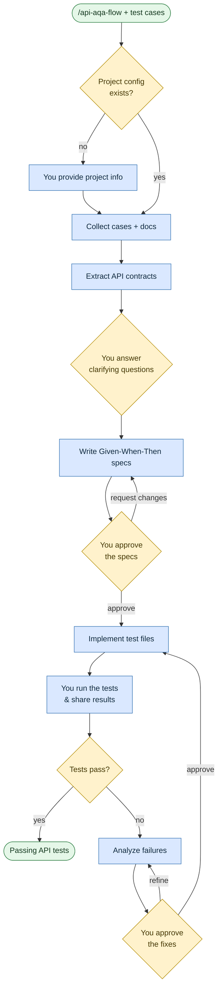

# Automate API tests

**Command:** `/api-aqa-flow` · *[← All scenarios](../README.md#scenarios-at-a-glance) · [User guide](../README.md)*

> Turn API test cases and contracts into working, corrected, passing automated API tests in your repo.

**Use this when** you need backend API automation: working from API contracts, Swagger/OpenAPI specs, or request/response test cases, and implementing or fixing API tests.

**Not for:** UI/browser tests ([Automate UI tests](automate-ui-tests.md)) or designing cases without code ([Generate test cases](generate-test-cases.md)).

## Running it

```text
/api-aqa-flow Automate API tests for the orders service
/api-aqa-flow Write API tests from these TestRail cases for the /payments endpoint
/api-aqa-flow Fix the failing API tests in the users module
```

## How it works

It extracts the real endpoint contracts (from Swagger/OpenAPI or code), resolves gaps with you, writes **Given-When-Then** specs for your approval, implements them, and triages your execution results. Like the UI flow, **it never assumes endpoints, payloads, auth, or response schemas.**



Every test spec (`ATC-NNN`) traces back to a source case or a documented gap, and your repository's own conventions win over any generic defaults.

## What you'll be asked to do

Provide project info if there's no config yet; answer clarifying questions; **explicitly approve the test specs** before implementation and the **fixes** before they're applied; and **run the tests yourself and share the real results** (a "it passed" confirmation isn't enough — the agent needs the actual output).

## What it creates

A session folder `plans/api-aqa-<identifier>/` with `api-aqa-project-config.md`, `initial-data.md`, `raw-data.md`, `api-analysis.md`, `analysis.md`, `test-specs.md` (the Given-When-Then cases), and `execution-report.md`; the implemented/corrected test files in your repo; and progress tracked in `agents/TEMP/<feature>/api-aqa-state.md`, which is not committed.

## Related

[Automate UI tests](automate-ui-tests.md) for the frontend · [Generate test cases](generate-test-cases.md) to design cases first · unsure which? use the [`/aqa-flow` router](get-help.md).

Prerequisites: Swagger/OpenAPI spec or backend source path.

## Sources

- Workflow: [`instructions/r3/qe/workflows/api-aqa-flow.md`](../../instructions/r3/qe/workflows/api-aqa-flow.md) (plus the `api-aqa-flow-*.md` phase files)
- Router: [`aqa-flow.md`](../../instructions/r3/qe/workflows/aqa-flow.md)
