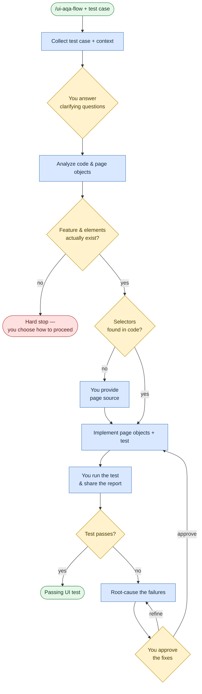

# Automate UI tests

**Command:** `/ui-aqa-flow` · *[← All scenarios](../README.md#scenarios-at-a-glance) · [User guide](../README.md)*

> Turn a test case into a working automated UI/browser test that follows your repo's existing page objects and conventions — and help you get it green.

**Use this when** you need UI, browser, or end-to-end automation: page objects, selectors, implementing a UI test, or fixing a failing one (Playwright, Cypress, Selenium, and similar).

**Not for:** backend API tests ([Automate API tests](automate-api-tests.md)) or designing test cases without code ([Generate test cases](generate-test-cases.md)).

## Running it

```text
/ui-aqa-flow Automate the test case for the checkout flow
/ui-aqa-flow Add E2E Playwright tests for the dashboard
/ui-aqa-flow Fix the failing UI test for user registration
```

## How it works

The defining rule: **it never guesses selectors, flows, or data.** It reads your frontend code to find selectors, and if it can't, it asks you for the page source. You run the test; it analyzes the report and proposes fixes for your approval.



It reuses your existing page objects and helpers before creating new ones, and every assertion traces back to a requirement. If the feature or elements simply don't exist yet, it stops rather than inventing them — and offers you options (point it at the real feature, author the missing UI as a separate task, mark the test pending, or abort).

## What you'll be asked to do

Answer clarifying questions about assertions and behavior; provide page source if selectors can't be found in code; **run the test yourself and share the actual results/report** (the agent stops and waits — it won't fake a run); and give explicit approval before any fixes are applied.

## What it creates

A plan folder `plans/ui-aqa-<test-name>/` with `test-plan.md` (including the explicit assertions), `code-analysis.md`, `page-sources/` (captured page HTML) and `failure-analysis.md` (the root-cause write-up); the implemented/updated page-object and test files in your repo; and progress tracked in `agents/TEMP/<feature>/ui-aqa-state.md`, which is not committed.

## Related

[Generate test cases](generate-test-cases.md) to design the case first · [Automate API tests](automate-api-tests.md) for backend tests · unsure which? use the [`/aqa-flow` router](get-help.md).

## Sources

- Workflow: [`instructions/r3/qe/workflows/ui-aqa-flow.md`](../../instructions/r3/qe/workflows/ui-aqa-flow.md) (plus the `ui-aqa-flow-*.md` phase files)
- Router: [`aqa-flow.md`](../../instructions/r3/qe/workflows/aqa-flow.md)
