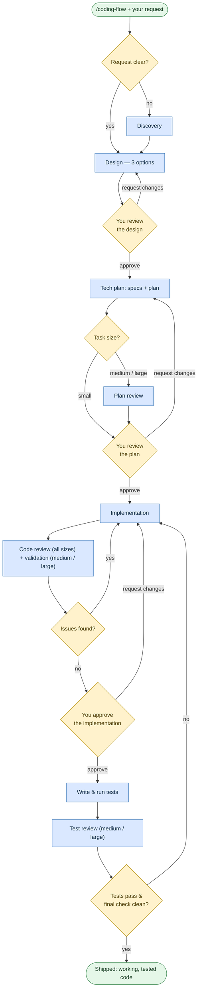

# Write or change code

**Command:** `/coding-flow` · *[← All scenarios](../README.md#scenarios-at-a-glance) · [User guide](../README.md)*

> Turn a request into working, reviewed, tested code — through discovery, a design you approve, a plan you approve, implementation, and a separate review-and-validation pass.

**Use this when** you know what needs to change: adding a feature, fixing a bug, refactoring, writing unit tests, or DevOps/IaC changes.

**Not for:** writing requirements first ([Author requirements](requirements.md)), understanding code without changing it ([Analyze a codebase](analyze-a-codebase.md)), or big migrations ([Modernize](modernize.md)).

## Running it

```text
/coding-flow Add password reset to the auth service
/coding-flow Identify and fix the race condition in payment processing
/coding-flow Improve unit test coverage to 85% for the billing module
```

Be specific — clear acceptance criteria mean fewer clarifying questions and a tighter plan. If you already have requirements, mention them and the agent will treat them as constraints and tag code with their IDs.

## How it works

The agent doesn't just start editing. It proposes a **design**, then a **plan**, and stops for your approval at each — plus once more before it moves on to tests. In the diagram, **amber diamonds are decision points** (including the gates where it waits for you), and arrows that loop back show where it revises and re-checks — for example, when review or validation finds issues it returns to implementation rather than pushing ahead.



The work is split across specialist subagents — a *discoverer* to gather context, an *architect* to design and plan, an *engineer* to implement and test, and independent *reviewer* and *validator* subagents that check the work in fresh context (so nothing reviews its own output). Validation includes actually building and running things, not just reading the diff.

**It scales to the task.** A small change merges the checkpoints and skips the heavier review/validation phases; medium and large tasks get the full sequence, including an explicit reasoning step during planning.

## What you'll be asked to do

- **Approve the design** before any plan is written.
- **Approve the plan** before any code is written — this is your main checkpoint. Read the scope and approach.
- **Approve the implementation** before it moves on to tests.
- Answer questions when the agent hits a genuine gap (business rules, trade-offs).

The agent won't slide past these gates on a vague reply; give a clear confirmation. (If you truly want it to run unattended, the only opt-out is saying `fully autonomous` or `no HITL` — use sparingly.)

## What it creates

- A state file under `agents/TEMP/<feature>/` so a long task can resume in a new session.
- Planning artifacts: `plans/<feature>/discovery-notes.md`, `plans/<feature>/architecture-notes.md`, and `plans/<feature>/<FEATURE>-SPECS.md` + `<FEATURE>-PLAN.md`.
- The code changes and passing tests, plus brief updates to your `docs/CONTEXT.md` / `docs/ARCHITECTURE.md` when relevant.

## Manage a task across chats

Use these four commands when you want a named task whose requirements, approvals and results
survive a new chat. Run them in the target repository with the Rosetta plugin installed.
Your host may display a plugin prefix; for example `$rosetta:task-define` instead of `/task-define`.

```text
/task-define
/task-define Let customers cancel an upcoming booking
```

Both create a task. The first starts with questions; the second uses your description as input.
The agent returns a stable ID and folder, clarifies scope and acceptance criteria, authors and
reviews requirements, and asks for approval. It stops before architecture or coding.

Use the returned ID in subsequent commands. `TASK-0001` below is an example:

```text
/task-spec TASK-0001
/task-implement TASK-0001
/tasks-list
```

| Command | Result | Where it stops |
|---|---|---|
| `task-define` | Requirements and their approval | Before solution design |
| `task-spec` | Approved architecture, specification and plan | Before implementation |
| `task-implement` | Implementation, independent review, tests and verification evidence | Final acceptance with you |
| `tasks-list` | ID, title, stage, blockers, folder and next command | Read-only listing |

The specification step runs the preparation part of `coding-flow`; implementation resumes its
remaining work. Each command retains the workflow's review and approval checkpoints. Starting a
new chat does not mean repeating an unchanged, recorded approval.

To revise or resume a task:

```text
/task-define TASK-0001 Customers may cancel only before the booking starts
/task-define plans/TASK-0001
/task-spec plans/TASK-0001
```

The ID or task folder comes first; the remaining text changes requirements. With only a task
reference, `task-define` resumes the existing discussion. Quote a folder containing spaces.
An explicit unknown ID or path reports a lookup problem rather than silently creating a task.

```text
plans/TASK-0001/
  TASK.md                 identity, approvals, current work and durable results
  ...                     specifications/plans/reports as the task size requires
docs/REQUIREMENTS/TASK-0001/
  ...                     requirement documents when produced
```

For a small managed task, a concise approved solution and plan can live in `TASK.md`; separate
specification and plan files are not mandatory. Ordinary `/coding-flow` keeps its existing
size rules and does not automatically register tasks or acquire new documentation obligations.

The list derives four stages from current approved content and evidence:

```text
Requirements needed → Specification needed → Implementation needed → Done
```

Work in progress, blockers and pending approval appear separately. Files existing is not proof
of approval. Changed requirements make dependent approvals stale while preserving earlier work.
`Done` requires verification and your recorded acceptance of the current result. Malformed or
duplicate passports are shown as diagnostics; listing does not repair them.

To continue after interruption, run the same command with the same ID in a new chat. The passport
and linked evidence survive loss of temporary workflow state. Missing evidence is rechecked;
the agent does not invent completion.

## Tips

- **Read the plan before approving.** The gate only protects you if you use it.
- **One task per session.** Start a fresh chat for an unrelated change so context stays lean (see [Tips](../05-tips-and-troubleshooting.md#managing-sessions)).
- **If it loops**, step in with a specific hint or ask it to spin up a focused subagent for just that problem.

## Related

[Author requirements](requirements.md) before building · [Analyze a codebase](analyze-a-codebase.md) first if the code is unfamiliar · [Ad-hoc task](adhoc-task.md) for non-code chores.

## Sources

- Workflow: [`instructions/r3/core/workflows/coding-flow.md`](../../instructions/r3/core/workflows/coding-flow.md)
- Skills: [`coding`](../../instructions/r3/core/skills/coding/SKILL.md), [`planning`](../../instructions/r3/core/skills/planning/SKILL.md), [`tech-specs`](../../instructions/r3/core/skills/tech-specs/SKILL.md), [`testing`](../../instructions/r3/core/skills/testing/SKILL.md), [`hitl`](../../instructions/r3/core/skills/hitl/SKILL.md)
