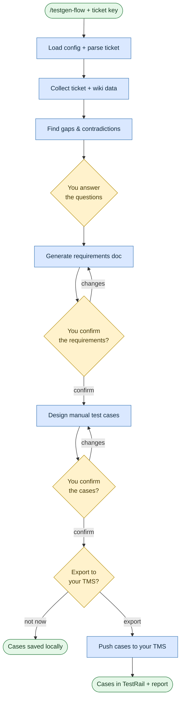

# Generate test cases

**Command:** `/testgen-flow` · *[← Scenarios](README.md) · [User guide](../README.md)*

> Turn a ticket (plus its linked docs) into a structured requirements document and a set of manual test cases — then export those cases to your test management system. No automation code is written here.

**Use this when** you have a Jira ticket, epic, or story and need designed test scenarios with traceability, optionally pushed to TestRail.

**Not for:** writing runnable tests — use [Automate UI tests](automate-ui-tests.md) or [Automate API tests](automate-api-tests.md) for that.

## Running it

```text
/testgen-flow Generate test cases for PROJ-123
/testgen-flow Create test scenarios from EPIC-789 and export to TestRail
```

You can also just give it the bare ticket key or a full ticket URL.

## How it works

It pulls the source material together, finds the contradictions and gaps, and — importantly — **stops and asks you to answer them** before it writes anything. You confirm the requirements and scenarios, and you decide when to export.



It reads the Jira ticket and its linked Confluence pages (including child pages, which often hold the real detail), and the requirements document it produces traces back to that source material and to your answers.

## What you'll be asked to do

**Answer the questions** it generates — you fill these in, not the agent — since skipping them bakes assumptions into the requirements. Then confirm the requirements summary and the test scenarios, and provide the TMS destination (project, suite, section) when you're ready to export. Occasionally you'll need to create the target container in the TMS UI yourself if the connector can't.

## What it creates

Everything lands under `plans/testgen-<TICKET-KEY>/`: the collected `raw-data.md`, a gap `analysis.md`, `questions.md` + `answers.md`, `requirements.md`, `test-scenarios.md`, and an `export-report.md` receipt with the created TMS IDs. A `testgen-state.md` tracks progress.

## Related

[Automate UI tests](automate-ui-tests.md) / [Automate API tests](automate-api-tests.md) to turn cases into code · [Author requirements](requirements.md) for a full requirements engineering pass.

## Sources

- Workflow: [`instructions/r3/core/workflows/testgen-flow.md`](../../instructions/r3/core/workflows/testgen-flow.md) (plus the `testgen-flow-*.md` phase files)
- Skills: [`qa-knowledge`](../../instructions/r3/core/skills/qa-knowledge/SKILL.md), [`qa-structure`](../../instructions/r3/core/skills/qa-structure/SKILL.md)
