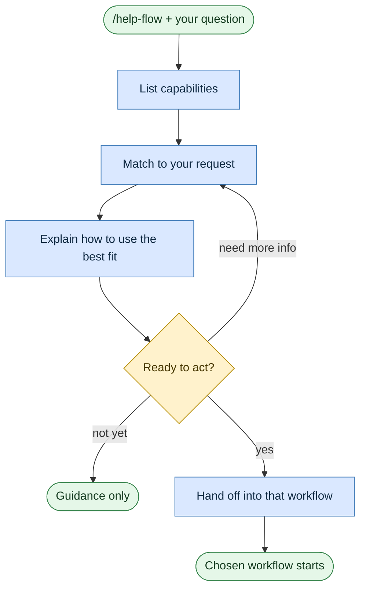

# Get help

**Command:** `/help-flow` · *[← Scenarios](README.md) · [User guide](../README.md)*

> A conversational way to discover what Rosetta can do and pick the right workflow — and hand off straight into it when you're ready.

**Use this when** you're not sure what's available or which scenario fits: *"what can you do?"*, *"how do I run a security review?"*, *"what workflows are there for testing?"*

## Running it

```text
/help-flow What can you do?
/help-flow How do I run a security review with Rosetta?
/help-flow What workflows are available for testing?
```

## How it works

It's a conversation, not an implementation. It lists the available workflows, skills, and agents, matches them to what you're asking, explains how to use the best fit, and can switch directly into that workflow when you decide to act.



When a workflow and a skill overlap, it recommends the **workflow** — that's the intended entry point for real work.

## A note on the command

`/help-flow` is the current command. You may see `/self-help-flow` referenced in older material — it's the deprecated alias and still works, but prefer `/help-flow`.

There's also `/aqa-flow`, a small **router** for test automation: give it any testing request and it dispatches to [UI](automate-ui-tests.md), [API](automate-api-tests.md), or [test-case generation](generate-test-cases.md) — handy when you're not sure which of the three you need.

## What it creates

Nothing — it's purely informational. The workflow it hands off to owns any files.

## Related

The full menu is the [Scenarios index](README.md) and the visual [workflow map](../workflow-map.html).

## Sources

- Workflow: [`instructions/r3/core/workflows/help-flow.md`](../../instructions/r3/core/workflows/help-flow.md)
- Router: [`aqa-flow.md`](../../instructions/r3/core/workflows/aqa-flow.md)
