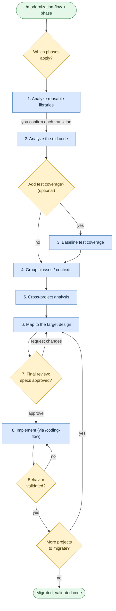

# Modernize / migrate

**Command:** `/modernization-flow` · *[← All scenarios](../README.md#scenarios-at-a-glance) · [User guide](../README.md)*

> Migrate or upgrade a system through strictly sequential, spec-first phases — document what exists, prove behavior with evidence, map the target, get your approval, then implement one piece at a time.

**Use this when** you're doing a real migration: a language conversion (C++ → Java), a framework or runtime upgrade (Java 8 → 21, .NET Framework → modern .NET), containerization, monolith → services, or a persistence change.

**Not for:** ordinary feature work ([Write or change code](coding.md) — which this flow calls internally for the actual implementation).

## Before you start

Set the stage in your repo so the flow has what it needs:

- Document the modernization goals in `docs/CONTEXT.md` and the target design in `docs/ARCHITECTURE.md`.
- Say where new source should live.
- Populate `refsrc/` with reference material — old code, target/new code, reusable libraries, config, and docs.

## Running it

You typically name the phase in the request:

```text
/modernization-flow Perform modernization phase 2 to analyze the billing service module
/modernization-flow Migrate the billing module from Java 8 to Java 21, one phase at a time
/modernization-flow Perform phase 8 for the orders service using coding-flow to implement
```

## How it works

This is the most disciplined flow. Phases run **one at a time**, and the agent waits for your confirmation before moving to the next. Analysis phases document *facts only* — no recommendations, no implementation code — until the mapping phase, where the target design is decided and reviewed.



Every phase spawns a validation subagent to check the work is grounded and complete. Backward compatibility is treated as a requirement. **You confirm each phase transition**, and the implementation phase needs your explicit approval of the target specs before any code is written. Small in-place upgrades use just the old-code analysis and mapping phases; full cross-technology migrations use them all.

## What you'll be asked to do

Approve which phases apply; confirm every phase transition; answer all clarification requests in the final review; and explicitly approve the target specs before implementation. If you want the test-coverage phase, say so — it's opt-in.

## What it creates

Per-project spec documents in `docs/`: `reference-code-specs-*.md`, `original-code-specs-*.md`, optional `original-test-coverage-*.md`, `cross-project-analysis.md`, and `target-code-specs-*.md` — then the implemented target code and tests, which must reach 80% coverage on migrated code. A `modernization-flow-state.md` tracks which phases apply and their status.

## Related

[Analyze a codebase](analyze-a-codebase.md) to understand the system first · [Write or change code](coding.md) (the implementation engine) · [Onboard a library](onboard-a-library.md) to teach the agent a dependency.

## Sources

- Workflow: [`instructions/r3/core/workflows/modernization-flow.md`](../../instructions/r3/core/workflows/modernization-flow.md) (plus the `modernization-flow-*.md` phase files)
- Skills: [`tech-specs`](../../instructions/r3/core/skills/tech-specs/SKILL.md), [`reverse-engineering`](../../instructions/r3/core/skills/reverse-engineering/SKILL.md)
