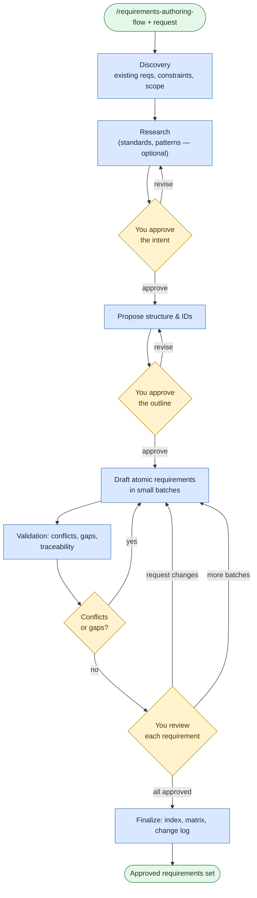

# Author requirements

**Command:** `/requirements-authoring-flow` · *[← Scenarios](README.md) · [User guide](../README.md)*

> Capture what should be built *before* building it — as small, atomic, testable requirement units, each one approved by you.

**Use this when** behavior is unclear, high-impact, or needs traceability: drafting new requirements, editing or reviewing existing ones, or reverse-engineering requirements out of an existing app.

**Not for:** implementation (that's [Write or change code](coding.md), which this flow hands off to when you're ready) or general architecture docs ([Analyze a codebase](analyze-a-codebase.md)).

Going requirements-first is the single most effective way to use a coding agent — it prevents scope creep and gives you a clean acceptance baseline.

## Running it

```text
/requirements-authoring-flow Define requirements for the checkout flow covering discount codes, tax, and payment retries
/requirements-authoring-flow Review and refactor the auth requirements for conflicts
/requirements-authoring-flow Reverse-engineer requirements from the existing orders service
```

> This flow expects a strong model (Opus / GPT-5.5-class or similar). If yours is too small, the agent will ask you to switch.

## How it works

The whole point is to stop the agent from drafting too early. It confirms **intent**, agrees an **outline** with you, then drafts requirements in small batches — and nothing becomes "approved" without your say-so.



Functional requirements are written in the EARS style; non-functional ones get measurable thresholds. A *requirements-engineer* subagent drafts, and an independent *reviewer* checks for conflicts, gaps, and end-to-end traceability (source → goal → requirement → test). When reverse-engineering an app, the agent spawns several narrow-scope subagents — one per screen, page, or endpoint — specifically to avoid hallucinating behavior.

## What you'll be asked to do

Approve the **intent**, the **outline**, **each requirement unit**, and the final **validation**. Along the way, supply the actors, goals, scope boundaries, non-goals, priorities, and any measurable thresholds. The agent walks you through the finished set as a plain-language story (per actor where possible) so you can confirm it matches what you meant.

## What it creates

A state file under `agents/TEMP/<feature>/`, then the deliverables: the approved requirements set, a validation pack, a traceability matrix, and a change log — with an index you can grep.

## Related

[Write or change code](coding.md) once requirements are set · [Analyze a codebase](analyze-a-codebase.md) to extract requirements from existing code · [Generate test cases](generate-test-cases.md) from a ticket instead.

## Sources

- Workflow: [`instructions/r3/core/workflows/requirements-authoring-flow.md`](../../instructions/r3/core/workflows/requirements-authoring-flow.md)
- Skills: [`requirements-authoring`](../../instructions/r3/core/skills/requirements-authoring/SKILL.md), [`reverse-engineering`](../../instructions/r3/core/skills/reverse-engineering/SKILL.md), [`hitl`](../../instructions/r3/core/skills/hitl/SKILL.md)
