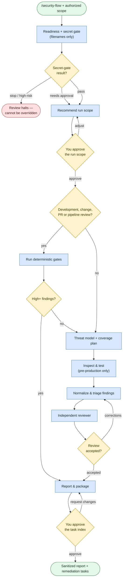

# Review security

**Command:** `/security-flow` · *[← All scenarios](../README.md#scenarios-at-a-glance) · [User guide](../README.md)*

> Run an authorized, evidence-preserving security review that ends with sanitized findings and concise remediation-task inputs. It reviews and reports — it does **not** fix anything or start coding.

**Use this when** you need an authorized security review of an application, repository, infrastructure, interface, host, or AI system — including PR and pipeline reviews or a broad threat-model-driven pass.

**Not for:** fixing findings (it hands off task inputs for a later [coding](coding.md) session) or any unauthorized/production active testing.

## Running it

```text
/security-flow Review this service and its infrastructure. Recommend a safe full-review scope and wait for approval before inspection.
/security-flow Review the payment-service PR on this branch, read-only, pre-production only.
/security-flow Threat-model the checkout API and run all applicable authorized read-only checks.
```

## How it works

Safety is built into the order of operations. Before any source is read, a **secret gate** scans filenames only. The agent proposes a scope you must approve, does the review within those bounds, has an independent reviewer challenge it, and packages sanitized results.



### The guardrails, plainly

- **Secrets never enter the model.** The gate returns affected filenames only — never the values.
- **It stops on high risk.** Candidate secret files in production or ambiguous environments, or a secret scanner that can't run, halt the review before any source is read — and can't be overridden.
- **Active testing is pre-production only.** Testing against production is prohibited.
- **New tools, network access, or credentials need separate approval.**
- **It never remediates.** Findings are grouped by root cause and emitted as task inputs for a later, separate coding session.

## What you'll be asked to do

Provide the authorized scope and environment; **approve the run contract** (activities, tools, data flows, stop conditions, how much exploit detail the report carries); approve any flagged DEV/QA candidate files; and approve the remediation **task index** at the end. The agent won't commit or delete on your behalf — you review and commit the artifacts.

## What it creates

With your storage approval, sanitized artifacts under `docs/security/<run-id>/`: `report.md`, `findings.json`, `run.json`, a `tasks/INDEX.md`, and per-group `tasks/<task-id>.md` files (the inputs for later remediation). Raw scanner output stays local and is never committed.

## Related

[Write or change code](coding.md) to act on the remediation tasks afterward.

## Sources

- Workflow: [`instructions/r3/workflows/workflows/security-flow.md`](../../instructions/r3/workflows/workflows/security-flow.md) (plus the `security-flow-*.md` phase files)
- Skills: [`security`](../../instructions/r3/core/skills/security/SKILL.md), [`sensitive-data`](../../instructions/r3/core/skills/sensitive-data/SKILL.md), [`risk-assessment`](../../instructions/r3/core/skills/risk-assessment/SKILL.md)
