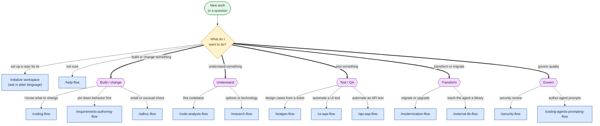
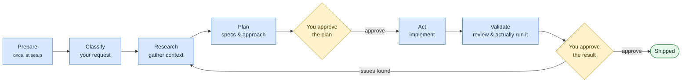

# Rosetta workflow map

[User guide](README.md) › Workflow map

Start from what you want to do, follow it to the right scenario, and see the shape every scenario shares. Boxes in **amber** are the moments a workflow stops and waits for your approval.

## 1. What do I want to do?

Find your task on the left, follow the arrows to a command. Open any command's scenario page from [Jump to a scenario](#3-jump-to-a-scenario) below.

**Legend:**

- 🟢 **Green** — where you start
- 🟡 **Amber** — a decision / your approval
- 🟣 **Purple** — category
- 🔵 **Blue** — a command

> **Tip:** if the diagram doesn't route you cleanly, just ask your agent `/help-flow What should I use to …` and it will point you to the right scenario.

## 2. How the process works

Whichever scenario you pick, the work follows the same five phases — **Prepare → Research → Plan → Act → Validate** — with approval gates where your judgment matters. *Prepare* happens once when you set up the repo; the rest repeats for every task.

> Bigger tasks add independent reviewer and validator subagents and more gates; small tasks collapse the gates and skip the heavy checks. The agent won't move past an amber gate without a clear go-ahead from you.

## 3. Jump to a scenario

### Build & change

| Scenario | Command |
| --- | --- |
| [Write or change code](scenarios/coding.md) | `/coding-flow` |
| [Author requirements](scenarios/requirements.md) | `/requirements-authoring-flow` |
| [Ad-hoc task](scenarios/adhoc-task.md) | `/adhoc-flow` |

### Test & QA

| Scenario | Command |
| --- | --- |
| [Generate test cases](scenarios/generate-test-cases.md) | `/testgen-flow` |
| [Automate UI tests](scenarios/automate-ui-tests.md) | `/ui-aqa-flow` |
| [Automate API tests](scenarios/automate-api-tests.md) | `/api-aqa-flow` |

### Understand

| Scenario | Command |
| --- | --- |
| [Analyze a codebase](scenarios/analyze-a-codebase.md) | `/code-analysis-flow` |
| [Research a question](scenarios/research.md) | `/research-flow` |

### Transform

| Scenario | Command |
| --- | --- |
| [Modernize / migrate](scenarios/modernize.md) | `/modernization-flow` |
| [Onboard a library](scenarios/onboard-a-library.md) | `/external-lib-flow` |

### Govern quality

| Scenario | Command |
| --- | --- |
| [Review security](scenarios/security-review.md) | `/security-flow` |
| [Author agent prompts](scenarios/author-agent-prompts.md) | `/coding-agents-prompting-flow` |

### Not sure?

| Scenario | Command |
| --- | --- |
| [Get help](scenarios/get-help.md) | `/help-flow` |

---

Part of the [Rosetta user guide](README.md). New here? Start with [What is Rosetta?](01-what-is-rosetta.md) · [Install](02-install.md) · [Set up your repo](03-initialize-your-repository.md).
